# Mission Control v2 — Architecture Document

<table>
<tr>
<td><strong>Document</strong></td>
<td>Mission Control v2 Architecture</td>
</tr>
<tr>
<td><strong>Version</strong></td>
<td>0.1.1</td>
</tr>
<tr>
<td><strong>Classification</strong></td>
<td>Internal — Technical Reference</td>
</tr>
<tr>
<td><strong>Author</strong></td>
<td>Robert Barnes</td>
</tr>
<tr>
<td><strong>Created</strong></td>
<td>2026-07-04</td>
</tr>
<tr>
<td><strong>Last Updated</strong></td>
<td>2026-07-16</td>
</tr>
<tr>
<td><strong>Status</strong></td>
<td>Active — Sprint 2.9</td>
</tr>
</table>

---

## Table of Contents

- [1. Executive Summary](#1-executive-summary)
  - [1.1 Mission](#11-mission)
  - [1.2 Vision](#12-vision)
  - [1.3 Goals](#13-goals)
  - [1.4 Design Philosophy](#14-design-philosophy)
  - [1.5 Target Audience](#15-target-audience)
  - [1.6 Primary Use Cases](#16-primary-use-cases)
  - [1.7 Business Value](#17-business-value)
- [2. Platform Overview](#2-platform-overview)
  - [2.1 What is Mission Control](#21-what-is-mission-control)
  - [2.2 Core Capabilities](#22-core-capabilities)
  - [2.3 Monitoring](#23-monitoring)
  - [2.4 Remote Operations](#24-remote-operations)
  - [2.5 Automation](#25-automation)
  - [2.6 AI Operations](#26-ai-operations)
  - [2.7 Mission Control Agent](#27-mission-control-agent)
  - [2.8 Plugin Framework](#28-plugin-framework)
  - [2.9 Multi-Tenant Architecture](#29-multi-tenant-architecture)
  - [2.10 Multi-Site Architecture](#210-multi-site-architecture)
  - [2.11 Enterprise Architecture](#211-enterprise-architecture)
- [3. Technology Stack](#3-technology-stack)
- [4. High Level Architecture](#4-high-level-architecture)
- [5. Backend Architecture](#5-backend-architecture)
- [6. Frontend Architecture](#6-frontend-architecture)
- [7. Database Architecture](#7-database-architecture)
- [8. Authentication and Authorization](#8-authentication-and-authorization)
- [9. Provider Framework](#9-provider-framework)
- [10. Mission Control Agent](#10-mission-control-agent)
- [11. Remote Operations](#11-remote-operations)
- [12. Monitoring](#12-monitoring)
- [13. Identity Management](#13-identity-management)
- [14. Virtualization](#14-virtualization)
- [15. Automation and Playbooks](#15-automation-and-playbooks)
- [16. AI Operations](#16-ai-operations)
- [17. Plugin Framework](#17-plugin-framework)
- [18. Multi-Tenant Architecture](#18-multi-tenant-architecture)
- [19. Multi-Site Architecture](#19-multi-site-architecture)
- [20. Security Architecture](#20-security-architecture)
- [21. Deployment Architecture](#21-deployment-architecture)
- [22. API Architecture](#22-api-architecture)
- [23. Testing Strategy](#23-testing-strategy)
- [24. Performance](#24-performance)
- [25. Roadmap](#25-roadmap)
- [26. Future Integrations](#26-future-integrations)
- [27. Glossary](#27-glossary)
- [28. Appendices](#28-appendices)

---

## 1. Executive Summary

### 1.1 Mission

Mission Control is a **comprehensive IT operations management platform** designed to serve as the daily workspace for IT operations teams. It provides a single-pane-of-glass dashboard that unifies remote server management, monitoring, virtualization management, identity administration, AI-driven insights, and playbook-based automation into one cohesive platform.

### 1.2 Vision

To become the **definitive operations platform** that replaces fragmented toolchains with an integrated, intelligent, and extensible management console. Mission Control envisions a future where IT operations teams can manage their entire infrastructure — across sites, clouds, and platforms — from a single, secure, and context-aware interface powered by artificial intelligence.

### 1.3 Goals

| Goal | Description |
|------|-------------|
| **Unified Operations** | Eliminate tool sprawl by consolidating monitoring, remote access, virtualization, identity, and automation into one platform |
| **Multi-Tenant** | Support managed service providers and enterprises with multiple companies, sites, and delegated administration |
| **Extensible** | Provide a plugin framework that allows third-party integrations and custom modules |
| **AI-Powered** | Leverage artificial intelligence for anomaly detection, incident correlation, predictive maintenance, and automated remediation |
| **Security First** | Encrypt all credentials at rest, enforce RBAC, maintain comprehensive audit trails, and support enterprise security standards |
| **Developer Friendly** | Clean architecture, comprehensive documentation, and modern technology stack that enables rapid development |
| **Production Ready** | Reliable deployment with Docker, health checks, graceful degradation, and operational observability |

### 1.4 Design Philosophy

Mission Control follows these architectural principles:

1. **Modular Monolith** — A single deployable unit with clear internal boundaries, enabling rapid development while preserving the option to extract services later (see [ADR-001](../DECISIONS.md)).

2. **Provider Pattern** — Every external integration is abstracted behind an ABC base class with production and mock implementations, enabling development without external dependencies and clean testing.

3. **Repository Pattern** — All database access is centralized in repository classes, keeping business logic clean and data access consistent.

4. **Defense in Depth** — Each layer validates inputs, enforces authorization, and handles errors independently. The dashboard never raises exceptions — it degrades gracefully.

5. **Convention Over Configuration** — Sensible defaults reduce configuration overhead while allowing override through environment variables and database-stored integration profiles.

6. **Security by Default** — Credentials are encrypted at rest using Fernet (AES-128-CBC), RBAC is enforced on every endpoint, and audit trails are maintained for all significant operations.

### 1.5 Target Audience

| Audience | Use Case |
|----------|----------|
| **Developers** | Onboarding, code navigation, understanding architectural decisions |
| **Technical Leads** | Architecture reviews, technology decisions, sprint planning |
| **DevOps Engineers** | Deployment, monitoring, scaling, troubleshooting |
| **Solutions Architects** | Customer-facing architecture discussions, integration planning |
| **Project Managers** | Understanding technical scope, roadmap alignment |
| **Security Teams** | Security reviews, compliance assessments |

### 1.6 Primary Use Cases

1. **Daily IT Operations** — Operations teams use Mission Control as their primary workspace to monitor infrastructure health, execute remote commands, manage VMs, and respond to incidents.

2. **Managed Service Provider (MSP)** — An MSP manages multiple client companies, each with multiple sites. They use Mission Control to provide delegated access, monitor client infrastructure, and execute automation playbooks.

3. **Incident Response** — When an alert fires, the AI engine correlates it with related events, recommends remediation steps, and allows the operator to execute a playbook that resolves the issue across multiple systems.

4. **Infrastructure Automation** — IT teams define playbooks that automate routine tasks — patch management, certificate rotation, backup verification — with approval workflows and rollback capabilities.

5. **Fleet Management** — Mission Control Agents deployed across hundreds of servers report inventory, execute commands, and provide real-time visibility into the entire fleet.

### 1.7 Business Value

| Value Driver | Impact |
|--------------|--------|
| **Reduced Tool Sprawl** | Replace 5-10 point tools with one integrated platform |
| **Faster Incident Response** | AI correlation reduces mean time to resolution (MTTR) |
| **Operational Efficiency** | Playbooks automate repetitive tasks, freeing staff for strategic work |
| **Compliance** | Comprehensive audit trails and RBAC satisfy regulatory requirements |
| **Scalability** | Multi-tenant architecture supports business growth without re-architecture |
| **Reduced Vendor Lock-in** | Open-source stack with provider abstraction prevents vendor dependency |

---

## 2. Platform Overview

### 2.1 What is Mission Control

Mission Control is a **full-stack IT operations management platform** that provides a unified web interface for managing remote infrastructure, monitoring system health, executing commands, managing virtual machines, and orchestrating automation workflows.

It is built as a modular monolith with a FastAPI backend, React frontend, PostgreSQL database, and Redis cache, deployed via Docker Compose with an Nginx reverse proxy.

```
Version: 0.1.1
Current Sprint: 2.9 (Multi-Tenant & Multi-Site Platform)
Architecture: Modular Monolith (ADR-001)
License: See LICENSE file
```

### 2.2 Core Capabilities

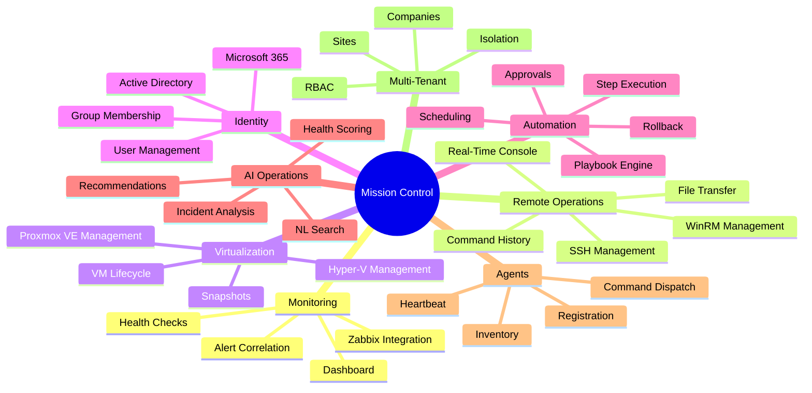

### 2.3 Monitoring

Mission Control integrates with Zabbix as its primary monitoring platform. The integration provides:

- **Host Monitoring** — View all monitored hosts, their status, and key metrics
- **Problem Management** — Browse and filter active problems with severity classification
- **Trigger Configuration** — View trigger definitions, thresholds, and states
- **Event History** — Explore historical events with filtering and pagination
- **Host Groups** — Organize hosts into logical groups
- **Template Management** — View and manage Zabbix templates
- **Custom Items** — Monitor custom metrics and data points
- **Dashboard Maps** — Display Zabbix dashboard maps within Mission Control
- **Health Overview** — Aggregated health status across all monitored systems

The Zabbix integration uses a provider pattern with `ApiZabbixProvider` communicating via Zabbix's JSON-RPC API. A `MockZabbixProvider` is available for development and testing.

**Implementation Status:** Sprint 2.4 — Implemented with mock and production providers.

### 2.4 Remote Operations

Remote Operations is the capability to execute commands and manage files on remote servers via SSH and WinRM protocols. Mission Control provides:

- **Host Management** — Register and manage remote servers with connection details
- **Credential Vault** — Encrypted storage of SSH keys, passwords, and WinRM credentials
- **Command Execution** — Execute commands on single or multiple hosts with real-time output
- **File Transfer** — Upload and download files via SFTP (SSH) or PowerShell (WinRM)
- **Directory Browsing** — Browse remote file systems with create/delete operations
- **Command Templates** — Save and reuse frequently executed commands
- **Scheduling** — Schedule commands for later or recurring execution via cron expressions
- **Bulk Execution** — Execute commands across multiple hosts simultaneously
- **Execution History** — Complete audit trail of all remote operations
- **Real-Time Console** — Interactive terminal sessions via xterm.js

**Implementation Status:** Sprint 2.1 through 2.2 — Fully implemented with SSH (Paramiko) and WinRM (pywinrm) providers.

### 2.5 Automation

The automation engine provides playbook-based workflow execution:

- **Playbooks** — Define multi-step automation workflows
- **Steps** — Individual actions within playbooks (SSH, WinRM, HTTP, PowerShell, Bash, Agent, Hyper-V, Proxmox)
- **Variables** — Dynamic variables with context injection
- **Approvals** — Human-approval gates before critical steps
- **Scheduling** — Cron-based playbook scheduling
- **Event Triggers** — Execute playbooks in response to events
- **Execution History** — Step-level execution logs
- **Rollback** — Automatic or manual rollback on failure
- **Audit Trail** — Immutable audit records for compliance

**Implementation Status:** Sprint 2.8 — Fully implemented with 8 step type providers.

### 2.6 AI Operations

Mission Control includes an AI engine for intelligent operations:

- **Incident Analysis** — Classify, correlate, and recommend actions for infrastructure incidents
- **Recommendations** — Proactive recommendations based on current infrastructure state
- **Health Scoring** — Composite health score (0-100, A-F grade) across all monitored systems
- **Natural Language Search** — Query infrastructure using natural language
- **Correlation Engine** — Identify related alerts and incidents across systems
- **Confidence Scoring** — Rate the confidence level of AI recommendations

The AI engine supports multiple backends: Ollama (local), OpenAI, Azure OpenAI, Anthropic, and a built-in rule-based fallback.

**Implementation Status:** Sprint 2.6 — Implemented with provider abstraction and rule-based fallback.

### 2.7 Mission Control Agent

The MC Agent is a lightweight daemon deployed on managed servers:

- **Registration** — Secure registration with one-time tokens
- **Authentication** — API key-based authentication
- **Heartbeat** — Regular heartbeat signaling agent liveness
- **Command Queue** — Polling-based command dispatch and execution
- **Inventory** — Automated system inventory collection (CPU, memory, disk, network, OS)
- **Compression** — gzip compression for payload transfer efficiency
- **Offline Support** — Queue commands during disconnection, execute on reconnect

**Implementation Status:** Sprint 2.7 — Server-side agent management implemented. Agent binary in development.

### 2.8 Plugin Framework

Mission Control is designed with an extensible plugin architecture (planned for v3):

- **Discovery** — Automatic plugin discovery from a designated directory
- **Registration** — Plugins register themselves with the platform on load
- **Isolation** — Plugins run in isolated contexts to prevent interference
- **Security** — Plugin permissions are explicitly granted and audited
- **SDK** — Python SDK for building Mission Control plugins
- **Marketplace** — Future marketplace for community and commercial plugins

**Implementation Status:** Planned for Version 3. Provider pattern in current codebase serves as the foundation.

### 2.9 Multi-Tenant Architecture

Mission Control supports multi-tenancy for managed service providers:

- **Companies** — Top-level tenant entity with licensing, limits, and configuration
- **Sites** — Organizational units within a company (physical locations, departments)
- **User Scoping** — Users are scoped to companies and sites with role-based access
- **Data Isolation** — Every record carries `company_id` and `site_id` for row-level isolation
- **Header-Based Context** — Tenant context injected via `X-Company-Id` and `X-Site-Id` HTTP headers
- **License Management** — Per-company limits on sites, agents, and users

**Implementation Status:** Sprint 2.9 — Companies, Sites, and tenant isolation columns implemented.

### 2.10 Multi-Site Architecture

Within a multi-tenant company, sites provide geographic or organizational subdivision:

- **Site Registration** — Create sites with location, timezone, and contact information
- **Site Health** — Monitor site-specific health metrics
- **Agent Assignment** — Assign agents to specific sites
- **Site Scoping** — Resources (hosts, playbooks, integrations) scoped to sites
- **Default Site** — Automatic default site for new deployments

**Implementation Status:** Sprint 2.9 — Site model, CRUD operations, and tenant scoping implemented.

### 2.11 Enterprise Architecture

Mission Control is designed for enterprise deployment:

- **Modular Monolith** — Single deployable unit with clean internal boundaries
- **Docker Deployment** — Containerized deployment with Docker Compose
- **Nginx Reverse Proxy** — Production-grade reverse proxy with security headers
- **PostgreSQL** — Enterprise-grade relational database with ACID compliance
- **Redis** — High-performance caching and session management
- **Alembic Migrations** — Version-controlled database schema management
- **Health Checks** — Application and infrastructure health monitoring
- **Audit Trails** — Comprehensive logging for compliance and forensics

---

## 3. Technology Stack

### 3.1 Backend Stack

| Technology | Version | Purpose |
|------------|---------|---------|
| **Python** | 3.12 (Docker) | Primary backend language |
| **FastAPI** | 0.111.0 | Async web framework with OpenAPI auto-generation |
| **Uvicorn** | 0.30.1 | ASGI server for production |
| **SQLAlchemy** | ≥2.0 | ORM with mapped_column style |
| **Alembic** | ≥1.14.1 | Database migration management |
| **Pydantic Settings** | 2.3.4 | Configuration management via environment variables |
| **Paramiko** | ≥3.4.0 | SSH client library for remote operations |
| **PyWinRM** | ≥0.5.0 | WinRM client for Windows remote management |
| **Cryptography** | ≥43.0.0 | Fernet encryption for credential vault |
| **LDAP3** | ≥2.9.1 | Active Directory / LDAP integration |
| **MSAL** | ≥1.31.0 | Microsoft Authentication Library for M365 |
| **APScheduler** | ≥3.10.0 | Task scheduling for commands and playbooks |
| **HTTPX** | ≥0.27.0 | Async HTTP client for API integrations |
| **Docker SDK** | ≥7.1.0 | Docker Engine API integration |
| **GitPython** | ≥3.1.0 | Git repository integration |
| **psutil** | 7.0.0 | System metrics collection |

### 3.2 Frontend Stack

| Technology | Version | Purpose |
|------------|---------|---------|
| **React** | 18.3.1 | UI component framework |
| **TypeScript** | 5.5.4 | Type-safe JavaScript |
| **Vite** | 5.4.3 | Build tool and dev server |
| **react-router-dom** | 7.18.1 | Client-side routing |
| **Tailwind CSS** | 3.4.10 | Utility-first CSS framework |
| **xterm.js** | 6.0.0 | Terminal emulator for remote console |
| **Nginx** | 1.27 (Alpine) | Static file serving and reverse proxy |

### 3.3 Database Stack

| Technology | Version | Purpose |
|------------|---------|---------|
| **PostgreSQL** | 16 (Alpine) | Primary relational database |
| **psycopg** | ≥3.2 | PostgreSQL Python driver (sync) |
| **asyncpg** | 0.29.0 | Async PostgreSQL driver (health checks) |
| **Alembic** | ≥1.14.1 | Schema migration management |

### 3.4 Container Platform

| Technology | Version | Purpose |
|------------|---------|---------|
| **Docker** | v2+ | Container runtime |
| **Docker Compose** | v2 | Multi-service orchestration |
| **Python** | 3.12-slim | Backend base image |
| **Node.js** | 22 (Alpine) | Frontend build image |
| **Nginx** | 1.27-alpine | Reverse proxy image |
| **PostgreSQL** | 16-alpine | Database image |
| **Redis** | 7.2-alpine | Cache image |

### 3.5 Authentication

| Component | Technology |
|-----------|------------|
| **Token Format** | Custom HMAC-SHA256 signed JWT-like tokens |
| **Password Hashing** | PBKDF2-SHA256 with per-user salt |
| **Encryption** | Fernet (AES-128-CBC with HMAC-SHA256) |
| **Token Extraction** | FastAPI `Depends()` dependency injection |

### 3.6 Caching

| Technology | Purpose |
|------------|---------|
| **Redis 7.2** | Session caching, API response caching, rate limiting |
| **Connection** | Async via `redis.asyncio` |
| **Persistence** | AOF (Append-Only File) with volume mount |

### 3.7 Testing

| Component | Technology |
|-----------|------------|
| **Backend Unit Tests** | pytest + pytest-asyncio |
| **Test Database** | In-memory SQLite via StaticPool |
| **Test Client** | FastAPI TestClient |
| **CLI Tests** | PowerShell Pester |
| **Frontend Tests** | Planned (Vitest) |

### 3.8 CI/CD Pipeline

| Component | Technology |
|-----------|------------|
| **CI Platform** | GitHub Actions |
| **OS** | Windows |
| **Shell** | PowerShell 7 |
| **Quality Gate** | `Invoke-Quality.ps1` |
| **Docker Build** | Docker Compose |
| **Releases** | GitHub Releases |

### 3.9 Technology Matrix

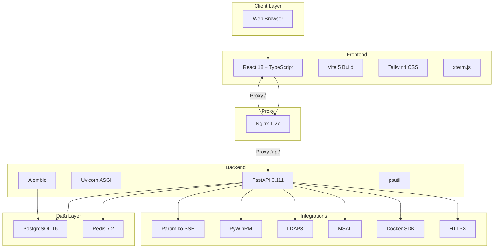

---

## 4. High Level Architecture

### 4.1 System Overview

Mission Control follows a classic three-tier architecture with a clear separation between presentation, business logic, and data layers. The system is deployed as a set of Docker containers orchestrated by Docker Compose.

### 4.2 Architecture Diagram

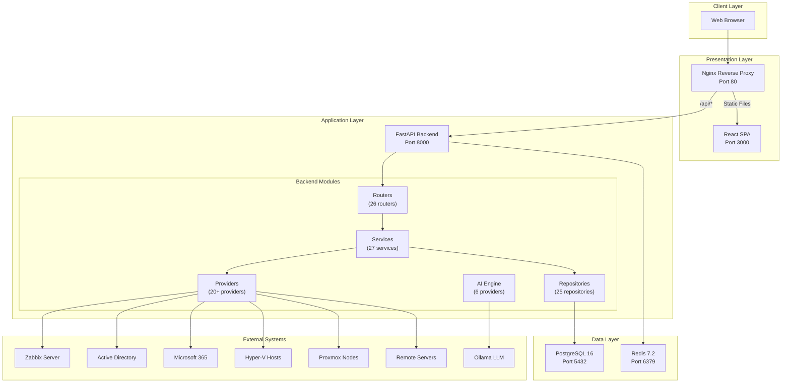

### 4.3 Data Flow

The following diagram illustrates the typical request flow through Mission Control:

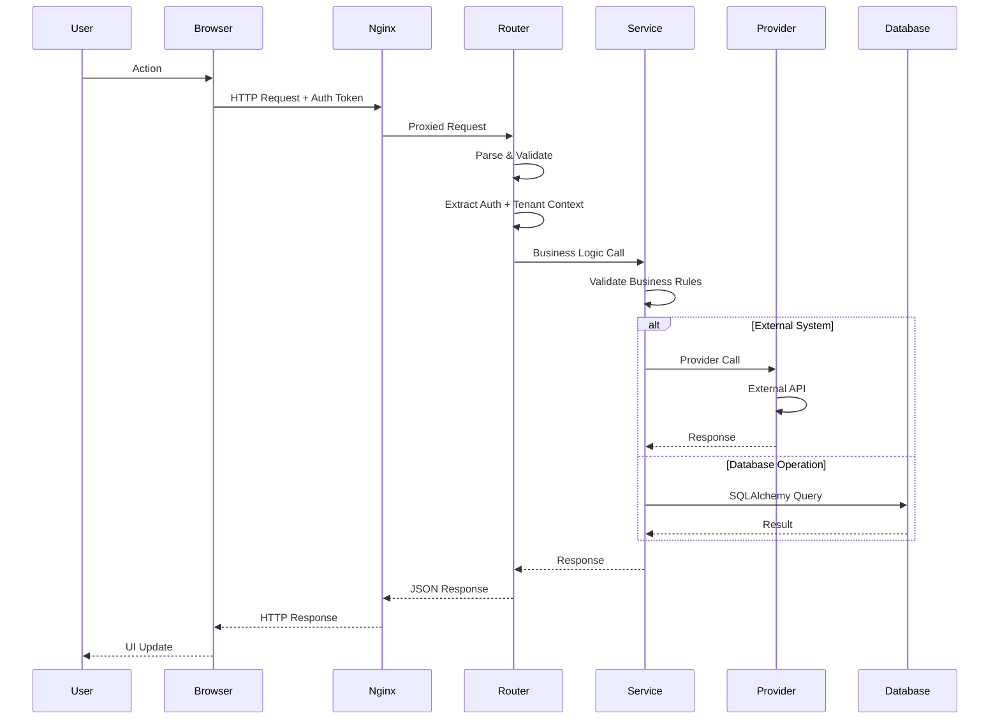

### 4.4 Deployment Topology

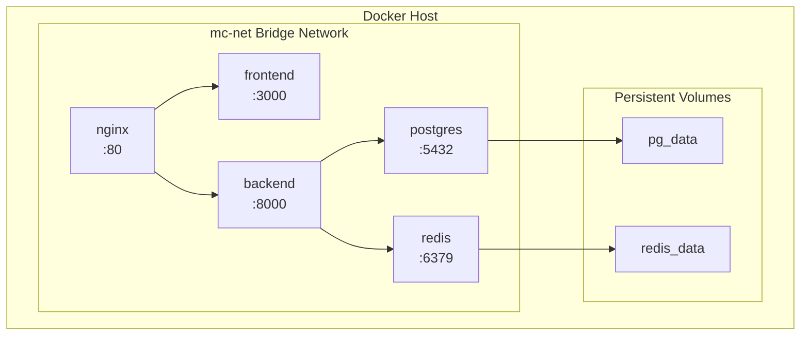

**Service Count:** 5 containers

| Service | Image | Port | Purpose |
|---------|-------|------|---------|
| `nginx` | nginx:1.27-alpine | 80 | Reverse proxy, static files |
| `frontend` | node:22-alpine (build) → nginx | 3000 | React SPA |
| `backend` | python:3.12-slim | 8000 | FastAPI application |
| `postgres` | postgres:16-alpine | 5432 | Primary database |
| `redis` | redis:7.2-alpine | 6379 | Cache layer |

---

## 5. Backend Architecture

### 5.1 Application Entry Point

The FastAPI application is created in `backend/app/main.py`. On startup, it:

1. Creates the FastAPI app instance with metadata (title, version, description)
2. Configures CORS middleware with origins from `Settings.cors_origins`
3. Mounts 26 routers under the `/api/v1` prefix
4. Validates the Fernet secret key configuration

The application startup is managed by `backend/entrypoint.sh`, which performs:

1. DNS resolution diagnostics
2. PostgreSQL connectivity verification (30 retries with TCP + protocol check)
3. Redis connectivity verification (30 retries with TCP + PING check)
4. Configuration validation (Fernet key)
5. Alembic migration execution (`alembic upgrade head`)
6. Database seeding (`python -m app.seed.runner`)
7. Uvicorn launch on `0.0.0.0:8000`

### 5.2 Layered Architecture

Mission Control follows a strict four-layer architecture:

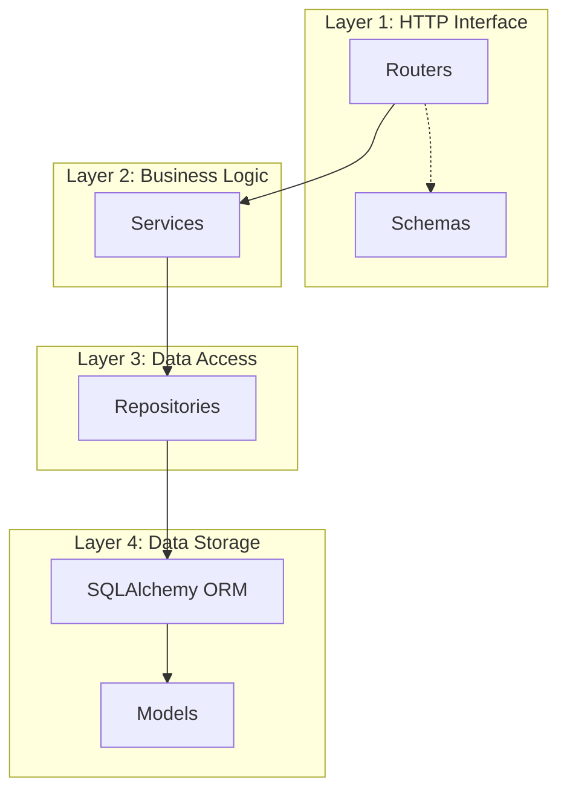

**Layer Responsibilities:**

| Layer | Responsibility | Components |
|-------|---------------|------------|
| **HTTP Interface** | Parse requests, validate input, enforce auth, format responses | Routers, Schemas |
| **Business Logic** | Apply business rules, orchestrate operations, coordinate providers | Services |
| **Data Access** | Database queries, transaction management, data retrieval | Repositories |
| **Data Storage** | ORM mapping, connection management, session lifecycle | Models, Database |

**Dependency Rule:** Dependencies flow strictly downward. Routers depend on Services, Services depend on Repositories, Repositories depend on Models. No circular dependencies.

### 5.3 Routers

Routers define the HTTP API surface. All 26 routers are mounted under `/api/v1` and organized by domain.

**Router Architecture:**

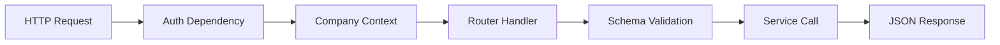

**Complete Router Catalog:**

| Router | File | Prefix | Auth | Description |
|--------|------|--------|------|-------------|
| Health | `health.py` | `/health` | Public | Liveness and readiness probes |
| Version | `version.py` | `/version` | Public | Application version information |
| Status | `status.py` | `/status` | Public | Platform status summary |
| Doctor | `doctor.py` | `/doctor` | Admin | Diagnostic system checks |
| Auth | `auth.py` | `/auth` | Partial | Login, user CRUD, password management |
| Company | `company.py` | `/companies` | Admin | Multi-tenant company management |
| Site | `site.py` | `/sites` | Admin | Site management within companies |
| Dashboard | `dashboard.py` | `/dashboard` | User | Aggregated dashboard data |
| Projects | `projects.py` | `/projects` | User | Project management CRUD |
| Tasks | `tasks.py` | `/tasks` | User | Task management CRUD |
| Notes | `notes.py` | `/notes` | User | Note management CRUD |
| Resume | `resume.py` | `/resume` | User | Work resumption context |
| Parking Lot | `parking_lot.py` | `/parking-lot` | User | Backlog item management |
| Remote | `remote.py` | `/remote` | User | Remote operations (hosts, credentials, execute, files, templates, schedules) |
| Docker | `docker.py` | `/docker` | Admin | Docker container management |
| Git | `git.py` | `/git` | User | Git repository status |
| Identity | `identity.py` | `/identity` | Admin | Active Directory and M365 operations |
| Integration | `integration.py` | `/integrations` | Admin | Integration profile management |
| Zabbix | `zabbix.py` | `/zabbix` | Admin | Zabbix monitoring operations |
| Hyper-V | `hyperv.py` | `/hyperv` | Admin | Hyper-V virtual machine management |
| Proxmox | `proxmox.py` | `/proxmox` | Admin | Proxmox VE management |
| AI | `ai.py` | `/ai` | User | AI analysis, recommendations, health score |
| Agent | `agent.py` | `/agents` | Admin | Mission Control agent management |
| Agent Token | `agent_token.py` | `/agent-tokens` | Admin | Agent registration token management |
| Automation | `automation.py` | `/automation` | User | Playbook CRUD, execution, approvals, triggers, audit |

### 5.4 Services

Services contain the business logic of the application. They sit between routers (HTTP layer) and repositories (data access layer), orchestrating operations and enforcing business rules.

**Service Categories:**

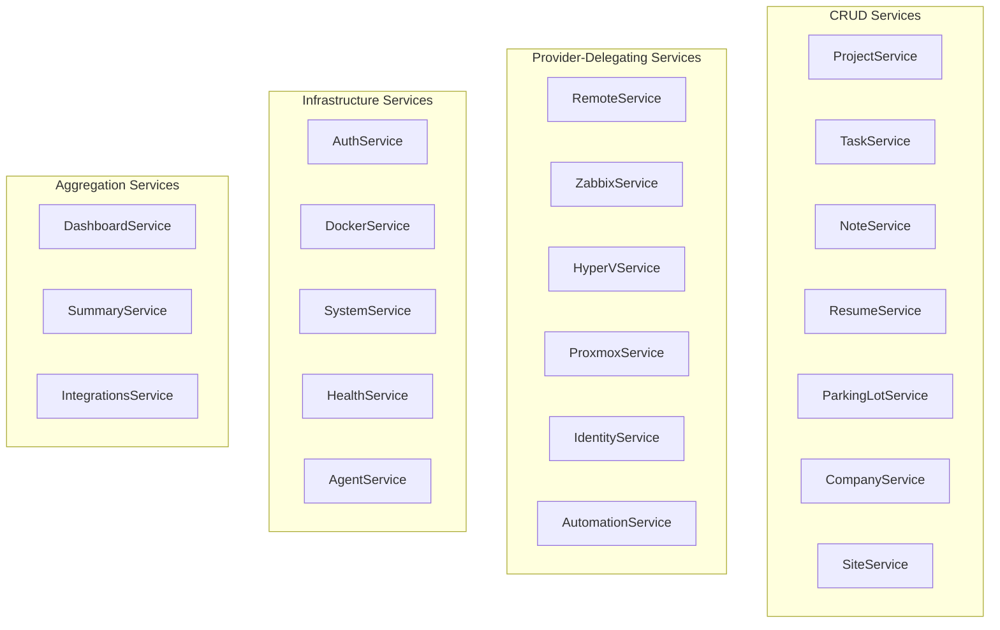

**Service Implementation Patterns:**

1. **CRUD Services** — Standard create/read/update/delete with validation and conflict detection
2. **Provider-Delegating Services** — Thin wrappers that resolve a provider per-call and delegate operations
3. **Infrastructure Services** — System-level operations (authentication, Docker, health checks)
4. **Aggregation Services** — Combine data from multiple providers with defensive error handling

**DashboardService — The Orchestrator:**

The `DashboardService` is a key architectural component. It aggregates data from 14+ providers to build the dashboard response. Every provider call is wrapped in defensive try/except blocks, returning safe defaults on failure. This ensures the dashboard never crashes due to a single integration failure.

```python
# DashboardService pattern (simplified)
async def get_dashboard(self, company_id, site_id):
    result = {}
    
    try:
        result["system"] = await self.system_provider.get_metrics()
    except Exception:
        result["system"] = DEFAULT_SYSTEM
    
    try:
        result["docker"] = await self.docker_provider.get_status()
    except Exception:
        result["docker"] = DEFAULT_DOCKER
    
    # ... 12 more providers
    
    return result
```

### 5.5 Providers

Providers implement the Strategy Pattern, abstracting external system integrations behind ABC base classes. Each provider domain follows the same structure:

```
providers/
├── {domain}/
│   ├── base_provider.py    # ABC definition
│   ├── {impl}_provider.py  # Production implementation
│   ├── mock_provider.py    # Mock for dev/testing
│   └── provider_factory.py # Singleton factory
```

See [Section 9: Provider Framework](#9-provider-framework) for detailed architecture.

### 5.6 Repositories

Repositories encapsulate all database access. They use static methods, accept a SQLAlchemy `Session` as the first parameter, and return ORM model instances.

**Repository Pattern:**

```python
class ProjectRepository:
    @staticmethod
    def get_all(db: Session, company_id: UUID = None, site_id: UUID = None) -> list[Project]:
        query = select(Project)
        if company_id:
            query = query.where(Project.company_id == company_id)
        if site_id:
            query = query.where(Project.site_id == site_id)
        return list(db.execute(query).scalars().all())

    @staticmethod
    def get_by_id(db: Session, project_id: UUID) -> Project | None:
        return db.execute(
            select(Project).where(Project.id == project_id)
        ).scalars().first()

    @staticmethod
    def create(db: Session, project: Project) -> Project:
        db.add(project)
        db.commit()
        db.refresh(project)
        return project
```

**Repository Catalog (25 repositories):**

| Repository | Domain |
|------------|--------|
| `agent_repository` | Agent and AgentCommand management |
| `approval_repository` | ApprovalRequest workflow |
| `audit_trail_repository` | AuditTrail immutable records |
| `command_history_repository` | CommandHistory execution records |
| `command_template_repository` | CommandTemplate library |
| `company_repository` | Company tenant management |
| `credential_profile_repository` | CredentialProfile encrypted storage |
| `dashboard_repository` | Dashboard aggregate counts |
| `event_trigger_repository` | EventTrigger definitions |
| `execution_log_repository` | ExecutionLog step records |
| `integration_profile_repository` | IntegrationProfile configs |
| `note_repository` | Note CRUD |
| `parking_lot_repository` | ParkingLot backlog items |
| `playbook_execution_repository` | PlaybookExecution records |
| `playbook_repository` | Playbook definitions |
| `playbook_schedule_repository` | PlaybookSchedule cron configs |
| `playbook_step_repository` | PlaybookStep definitions |
| `playbook_variable_repository` | PlaybookVariable definitions |
| `project_repository` | Project management |
| `remote_host_repository` | RemoteHost definitions |
| `resume_repository` | Resume context entries |
| `scheduled_command_repository` | ScheduledCommand cron configs |
| `site_repository` | Site management |
| `task_repository` | Task management |

### 5.7 Database Layer

The database layer is managed by SQLAlchemy with a synchronous engine configuration.

**`backend/app/db/database.py`:**

```python
engine = create_engine(
    settings.database_url,
    pool_pre_ping=True,
    pool_size=10,
    max_overflow=20
)

SessionLocal = sessionmaker(autocommit=False, autoflush=False, bind=engine)

class Base(DeclarativeBase):
    pass

def get_db():
    db = SessionLocal()
    try:
        yield db
    finally:
        db.close()
```

**Health Checks:**

- `postgres.py` — Uses `asyncpg` to execute `SELECT 1` for PostgreSQL liveness
- `redis.py` — Uses `redis.asyncio` to execute `PING` for Redis liveness

### 5.8 Schemas

Pydantic schemas define the API contract — request validation and response serialization. There are 33 schema files, one per domain entity.

**Schema Categories:**

| Category | Schemas |
|----------|---------|
| **Core** | `company.py`, `site.py`, `user.py`, `auth.py` |
| **Project Management** | `project.py`, `task.py`, `note.py`, `resume.py`, `parking_lot.py` |
| **Remote Operations** | `remote.py`, `credential.py`, `command.py`, `template.py`, `schedule.py` |
| **Infrastructure** | `docker.py`, `git.py`, `health.py`, `system.py` |
| **Monitoring** | `zabbix.py` |
| **Virtualization** | `hyperv.py`, `proxmox.py` |
| **Identity** | `identity.py`, `integration.py` |
| **Automation** | `automation.py`, `playbook.py`, `approval.py`, `trigger.py` |
| **Agent** | `agent.py`, `agent_token.py` |
| **AI** | `ai.py` |

### 5.9 Dependency Injection

FastAPI's dependency injection system is used extensively for:

1. **Database Sessions** — `get_db()` yields a session for each request
2. **Authentication** — `get_current_user()` validates the Bearer token
3. **Company Context** — `CompanyContext` extracts tenant headers
4. **Provider Singletons** — Provider factories return cached instances

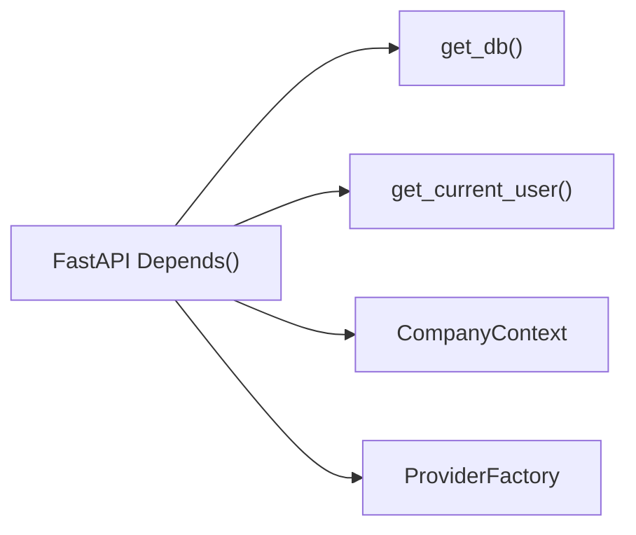

### 5.10 Configuration Management

Configuration is managed through Pydantic Settings (`backend/app/core/config.py`), loading from environment variables and `.env` files.

**Configuration Categories:**

| Category | Settings |
|----------|----------|
| **Application** | `PROJECT_NAME`, `ENVIRONMENT`, `VERSION` |
| **Security** | `MISSIONCONTROL_SECRET_KEY` (Fernet key) |
| **PostgreSQL** | `DB`, `USER`, `PASSWORD`, `HOST`, `PORT` |
| **Redis** | `REDIS_HOST`, `REDIS_PORT` |
| **SQLAlchemy** | `SQL_ECHO`, `SQL_POOL_SIZE`, `SQL_MAX_OVERFLOW` |
| **Remote Ops** | SSH/WinRM timeouts, retry counts, pool sizes |
| **Active Directory** | Server, port, SSL, credentials, base DN |
| **Microsoft 365** | Tenant ID, client ID, client secret |
| **Zabbix** | URL, credentials, SSL, timeout, retries |
| **API** | `CORS_ORIGINS` |

**Computed Properties:**

- `database_url` — Full PostgreSQL connection string
- `redis_url` — Full Redis connection string
- `cors_origins` — Parsed CORS origins list

### 5.11 Error Handling

Mission Control employs defense-in-depth error handling:

1. **Router Layer** — Input validation via Pydantic schemas, HTTP status codes
2. **Service Layer** — Business rule enforcement, `HTTPException` for domain errors
3. **Repository Layer** — Database error propagation
4. **Provider Layer** — External system failures caught and wrapped
5. **Dashboard Aggregation** — Every provider call wrapped in try/except with safe defaults

**Error Response Format:**

```json
{
    "detail": "Resource not found",
    "status_code": 404
}
```

### 5.12 Multi-Tenancy in the Backend

Multi-tenancy is enforced at multiple layers:

1. **HTTP Headers** — `X-Company-Id` and `X-Site-Id` extracted by `CompanyContext`
2. **Repository Queries** — All queries filter by `company_id` and `site_id`
3. **Database Columns** — Every major table includes `company_id` and `site_id` columns
4. **User Scoping** — Users are assigned to companies and sites
5. **Role Hierarchy** — `global_admin` can access all tenants; other roles are scoped

---

## 6. Frontend Architecture

### 6.1 Windows Admin Center Inspired UI

Mission Control's frontend is inspired by Microsoft's Windows Admin Center (WAC) design language:

- **Dark theme** with deep blues, grays, and accent colors
- **Collapsible sidebar** with grouped navigation
- **TopBar with breadcrumb navigation**
- **StatusBar** showing system clock and version
- **Card-based dashboard** with status badges and gauges
- **Data tables** with search, filter, and pagination
- **Consistent page patterns** — every page follows Header → Content → Actions layout

### 6.2 Application Shell

The application shell is defined by `AppLayout.tsx`, which composes:

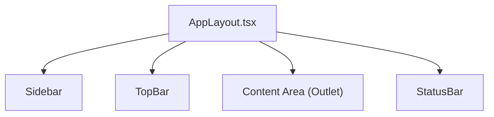

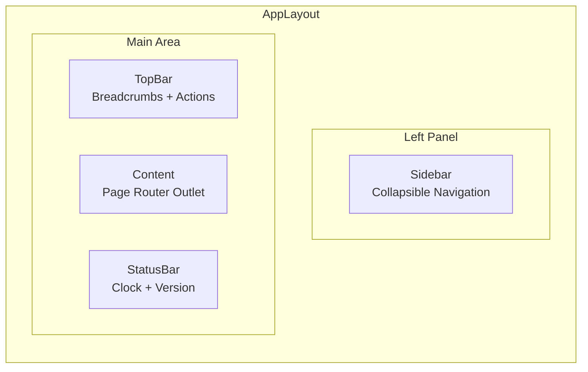

### 6.3 Layouts

**`AppLayout.tsx`** — The primary layout component:
- Renders `Sidebar`, `TopBar`, content `<Outlet />`, and `StatusBar`
- Manages sidebar collapse state via `SidebarContext`
- Wraps authenticated routes

**`Sidebar.tsx`** — Collapsible navigation panel:
- Reads navigation groups from `config/navigation.ts`
- Renders `NavGroup` and `NavItem` components
- Shows `UserBadge` with current user info
- Persists collapse state in `SidebarContext`

**`TopBar.tsx`** — Top navigation bar:
- Displays `Breadcrumb` component based on current route
- Shows page-level actions (configurable per page)

**`StatusBar.tsx`** — Bottom status bar:
- Real-time clock display
- Application version
- Connection status indicator

### 6.4 Sidebar Navigation

The sidebar organizes navigation into 12 groups:

| Group | Items | Pages |
|-------|-------|-------|
| Dashboard | 1 | Dashboard |
| Tenants/Companies | 1 | Companies, Company Detail |
| Infrastructure | 5 | Overview, System, Docker, Git, Health |
| Remote Operations | 7 | Hosts, Credentials, Console, Execute, Quick Commands, History, Files |
| Identity | 3 | Overview, Active Directory, Microsoft 365 |
| Monitoring/Zabbix | 11 | Overview, Hosts, Problems, Triggers, Events, Host Groups, Templates, Items, Maps, Dashboards, Health |
| Hyper-V | 7 | Overview, Virtual Machines, Networks, Storage, Checkpoints, Replication, Health |
| Proxmox VE | 9 | Overview, Health, Nodes, VMs, Containers, Storage, Networks, Snapshots, Tasks |
| AI Operations | 6 | Overview, Recommendations, Incident Analysis, Correlations, Health Score, History |
| Agents | 1 | Agents Overview, Agent Detail |
| Automation | 7 | Overview, Playbooks, Playbook Detail, Executions, Approvals, Schedules, Triggers, Audit |
| Settings | 5 | General, Users, Integrations, Appearance, About |

### 6.5 TopBar and Breadcrumbs

The `Breadcrumb` component generates navigation trails from the current route path. It reads the URL segments and maps them to human-readable labels using a lookup table.

### 6.6 Status Bar

The `StatusBar` displays:
- Current date and time (real-time updating)
- Application version (from `VERSION` file)
- Connection status
- Custom status messages (configurable)

### 6.7 Dashboard

The Dashboard is the application's landing page, composed of card-based widgets:

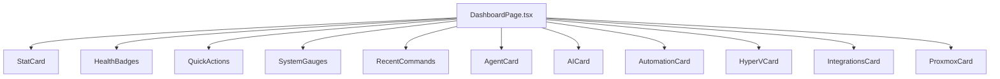

Each card is a self-contained component that fetches data from a specific API endpoint and renders a summary view. Cards are designed to degrade gracefully — if a provider is unavailable, the card shows a safe default state.

### 6.8 Pages

Mission Control has 70+ page files organized into 14 groups:

| Group | Pages | File Pattern |
|-------|-------|-------------|
| **Auth** | Login | `pages/auth/LoginPage.tsx` |
| **Dashboard** | Dashboard | `pages/DashboardPage.tsx` |
| **Infrastructure** | Overview, System, Docker, Git, Health | `pages/infrastructure/*.tsx` |
| **Remote** | Hosts, Credentials, Console, Execute, QuickCommands, History, Files | `pages/remote/*.tsx` |
| **Identity** | Overview, ActiveDirectory, Microsoft365 | `pages/identity/*.tsx` |
| **Zabbix** | Overview, Hosts, Problems, Triggers, Events, HostGroups, Templates, Items, Maps, Dashboards, Health | `pages/zabbix/*.tsx` |
| **Hyper-V** | Overview, VirtualMachines, Networks, Storage, Checkpoints, Replication, Health | `pages/hyperv/*.tsx` |
| **Proxmox** | Overview, Health, Nodes, VirtualMachines, Containers, Storage, Networks, Snapshots, Tasks | `pages/proxmox/*.tsx` |
| **AI** | Overview, Recommendations, IncidentAnalysis, Correlations, HealthScore, History | `pages/ai/*.tsx` |
| **Agents** | Overview, Detail | `pages/agents/*.tsx` |
| **Automation** | Overview, Playbooks, PlaybookDetail, Executions, Approvals, Schedules, Triggers, Audit | `pages/automation/*.tsx` |
| **Companies** | Companies, CompanyDetail | `pages/companies/*.tsx` |
| **Settings** | General, Users, Integrations, Appearance, About | `pages/settings/*.tsx` |
| **Placeholder** | Placeholder | `pages/PlaceholderPage.tsx` |

### 6.9 Components

**Common Components** (`components/common/`):

| Component | Purpose |
|-----------|---------|
| `DataTable` | Reusable data table with sorting, pagination, search |
| `EmptyState` | Empty state display with icon and message |
| `LoadingButton` | Button with loading spinner state |
| `PageHeader` | Consistent page header with title and actions |
| `SearchInput` | Debounced search input |
| `StatusBadge` | Color-coded status indicator |

**Dashboard Components** (`components/dashboard/`):

| Component | Purpose |
|-----------|---------|
| `StatCard` | Metric card with value, label, trend |
| `HealthBadges` | System health status badges |
| `QuickActions` | Common action buttons |
| `SystemGauges` | CPU, memory, disk usage gauges |
| `RecentCommands` | Last executed commands list |
| `AgentCard` | Agent fleet status summary |
| `AICard` | AI insights summary |
| `AutomationCard` | Automation status summary |
| `HyperVCard` | Hyper-V fleet status |
| `IntegrationsCard` | Integration status summary |
| `ProxmoxCard` | Proxmox fleet status |

**Modal Components** (`components/modals/`):

| Component | Purpose |
|-----------|---------|
| `HostModal` | Create/edit remote host |
| `CredentialModal` | Create/edit credential profile |
| `ZabbixConfigModal` | Zabbix integration configuration |
| `HypervConfigModal` | Hyper-V integration configuration |
| `ProxmoxConfigModal` | Proxmox integration configuration |
| `ADConfigModal` | Active Directory configuration |
| `M365ConfigModal` | Microsoft 365 configuration |

### 6.10 Services (API Clients)

Frontend API services use the native `fetch` API with relative paths. There are 14 service files:

| Service | File | API Domain |
|---------|------|------------|
| Dashboard | `services/api.ts` | `/api/v1/dashboard` |
| Auth | `services/auth.ts` | `/api/v1/auth` |
| Remote | `services/remote.ts` | `/api/v1/remote` |
| Files | `services/files.ts` | `/api/v1/remote/files` |
| Agents | `services/agents.ts` | `/api/v1/agents` |
| AI | `services/ai.ts` | `/api/v1/ai` |
| Automation | `services/automation.ts` | `/api/v1/automation` |
| Companies | `services/company.ts` | `/api/v1/companies` |
| Users | `services/users.ts` | `/api/v1/auth` |
| Identity | `services/identity.ts` | `/api/v1/identity` |
| Integrations | `services/integrations.ts` | `/api/v1/integrations` |
| Zabbix | `services/zabbix.ts` | `/api/v1/zabbix` |
| Hyper-V | `services/hyperv.ts` | `/api/v1/hyperv` |
| Proxmox | `services/proxmox.ts` | `/api/v1/proxmox` |

### 6.11 Contexts (State Management)

Mission Control uses React Context for state management:

| Context | File | Purpose |
|---------|------|---------|
| `AuthContext` | `contexts/AuthContext.tsx` | Authentication state, login/logout, token management |
| `SidebarContext` | `contexts/SidebarContext.tsx` | Sidebar collapse/expand state |
| `ToastContext` | `contexts/ToastContext.tsx` | Toast notification state and methods |

### 6.12 Routing

Routing is managed by react-router-dom v7, defined in `App.tsx`:

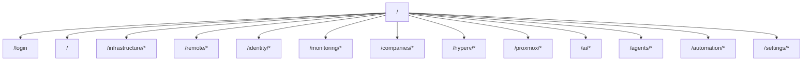

- `/login` — Login page (outside AppLayout, no auth required)
- All other routes require authentication (wrapped in `AuthContext`)
- Routes use nested `<Outlet />` for sub-page rendering
- Catch-all route redirects to Dashboard

### 6.13 Styling

The frontend uses a combination of:

- **Tailwind CSS 3.4.10** — Utility classes for layout and spacing
- **Custom CSS** — `styles.css` (2,425 lines) defining the dark theme with CSS custom properties
- **CSS Variables** — Theme colors defined as `--mc-*` custom properties for consistency

---

## 7. Database Architecture

### 7.1 Database Engine

Mission Control uses **PostgreSQL 16** as its primary database, accessed via SQLAlchemy 2.0 ORM with the `psycopg` synchronous driver.

**Key Configuration:**

| Setting | Value |
|---------|-------|
| Engine | PostgreSQL 16 Alpine |
| ORM | SQLAlchemy 2.0+ |
| Driver | psycopg (sync) |
| Pool Size | 10 connections |
| Max Overflow | 20 connections |
| Pool Pre-ping | Enabled |
| Migrations | Alembic (21 migrations) |

### 7.2 Entity Relationship Diagram

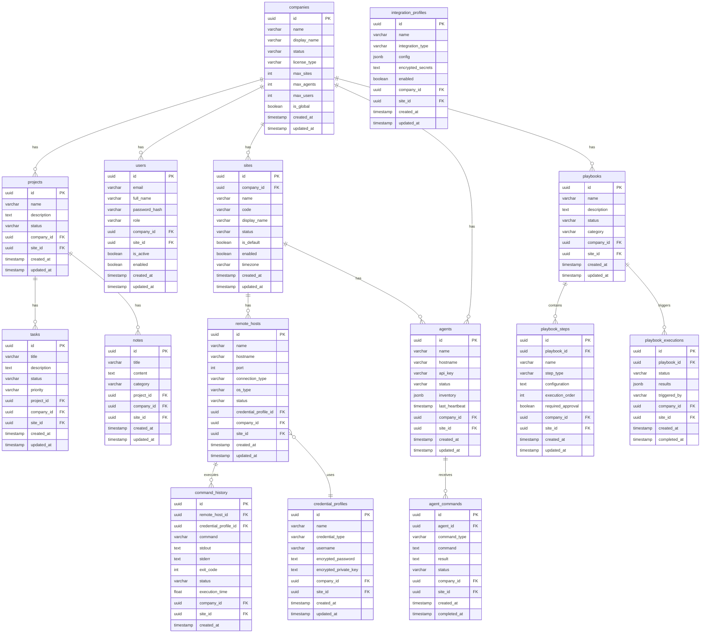

### 7.3 Core Domain Tables

**Projects, Tasks, Notes, Resumes, Parking Lot:**

These tables support the project management and operational context features:

| Table | Purpose | Key Fields |
|-------|---------|------------|
| `projects` | Work tracking projects | name, description, status |
| `tasks` | Tasks linked to projects | title, description, status, priority, project_id |
| `notes` | Operational documentation | title, content, category, project_id |
| `resumes` | Work resumption context | title, content, context_type |
| `parking_lot` | Backlog items | title, description, category, priority, status |

### 7.4 Multi-Tenant Tables

| Table | Purpose | Key Fields |
|-------|---------|------------|
| `companies` | Tenant organizations | name, status, license_type, max_sites/agents/users, is_global |
| `sites` | Organizational units | name, code, company_id, is_default, timezone |
| `users` | Authentication users | email, password_hash, role, company_id, site_id |

### 7.5 Remote Operations Tables

| Table | Purpose | Key Fields |
|-------|---------|------------|
| `remote_hosts` | Managed servers | hostname, port, connection_type, os_type, credential_profile_id |
| `credential_profiles` | Encrypted credentials | name, credential_type, username, encrypted_password, encrypted_private_key |
| `command_history` | Execution audit trail | command, stdout, stderr, exit_code, execution_time |
| `command_templates` | Reusable command library | name, command, category, connection_type |
| `scheduled_commands` | Cron-based scheduling | cron_expression, remote_host_id, enabled |

### 7.6 Agent Tables

| Table | Purpose | Key Fields |
|-------|---------|------------|
| `agents` | Registered agent instances | name, hostname, api_key, status, inventory, last_heartbeat |
| `agent_commands` | Commands dispatched to agents | command_type, command, result, status |
| `agent_registration_tokens` | One-time registration tokens | token, used, enabled, expires_at |

### 7.7 Automation Tables

| Table | Purpose | Key Fields |
|-------|---------|------------|
| `playbooks` | Automation workflow definitions | name, description, status, category |
| `playbook_steps` | Individual workflow steps | name, step_type, configuration, execution_order |
| `playbook_variables` | Dynamic variables | name, value, var_type, required |
| `playbook_executions` | Execution records | status, results, triggered_by |
| `playbook_schedules` | Cron-based scheduling | cron_expression, enabled |
| `approval_workflows` | Approval gate definitions | name, approver_role, required |
| `approval_requests` | Individual approval requests | status, approver_id, comments |
| `event_triggers` | Event-based triggers | event_type, conditions, enabled |
| `audit_trail` | Immutable audit records | action, entity_type, entity_id, details, user_id |
| `execution_logs` | Step-level execution logs | status, output, error, execution_time |

### 7.8 Identity Tables

| Table | Purpose | Key Fields |
|-------|---------|------------|
| `integration_profiles` | External system configurations | name, integration_type, config, encrypted_secrets |

Integration profiles store configuration for: Zabbix, Active Directory, Microsoft 365, Hyper-V, Proxmox, and future integrations.

### 7.9 Relationships and Foreign Keys

**Cascade Rules:**

| Parent | Child | FK Column | On Delete |
|--------|-------|-----------|-----------|
| `projects` | `tasks` | `project_id` | CASCADE |
| `projects` | `notes` | `project_id` | CASCADE |
| `remote_hosts` | `command_history` | `remote_host_id` | CASCADE |
| `remote_hosts` | `scheduled_commands` | `remote_host_id` | CASCADE |
| `agents` | `agent_commands` | `agent_id` | CASCADE |
| `playbooks` | `playbook_steps` | `playbook_id` | CASCADE |
| `playbooks` | `playbook_executions` | `playbook_id` | CASCADE |
| `playbook_executions` | `execution_logs` | `execution_id` | CASCADE |
| `playbook_executions` | `approval_requests` | `execution_id` | CASCADE |
| `remote_hosts` | `credential_profiles` | `credential_profile_id` | SET NULL |
| `command_history` | `credential_profiles` | `credential_profile_id` | SET NULL |

### 7.10 Migration Strategy

Mission Control uses **Alembic** for database migration management with 21 migrations covering the complete schema evolution:

```mermaid
graph LR
    M1["Initial Schema<br/>(Projects)"] --> M2["Tasks"]
    M2 --> M3["Notes"]
    M3 --> M4["Resumes"]
    M4 --> M5["Parking Lot"]
    M5 --> M6["Users"]
    M6 --> M7["Remote Operations"]
    M7 --> M8["Integration Profiles"]
    M8 --> M9["Templates & Schedules"]
    M9 --> M10["Agents"]
    M10 --> M11["Agent Tokens"]
    M11 --> M12["Automation & Playbooks"]
    M12 --> M13["Sites"]
    M13 --> M14["Companies"]
    M14 --> M15["Tenant Isolation"]
    M15 --> M16["Encrypted Credentials"]
    M16 --> M17["Performance Indexes"]
```

**Migration Rules:**

1. Migrations are forward-only (no downgrades in production)
2. `entrypoint.sh` runs `alembic upgrade head` on startup
3. Fallback: `alembic stamp head` if migration fails (non-blocking startup)
4. Each migration is idempotent-safe
5. Migrations use `op.execute()` for DDL and `op.bulk_insert()` for seed data

### 7.11 Future Growth

Planned database evolution:

| Future Feature | Tables | Migration |
|---------------|--------|-----------|
| Plugin Framework | `plugins`, `plugin_configs` | Pending |
| Remote Desktop Sessions | `rdp_sessions`, `rdp_recordings` | Pending |
| SSO/OAuth | `oauth_providers`, `oauth_tokens` | Pending |
| Multi-Factor Auth | `mfa_factors`, `mfa_challenges` | Pending |
| Workflow Engine | `workflow_definitions`, `workflow_states` | Pending |
| Notification System | `notifications`, `notification_rules` | Pending |
| Reporting | `report_definitions`, `report_executions` | Pending |

---

## 8. Authentication and Authorization

### 8.1 Users

The `User` model represents authenticated users of Mission Control:

| Field | Type | Description |
|-------|------|-------------|
| `id` | UUID | Unique identifier |
| `email` | VARCHAR | Login email (unique) |
| `full_name` | VARCHAR | Display name |
| `password_hash` | VARCHAR | PBKDF2-SHA256 hashed password |
| `role` | VARCHAR | RBAC role |
| `company_id` | UUID (FK) | Tenant assignment |
| `site_id` | UUID (FK) | Site assignment |
| `is_active` | BOOLEAN | Account active flag |
| `enabled` | BOOLEAN | Account enabled flag |

### 8.2 Roles

Mission Control implements a hierarchical role-based access control (RBAC) system:

| Role | Level | Capabilities |
|------|-------|-------------|
| `global_admin` | 5 | Full platform access, view/switch all companies and sites, user management across tenants |
| `company_admin` | 4 | Manage company and all sites, user CRUD within company, integration management |
| `site_admin` | 3 | Manage assigned sites, remote operations, monitoring, virtualization within site |
| `operator` | 2 | Execute commands, run playbooks, view dashboards within scope |
| `readonly` | 1 | Read-only access to all resources within scope |

**Role Enforcement:**

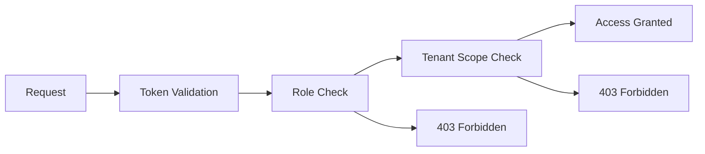

### 8.3 Permissions

Permissions are enforced at multiple layers:

1. **Router Level** — Auth dependency checks token validity
2. **Service Level** — Role hierarchy checked for admin operations
3. **Repository Level** — Tenant scoping filters data
4. **Provider Level** — Provider access checked for external systems

**Endpoint Authorization Matrix:**

| Operation | global_admin | company_admin | site_admin | operator | readonly |
|-----------|:---:|:---:|:---:|:---:|:---:|
| View Dashboard | Yes | Yes | Yes | Yes | Yes |
| Execute Commands | Yes | Yes | Yes | Yes | No |
| Manage Hosts | Yes | Yes | Yes | No | No |
| Manage Credentials | Yes | Yes | Yes | No | No |
| Manage Users | Yes | Yes | No | No | No |
| Manage Companies | Yes | No | No | No | No |
| Manage Integrations | Yes | Yes | No | No | No |
| Run Playbooks | Yes | Yes | Yes | Yes | No |
| Approve Playbooks | Yes | Yes | Yes | No | No |
| View Audit Trail | Yes | Yes | Yes | No | No |

### 8.4 Credential Profiles

Credential Profiles store encrypted connection credentials:

| Field | Type | Description |
|-------|------|-------------|
| `id` | UUID | Unique identifier |
| `name` | VARCHAR | Human-readable name |
| `credential_type` | VARCHAR | ssh_key, password, winrm |
| `username` | VARCHAR | Connection username |
| `encrypted_password` | TEXT | Fernet-encrypted password |
| `encrypted_private_key` | TEXT | Fernet-encrypted SSH private key |
| `passphrase` | VARCHAR | Key passphrase (if applicable) |
| `company_id` | UUID (FK) | Tenant scope |
| `site_id` | UUID (FK) | Site scope |

**Encryption Flow:**

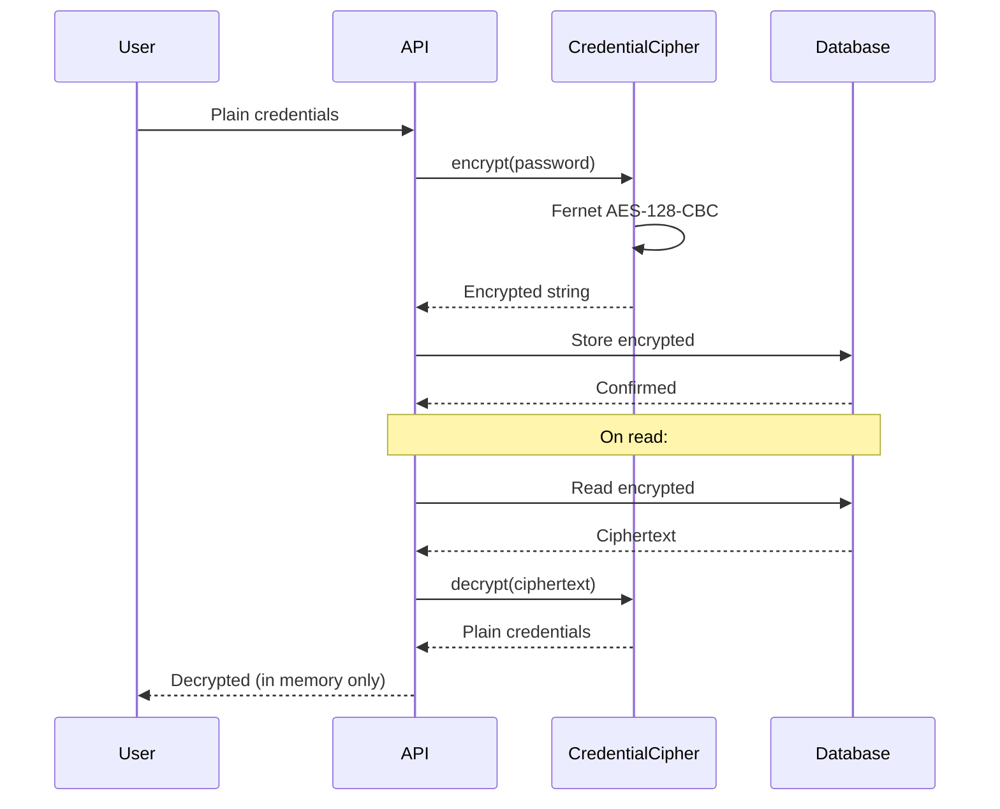

### 8.5 Token Lifecycle

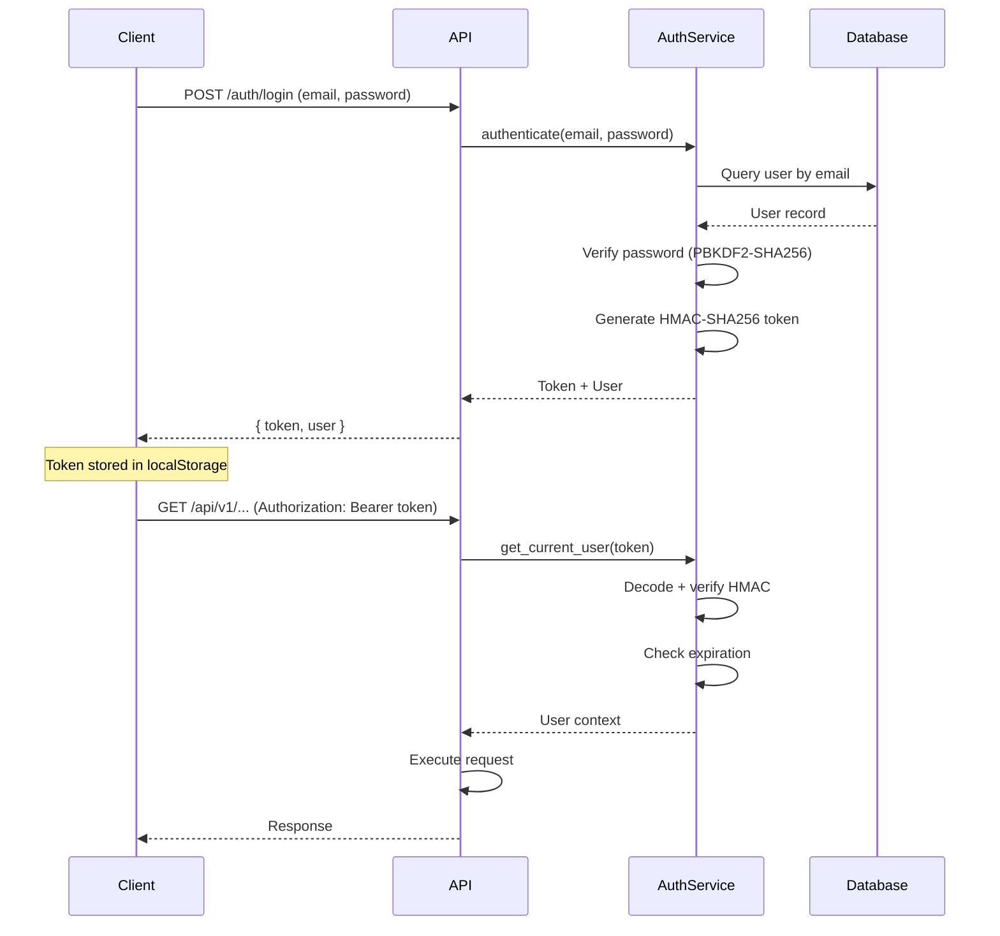

**Token Properties:**

| Property | Value |
|----------|-------|
| Algorithm | HMAC-SHA256 |
| Payload | user_id, role, company_id, site_id, iat, exp |
| Expiry | 480 minutes (8 hours) |
| Secret | `MISSIONCONTROL_SECRET_KEY` (Fernet key) |
| Header | `Authorization: Bearer <token>` |

### 8.6 Password Security

| Component | Implementation |
|-----------|---------------|
| Hashing Algorithm | PBKDF2-SHA256 |
| Iterations | 260,000 |
| Salt | Per-user random salt |
| Storage | `password_hash` field (combined salt:hash) |

### 8.7 Future SSO

**Planned for Version 3:**

- SAML 2.0 integration for enterprise SSO
- Support for Okta, Azure AD, OneLogin
- Service Provider (SP) configuration
- Just-In-Time (JIT) user provisioning

### 8.8 Future OAuth

**Planned for Version 3:**

- OAuth 2.0 / OpenID Connect support
- Authorization Code flow with PKCE
- Support for Google, GitHub, Microsoft identity providers
- Token refresh and revocation

### 8.9 Future MFA

**Planned for Version 4:**

- TOTP (Time-based One-Time Password) support
- WebAuthn / FIDO2 hardware key support
- Backup codes
- Per-user MFA enforcement policies

---

## 9. Provider Framework

### 9.1 Provider Pattern Overview

The Provider Framework is one of the most critical architectural patterns in Mission Control. It abstracts every external system integration behind a common interface, enabling:

- **Development without external dependencies** — Mock providers for local development
- **Testing isolation** — Tests use mock providers, never touching real systems
- **Clean architecture** — Services never directly call external APIs
- **Runtime flexibility** — Swap implementations based on configuration

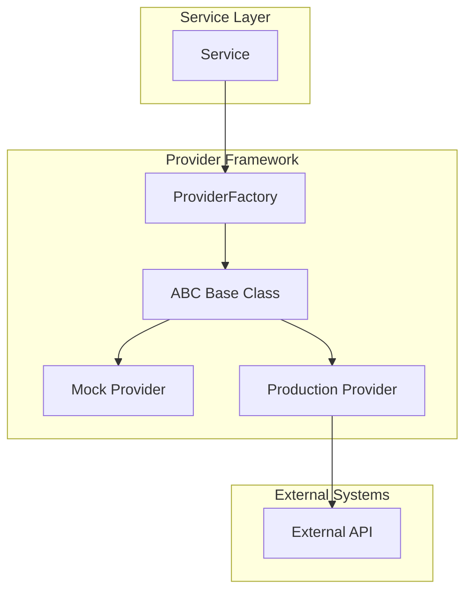

### 9.2 ABC Base Classes

Each provider domain defines an Abstract Base Class (ABC) that specifies the contract:

**Remote Operations Base:**

```python
class RemoteBaseProvider(ABC):
    @abstractmethod
    async def test_connection(self, host, port, credentials) -> bool: ...

    @abstractmethod
    async def execute_command(self, host, port, credentials, command) -> CommandResult: ...

    @abstractmethod
    async def upload_file(self, host, port, credentials, local_path, remote_path) -> bool: ...

    @abstractmethod
    async def download_file(self, host, port, credentials, remote_path, local_path) -> bool: ...

    @abstractmethod
    async def list_directory(self, host, port, credentials, path) -> list: ...

    @abstractmethod
    async def create_directory(self, host, port, credentials, path) -> bool: ...

    @abstractmethod
    async def delete_file(self, host, port, credentials, path) -> bool: ...
```

### 9.3 Mock Providers

Mock providers return realistic-looking data without touching external systems:

```python
class MockZabbixProvider(ZabbixBaseProvider):
    async def get_hosts(self):
        return [
            {"hostid": "10001", "name": "web-server-01", "status": "0"},
            {"hostid": "10002", "name": "db-server-01", "status": "0"},
            {"hostid": "10003", "name": "app-server-01", "status": "1"},
        ]
```

**Benefits:**
- Frontend development without Zabbix/AD/Hyper-V/Proxmox servers
- Deterministic test results
- No external dependencies for CI/CD
- Faster development iteration

### 9.4 Production Providers

Production providers implement real integrations:

| Domain | Provider | Library | Protocol |
|--------|----------|---------|----------|
| SSH | `SSHProvider` | Paramiko | SSH/SFTP |
| WinRM | `WinRMProvider` | PyWinRM | WinRM/HTTPS |
| Zabbix | `ApiZabbixProvider` | requests | JSON-RPC |
| Hyper-V | `HyperVPowerShellProvider` | WinRM/SSH | PowerShell |
| Proxmox | `ProxmoxRESTProvider` | httpx | REST API |
| AD | `LDAPActiveDirectoryProvider` | ldap3 | LDAP/LDAPS |
| M365 | `GraphMicrosoft365Provider` | httpx | Microsoft Graph |
| Docker | `DockerSdkProvider` | docker | Docker Engine API |
| Ollama | `OllamaProvider` | httpx | Ollama API |
| OpenAI | `OpenAIProvider` | httpx | OpenAI API |

### 9.5 Factory Pattern

Provider factories use the Singleton pattern with lazy initialization:

```python
_hyperv_provider = None

def get_hyperv_provider() -> HyperVBaseProvider:
    global _hyperv_provider
    if _hyperv_provider is None:
        config = get_hyperv_config()
        if config.get("use_mock", True):
            _hyperv_provider = MockHyperVProvider()
        else:
            _hyperv_provider = HyperVPowerShellProvider(config)
    return _hyperv_provider

def reset_hyperv_provider():
    global _hyperv_provider
    _hyperv_provider = None
```

**Factory Pattern Features:**

- **Lazy initialization** — Provider created on first access
- **Singleton caching** — Single instance reused across requests
- **Reset capability** — `reset_*_provider()` functions clear cached instances
- **Config-driven** — Factory reads configuration to decide mock vs production
- **Graceful fallback** — Falls back to mock if production config is missing

### 9.6 Dependency Injection

Providers are injected into services via factory functions:

```python
class ZabbixService:
    def __init__(self, db: Session):
        self.db = db
        self.provider = get_zabbix_provider()  # Factory injection

    async def get_hosts(self, company_id, site_id):
        return await self.provider.get_hosts()
```

### 9.7 Provider Advantages

| Advantage | Description |
|-----------|-------------|
| **Testability** | Mock providers enable unit testing without external systems |
| **Development Speed** | Frontend development proceeds independently of backend integrations |
| **Configuration Flexibility** | Runtime switching between mock and production |
| **Error Isolation** | External system failures don't crash the application |
| **Performance** | Singleton caching prevents redundant connection setup |
| **Security** | Provider abstraction prevents credential leakage between layers |

### 9.8 Provider Catalog

| Domain | Base Class | Providers | Factory |
|--------|-----------|-----------|---------|
| Remote | `RemoteBaseProvider` | SSH, WinRM | `ProviderFactory` |
| Zabbix | `ZabbixBaseProvider` | API, Mock | `provider_factory` |
| Hyper-V | `HyperVBaseProvider` | PowerShell, Mock | `provider_factory` |
| Proxmox | `ProxmoxBaseProvider` | REST, Mock | `provider_factory` |
| Identity AD | `IdentityBaseProvider` | LDAP, Mock | `provider_factory` |
| Identity M365 | `IdentityBaseProvider` | Graph, Mock | `provider_factory` |
| Automation | `AutomationProvider` | SSH, WinRM, Bash, PowerShell, HTTP, Agent, Hyper-V, Proxmox | `provider_factory` |
| Docker | `DockerProvider` | SDK | `factory` |
| AI | `AIProvider` | Ollama, OpenAI, Azure, Anthropic, Local, RuleBased | `AIProviderFactory` |

---

## 10. Mission Control Agent

### 10.1 Agent Architecture

The Mission Control Agent is a lightweight daemon deployed on managed servers. It provides the server with bidirectional communication with the Mission Control platform.

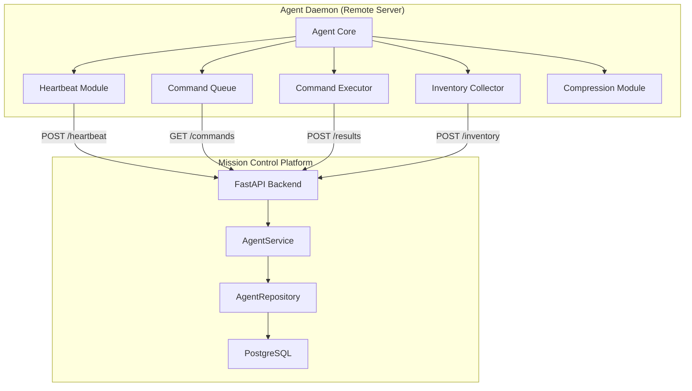

### 10.2 Registration

Agent registration follows a secure token-based workflow:

```mermaid
sequenceDiagram
    participant ADMIN as Admin
    participant API as API
    participant DB as Database
    participant AGENT as Agent Daemon

    ADMIN->>API: Create registration token
    API->>DB: Store token (company_id, site_id)
    API-->>ADMIN: One-time token

    Note over ADMIN,AGENT: Token securely delivered to agent server

    AGENT->>API: POST /agents/register (token, hostname, inventory)
    API->>DB: Validate token (not used, not expired)
    API->>DB: Create agent record
    API->>DB: Mark token as used
    API->>DB: Generate API key
    API-->>AGENT: API key + agent_id
    
    Note over AGENT: Agent stores API key for future auth
```

### 10.3 Authentication

Registered agents authenticate using an API key:

```
Authorization: Bearer <agent_api_key>
```

The API key is generated during registration and stored both on the agent and in the `agents` table.

### 10.4 Heartbeat

Agents send regular heartbeats to signal liveness:

```mermaid
sequenceDiagram
    participant AGENT as Agent
    participant API as Platform

    loop Every 30 seconds
        AGENT->>API: POST /agents/{id}/heartbeat
        Note right of API: Update last_heartbeat
        API-->>AGENT: OK + pending commands
    end
```

**Heartbeat Response includes:**
- Acknowledgment
- Pending commands (if any)
- Platform configuration updates
- Agent update notifications

### 10.5 Command Queue

Commands are dispatched to agents via a polling model:

```mermaid
sequenceDiagram
    participant ADMIN as Admin
    participant API as Platform
    participant DB as Database
    participant AGENT as Agent

    ADMIN->>API: POST /agents/{id}/commands
    API->>DB: Store command (status: pending)
    API-->>ADMIN: Command queued

    loop Agent heartbeat
        AGENT->>API: GET /agents/{id}/commands?status=pending
        API->>DB: Query pending commands
        DB-->>API: Command list
        API-->>AGENT: Commands to execute
    end

    AGENT->>AGENT: Execute command
    AGENT->>API: POST /agents/{id}/commands/{cmd_id}/result
    API->>DB: Update command (status: completed, result)
    API-->>AGENT: Acknowledged
```

### 10.6 Command Execution

The agent supports multiple command types:

| Type | Description |
|------|-------------|
| `shell` | Execute shell commands (bash/sh) |
| `powershell` | Execute PowerShell commands |
| `script` | Execute multi-line scripts |
| `file_transfer` | Upload/download files |
| `inventory` | Collect system inventory |
| `update` | Self-update agent binary |

### 10.7 Inventory Collection

Agents collect and report system inventory:

```json
{
    "hostname": "web-server-01",
    "os": "Ubuntu 22.04 LTS",
    "kernel": "5.15.0-91-generic",
    "cpu": {
        "cores": 8,
        "model": "Intel Xeon E5-2680",
        "usage_percent": 34.2
    },
    "memory": {
        "total_gb": 32.0,
        "used_gb": 18.5,
        "usage_percent": 57.8
    },
    "disk": [
        {"mount": "/", "total_gb": 500, "used_gb": 234, "usage_percent": 46.8}
    ],
    "network": [
        {"interface": "eth0", "ip": "10.0.1.100", "mac": "00:1a:2b:3c:4d:5e"}
    ],
    "uptime_seconds": 864000,
    "agent_version": "0.1.0"
}
```

### 10.8 Agent Updates

The platform can push update commands to agents:

1. Admin triggers update via dashboard
2. Platform queues `update` command with new version URL
3. Agent downloads and verifies the update
4. Agent restarts with new version
5. Agent reports new version in next heartbeat

### 10.9 Data Compression

All agent communication uses gzip compression:

- **Request bodies** — gzip compressed before transmission
- **Response bodies** — gzip compressed by the platform
- **Inventory data** — Compressed for efficient transfer
- **Command results** — Compressed, especially for large outputs

**Compression headers:**

```
Content-Encoding: gzip
Content-Type: application/json
```

### 10.10 Offline Support

When an agent loses connectivity:

1. **Command Queue** — Commands are queued locally on the agent
2. **Retry Logic** — Agent retries connection with exponential backoff
3. **Result Buffer** — Execution results are buffered until connectivity is restored
4. **Heartbeat Timeout** — Platform marks agent as "offline" after missing 3 heartbeats
5. **Reconnection** — Agent resynchronizes state on reconnection

### 10.11 Future Plugins

**Planned for Version 3:**

- Agent plugin system for custom inventory collectors
- Plugin SDK for extending agent capabilities
- Hot-reload of agent plugins without restart
- Plugin marketplace for community contributions

### 10.12 Future Platform Support

| Platform | Status | Priority |
|----------|--------|----------|
| **Linux** | Planned (Python daemon) | High |
| **Windows** | Planned (PowerShell/Python) | High |
| **macOS** | Planned (Python daemon) | Medium |

---

## 11. Remote Operations

### 11.1 SSH Operations

The SSH provider uses **Paramiko** for remote server management:

**Capabilities:**

| Feature | Implementation |
|---------|---------------|
| Command Execution | `exec_command()` with timeout |
| File Upload | SFTP `put()` |
| File Download | SFTP `get()` |
| Directory Listing | SFTP `listdir()` |
| Directory Creation | SFTP `mkdir()` |
| File Deletion | SFTP `remove()` |
| Streaming Console | `invoke_shell()` with real-time I/O |
| Connection Pooling | Per-host connection cache |
| Retry Logic | One retry for transient failures |

**SSH Connection Flow:**

```mermaid
sequenceDiagram
    participant SVC as RemoteService
    participant FACTORY as ProviderFactory
    participant SSH as SSHProvider
    participant HOST as Remote Host

    SVC->>FACTORY: get_remote_provider("ssh")
    FACTORY-->>SVC: SSHProvider instance
    SVC->>SSH: test_connection(host, port, creds)
    SSH->>HOST: TCP connect + SSH handshake
    SSH->>HOST: Authenticate (key/password)
    HOST-->>SSH: Auth success
    SSH-->>SVC: Connection OK

    SVC->>SSH: execute_command(host, port, creds, cmd)
    SSH->>HOST: exec_command(cmd)
    HOST-->>SSH: stdout + stderr + exit_code
    SSH-->>SVC: CommandResult
```

### 11.2 WinRM Operations

The WinRM provider uses **PyWinRM** for Windows remote management:

**Capabilities:**

| Feature | Implementation |
|---------|---------------|
| Command Execution | `run_cmd()` / `run_ps()` |
| PowerShell Execution | `run_ps()` with encoded commands |
| File Upload | Base64-encoded PowerShell transfer |
| Authentication | NTLM, Basic, HTTPS client cert |
| Retry Logic | Configurable retry count |
| Timeouts | Configurable connect and read timeouts |

### 11.3 Credential Vault

Mission Control implements a credential vault using Fernet encryption:

**Encryption Stack:**

| Layer | Technology |
|-------|-----------|
| Algorithm | AES-128-CBC |
| Authentication | HMAC-SHA256 |
| Implementation | Python `cryptography` library |
| Key Source | `MISSIONCONTROL_SECRET_KEY` environment variable |
| Key Format | URL-safe base64-encoded 32-byte key |

**Encrypted Fields:**

| Model | Fields |
|-------|--------|
| `CredentialProfile` | `encrypted_password`, `encrypted_private_key` |
| `IntegrationProfile` | `encrypted_secrets` |

### 11.4 Command Templates

Command templates provide a reusable library of frequently executed commands:

| Field | Description |
|-------|-------------|
| `name` | Human-readable template name |
| `description` | What the command does |
| `command` | The command string |
| `category` | Organizational category |
| `connection_type` | ssh or winrm |

### 11.5 Scheduling

Scheduled commands use cron expressions for recurring execution:

| Field | Description |
|-------|-------------|
| `name` | Schedule name |
| `command` | Command to execute |
| `cron_expression` | Standard cron format |
| `remote_host_id` | Target host |
| `credential_profile_id` | Credentials to use |
| `enabled` | Active/inactive flag |

**Cron Expression Examples:**

```
0 2 * * *        # Daily at 2:00 AM
0 */6 * * *      # Every 6 hours
0 9 * * 1-5      # Weekdays at 9:00 AM
0 0 1 * *        # Monthly on the 1st
```

### 11.6 Bulk Execution

Bulk execution allows running commands across multiple hosts simultaneously:

```mermaid
sequenceDiagram
    participant U as User
    participant API as API
    participant SVC as RemoteService
    participant P1 as SSH Provider
    participant P2 as WinRM Provider
    participant H1 as Host 1
    participant H2 as Host 2

    U->>API: Execute on hosts [H1, H2]
    API->>SVC: bulk_execute(command, hosts)
    
    par Parallel Execution
        SVC->>P1: execute_command(H1, cmd)
        P1->>H1: SSH exec
        H1-->>P1: Result
        P1-->>SVC: CommandResult
    and
        SVC->>P2: execute_command(H2, cmd)
        P2->>H2: WinRM exec
        H2-->>P2: Result
        P2-->>SVC: CommandResult
    end
    
    SVC-->>API: AggregatedResults
    API-->>U: All results
```

### 11.7 Command History and Audit

Every remote command execution is recorded in the `command_history` table:

| Field | Description |
|-------|-------------|
| `command` | The executed command |
| `stdout` | Standard output |
| `stderr` | Standard error |
| `exit_code` | Process exit code |
| `execution_time` | Duration in seconds |
| `status` | success/failed/timeout |
| `company_id` | Tenant scope |
| `site_id` | Site scope |

### 11.8 File Transfer

File transfer is supported via:

- **SSH/SFTP** — Native SFTP operations (upload, download, list, create dir, delete)
- **WinRM** — Base64-encoded PowerShell file transfer

### 11.9 Real-Time Console

The real-time console provides interactive terminal sessions:

- **Frontend:** xterm.js renders the terminal UI
- **Backend:** WebSocket connection streams command I/O
- **Protocol:** SSH `invoke_shell()` for interactive sessions

---

## 12. Monitoring

### 12.1 Zabbix Integration

Mission Control integrates with Zabbix as its primary monitoring platform. The integration covers:

| Feature | Zabbix API Method |
|---------|-------------------|
| Host Management | `host.get`, `host.create`, `host.update` |
| Problem Management | `problem.get` |
| Trigger Management | `trigger.get` |
| Event History | `event.get` |
| Host Groups | `hostgroup.get` |
| Templates | `template.get` |
| Items | `item.get` |
| Dashboards | `dashboard.get` |
| Maps | `map.get` |
| Authentication | `user.login` |

### 12.2 Zabbix Architecture

```mermaid
graph TB
    subgraph "Mission Control"
        API["FastAPI"]
        ZSVC["ZabbixService"]
        ZPROV["ApiZabbixProvider"]
    end

    subgraph "Zabbix Server"
        ZAPI["JSON-RPC API"]
        ZDB["Zabbix Database"]
    end

    API --> ZSVC
    ZSVC --> ZPROV
    ZPROV -->|"HTTP/HTTPS"| ZAPI
    ZAPI --> ZDB
```

### 12.3 Zabbix Provider

**`ApiZabbixProvider`** implements the `ZabbixBaseProvider` ABC:

| Method | Description |
|--------|-------------|
| `get_hosts()` | List all monitored hosts |
| `get_host_by_id(hostid)` | Get specific host details |
| `get_problems()` | Get active problems |
| `get_triggers()` | Get trigger definitions |
| `get_events()` | Get event history |
| `get_host_groups()` | Get host group list |
| `get_templates()` | Get template list |
| `get_items(hostid)` | Get items for a host |
| `get_dashboards()` | Get dashboard list |
| `get_maps()` | Get map list |
| `test_connection()` | Verify Zabbix connectivity |

**Authentication:** Session-based with auto-login on expiry.

**Configuration:** Stored in `IntegrationProfile` table (type: `zabbix`), with encrypted API token.

### 12.4 Zabbix Dashboard

The Zabbix integration provides 11 frontend pages:

| Page | Purpose |
|------|---------|
| Overview | Summary of monitoring status |
| Hosts | List all monitored hosts |
| Problems | Active problems with severity |
| Triggers | Trigger definitions and states |
| Events | Historical event log |
| Host Groups | Organizational groups |
| Templates | Template management |
| Items | Custom metrics and data points |
| Maps | Dashboard map visualization |
| Dashboards | Zabbix dashboard views |
| Health | Overall monitoring health |

### 12.5 Future Monitoring Plugins

**Planned for Version 3:**

| Plugin | Purpose |
|--------|---------|
| Prometheus | Metrics collection and alerting |
| Grafana | Dashboard embedding |
| PRTG | Network monitoring |
| Uptime Robot | Uptime monitoring |
| Custom Webhooks | Generic alert ingestion |

---

## 13. Identity Management

### 13.1 Active Directory

The Active Directory integration provides:

| Feature | Description |
|---------|-------------|
| User Enumeration | List AD users with attributes |
| User Details | Get detailed user information |
| User Creation | Create new AD users |
| Password Reset | Reset user passwords |
| Account Lock/Unlock | Manage account lockout status |
| Enable/Disable | Toggle account enabled state |
| Rename Users | Rename AD user accounts |
| Group Membership | Add/remove users from groups |
| Device Enumeration | List domain-joined devices |

### 13.2 Microsoft 365

The Microsoft 365 integration uses the Microsoft Graph API:

| Feature | Description |
|---------|-------------|
| User Management | List, create, update M365 users |
| Group Management | Manage M365 groups |
| License Assignment | Assign/remove M365 licenses |
| Mailbox Management | Mailbox configuration |
| Teams Management | Team and channel management |
| SharePoint | Site and document management |

### 13.3 Identity Architecture

```mermaid
graph TB
    subgraph "Mission Control"
        API["FastAPI"]
        ISVC["IdentityService"]
        
        subgraph "Identity Providers"
            LDAP["LDAPActiveDirectoryProvider"]
            GRAPH["GraphMicrosoft365Provider"]
            MOCK_AD["MockADProvider"]
            MOCK_M365["MockM365Provider"]
        end
    end

    subgraph "External Systems"
        AD_SERVER["Active Directory"]
        M365_API["Microsoft Graph API"]
    end

    API --> ISVC
    ISVC --> LDAP
    ISVC --> GRAPH
    ISVC --> MOCK_AD
    ISVC --> MOCK_M365
    LDAP -->|"LDAP/LDAPS"| AD_SERVER
    GRAPH -->|"HTTPS"| M365_API
```

### 13.4 Synchronization

Identity synchronization involves:

1. **Pull-based sync** — On-demand synchronization from AD/M365
2. **Cached data** — Integration profile stores connection config
3. **Real-time queries** — Direct API calls for live data
4. **Conflict resolution** — Manual resolution for sync conflicts

### 13.5 Future Entra ID

**Planned for Version 3:**

- Microsoft Entra ID (Azure AD) native integration
- Conditional Access policies
- Device compliance status
- Application registration management
- Managed identities

---

## 14. Virtualization

### 14.1 Hyper-V Integration

The Hyper-V integration provides:

| Feature | Description |
|---------|-------------|
| VM Lifecycle | Start, stop, restart, pause, resume |
| VM Details | CPU, memory, disk, network configuration |
| Network Management | Virtual switch configuration |
| Storage Management | VHDX management |
| Checkpoints | Create, apply, remove checkpoints |
| Replication | Hyper-V Replica configuration |
| Health Monitoring | Host and VM health status |

**Transport:** PowerShell remoting via WinRM or SSH.

### 14.2 Proxmox VE Integration

The Proxmox VE integration provides:

| Feature | Description |
|---------|-------------|
| Node Management | Cluster node status |
| VM Management | KVM virtual machine lifecycle |
| Container Management | LXC container lifecycle |
| Storage | Storage pool management |
| Networks | Virtual network configuration |
| Snapshots | VM/container snapshots |
| Tasks | Background task monitoring |

**Transport:** REST API with API token authentication (`PVEAPIToken`).

### 14.3 Architecture

```mermaid
graph TB
    subgraph "Mission Control"
        API["FastAPI"]
        HSVC["HyperVService"]
        PSVC["ProxmoxService"]
        HPROV["HyperVPowerShellProvider"]
        PPROV["ProxmoxRESTProvider"]
        HMOCK["MockHyperVProvider"]
        PMOCK["MockProxmoxProvider"]
    end

    subgraph "Infrastructure"
        HV_HOST["Hyper-V Host"]
        PX_NODE["Proxmox Node"]
    end

    API --> HSVC
    API --> PSVC
    HSVC --> HPROV
    HSVC --> HMOCK
    PSVC --> PPROV
    PSVC --> PMOCK
    HPROV -->|"WinRM/SSH"| HV_HOST
    PPROV -->|"REST API"| PX_NODE
```

### 14.4 Virtualization Domain Models

Shared domain models in `providers/virtualization/domain_models.py`:

| Model | Description |
|-------|-------------|
| `VirtualMachine` | VM metadata (name, status, CPU, memory, OS) |
| `VirtualNetwork` | Network configuration (name, VLAN, subnet) |
| `VirtualStorage` | Storage configuration (name, capacity, used) |
| `VirtualCheckpoint` | Snapshot/checkpoint metadata |
| `VirtualizationProvider` | ABC for all virtualization providers |

### 14.5 Future VMware

**Planned for Version 4:**

- VMware vSphere integration via SDK
- ESXi host management
- vCenter cluster management
- VMware template management
- vMotion support

### 14.6 Future Nutanix

**Planned for Version 5:**

- Nutanix Prism integration
- AHV virtual machine management
- Nutanix cluster management
- Storage container management

---

## 15. Automation and Playbooks

### 15.1 Execution Engine

The automation execution engine orchestrates playbook execution:

```mermaid
graph TB
    subgraph "Execution Engine"
        ENGINE["AutomationService"]
        EXECUTOR["StepExecutor"]
        VALIDATOR["StepValidator"]
        ROLLBACK["RollbackManager"]
    end

    subgraph "Step Providers"
        SSH_P["SSH Provider"]
        WINRM_P["WinRM Provider"]
        BASH_P["Bash Provider"]
        PS_P["PowerShell Provider"]
        HTTP_P["HTTP Provider"]
        AGENT_P["Agent Provider"]
        HV_P["Hyper-V Provider"]
        PX_P["Proxmox Provider"]
    end

    ENGINE --> EXECUTOR
    ENGINE --> VALIDATOR
    ENGINE --> ROLLBACK
    EXECUTOR --> SSH_P
    EXECUTOR --> WINRM_P
    EXECUTOR --> BASH_P
    EXECUTOR --> PS_P
    EXECUTOR --> HTTP_P
    EXECUTOR --> AGENT_P
    EXECUTOR --> HV_P
    EXECUTOR --> PX_P
```

### 15.2 Playbooks

A playbook is a named automation workflow:

| Field | Description |
|-------|-------------|
| `id` | Unique identifier |
| `name` | Human-readable name |
| `description` | What the playbook does |
| `status` | draft, active, archived |
| `category` | Organizational category |
| `company_id` | Tenant scope |
| `site_id` | Site scope |

### 15.3 Steps

Steps are the individual actions within a playbook:

| Field | Description |
|-------|-------------|
| `name` | Step name |
| `step_type` | ssh, winrm, bash, powershell, http, agent, hyperv, proxmox |
| `configuration` | Step-specific config (JSON) |
| `execution_order` | Sequence number |
| `required_approval` | Whether this step needs approval |

**Supported Step Types:**

| Type | Provider | Use Case |
|------|----------|----------|
| `ssh` | SSHAutomationProvider | Remote command execution on Linux |
| `winrm` | WinRMAutomationProvider | Remote command execution on Windows |
| `bash` | BashAutomationProvider | Local bash script execution |
| `powershell` | PowerShellAutomationProvider | Local PowerShell execution |
| `http` | HttpAutomationProvider | HTTP/REST webhook calls |
| `agent` | AgentAutomationProvider | Commands dispatched to MC Agent |
| `hyperv` | HyperVAutomationProvider | Hyper-V VM operations |
| `proxmox` | ProxmoxAutomationProvider | Proxmox VE operations |

### 15.4 Variables

Playbook variables enable dynamic configuration:

| Field | Description |
|-------|-------------|
| `name` | Variable name (used in templates) |
| `value` | Default value |
| `var_type` | string, number, boolean, secret |
| `required` | Whether the variable must be provided |

### 15.5 Approvals

Approval workflows provide human gates before critical operations:

```mermaid
graph LR
    STEP["Step Execution"] --> APPROVAL["Approval Required"]
    APPROVAL --> REQUEST["Approval Request"]
    REQUEST --> APPROVER["Approver Reviews"]
    APPROVER -->|Approved| EXECUTE["Execute Step"]
    APPROVER -->|Rejected| SKIP["Skip Step"]
    APPROVER -->|Timeout| DEFAULT["Default Action"]
```

| Field | Description |
|-------|-------------|
| `approver_role` | Minimum role required to approve |
| `required` | Whether approval is mandatory |
| `timeout_hours` | Maximum wait time before default action |

### 15.6 Execution History

Every playbook execution is recorded:

| Table | Purpose |
|-------|---------|
| `playbook_executions` | Overall execution record (status, results, timing) |
| `execution_logs` | Step-level logs (output, errors, timing) |
| `approval_requests` | Approval request history |
| `audit_trail` | Immutable audit records for compliance |

### 15.7 Event Triggers

Event triggers enable event-driven automation:

| Field | Description |
|-------|-------------|
| `event_type` | Triggering event type |
| `conditions` | JSON conditions that must be met |
| `enabled` | Active/inactive flag |

### 15.8 Scheduling

Playbook scheduling uses cron expressions:

```
# Daily at 2:00 AM
0 2 * * *

# Every Sunday at 3:00 AM
0 3 * * 0

# First Monday of every month at 9:00 AM
0 9 1-7 * 1
```

### 15.9 Rollback

The rollback manager provides automatic or manual rollback:

1. **Automatic Rollback** — If a step fails and rollback is configured, previous steps are reversed
2. **Manual Rollback** — Admin can trigger rollback from the execution history
3. **Rollback Steps** — Each step can define a rollback action

### 15.10 Execution Flow

```mermaid
flowchart TD
    START([Playbook Triggered]) --> VALIDATE[Validate Variables]
    VALIDATE --> CHECKApproval{Requires Approval?}
    CHECKApproval -->|Yes| WAIT_APPROVAL[Wait for Approval]
    WAIT_APPROVAL --> APPROVED{Approved?}
    APPROVED -->|Yes| EXEC_STEPS
    APPROVED -->|No| ABORT([Aborted])
    CHECKApproval -->|No| EXEC_STEPS
    
    EXEC_STEPS[Execute Steps in Order] --> STEP[Execute Next Step]
    STEP --> STEP_RESULT{Step Success?}
    STEP_RESULT -->|Yes| MORE{More Steps?}
    STEP_RESULT -->|No| ROLLBACK_NEEDED{Rollback Configured?}
    
    ROLLBACK_NEEDED -->|Yes| DO_ROLLBACK[Execute Rollback]
    ROLLBACK_NEEDED -->|No| FAIL([Failed])
    
    DO_ROLLBACK --> FAIL
    
    MORE -->|Yes| STEP
    MORE -->|No| SUCCESS([Completed Successfully])
    
    SUCCESS --> AUDIT[Record Audit Trail]
    FAIL --> AUDIT
    ABORT --> AUDIT
```

### 15.11 Future AI Integration

**Planned for Version 5:**

- AI-generated playbooks from natural language descriptions
- AI-optimized step ordering
- AI-recommended rollback strategies
- AI-driven failure prediction and pre-emption
- Self-healing automation with AI decision-making

---

## 16. AI Operations

### 16.1 Architecture

The AI Operations module provides intelligent analysis and recommendations:

```mermaid
graph TB
    subgraph "AI Module"
        ENGINE["AIEngine"]
        
        subgraph "Subsystems"
            CLASSIFIER["Incident Classifier"]
            CORRELATOR["Correlation Engine"]
            RECOMMENDER["Recommendation Engine"]
            CONFIDENCE["Confidence Engine"]
            HEALTH["Health Scorer"]
            NL["NL Search"]
        end
    end

    subgraph "AI Providers"
        OLLAMA["OllamaProvider"]
        OPENAI["OpenAIProvider"]
        AZURE["AzureOpenAIProvider"]
        ANTHROPIC["AnthropicProvider"]
        LOCAL["LocalLLMProvider"]
        RULE["RuleBasedProvider"]
    end

    subgraph "Data Sources"
        ZABBIX["Zabbix Alerts"]
        AGENTS["Agent Inventory"]
        REMOTE["Remote Ops"]
        PLAYBOOKS["Playbook History"]
    end

    ENGINE --> CLASSIFIER
    ENGINE --> CORRELATOR
    ENGINE --> RECOMMENDER
    ENGINE --> CONFIDENCE
    ENGINE --> HEALTH
    ENGINE --> NL

    ENGINE --> OLLAMA
    ENGINE --> OPENAI
    ENGINE --> AZURE
    ENGINE --> ANTHROPIC
    ENGINE --> LOCAL
    ENGINE --> RULE

    ZABBIX --> ENGINE
    AGENTS --> ENGINE
    REMOTE --> ENGINE
    PLAYBOOKS --> ENGINE
```

### 16.2 AI Providers

| Provider | Description | Requirement |
|----------|-------------|-------------|
| `OllamaProvider` | Local LLM via Ollama API | Ollama server |
| `OpenAIProvider` | GPT-4o via OpenAI API | API key |
| `AzureOpenAIProvider` | Azure OpenAI endpoint | Azure subscription |
| `AnthropicProvider` | Claude via Anthropic API | API key |
| `LocalLLMProvider` | Ollama-based offline | Ollama server |
| `RuleBasedProvider` | Built-in rules engine | Always available |

**Provider Selection:** The factory reads from `IntegrationProfile` (type: `ai`), falling back to `RuleBasedProvider` if no AI provider is configured.

### 16.3 Decision Engine

The AI Engine orchestrates analysis through a pipeline:

```mermaid
graph LR
    INPUT["Input Data"] --> CLASSIFY["Classify Incidents"]
    CLASSIFY --> CORRELATE["Correlate Events"]
    CORRELATE --> RECOMMEND["Generate Recommendations"]
    RECOMMEND --> SCORE["Score Confidence"]
    SCORE --> OUTPUT["Output"]
```

### 16.4 Recommendations

The recommendation engine generates actionable suggestions:

| Category | Example |
|----------|---------|
| **Performance** | "CPU usage on web-server-01 has been >90% for 2 hours. Consider scaling horizontally." |
| **Security** | "SSH brute force attempts detected from 192.168.1.100. Consider blocking this IP." |
| **Maintenance** | "SSL certificate for api.example.com expires in 14 days. Renew immediately." |
| **Capacity** | "Disk usage on db-server-01 is at 87%. Plan storage expansion." |
| **Automation** | "Recurring task 'backup-verification' failed 3 times this week. Review playbook." |

### 16.5 Risk Analysis

Risk analysis evaluates the potential impact of detected issues:

| Risk Level | Criteria |
|------------|----------|
| **Critical** | Production systems affected, data loss risk, security breach |
| **High** | Service degradation, performance impact, compliance risk |
| **Medium** | Non-critical system issues, capacity warnings |
| **Low** | Informational alerts, optimization opportunities |

### 16.6 Anomaly Detection

The anomaly detection subsystem identifies unusual patterns:

- **Metric Anomalies** — CPU, memory, disk usage deviations from baseline
- **Behavioral Anomalies** — Unusual login patterns, command execution
- **Network Anomalies** — Traffic spikes, connection pattern changes
- **Temporal Anomalies** — Activities outside normal operating hours

### 16.7 Incident Correlation

The correlation engine identifies relationships between alerts:

```mermaid
graph TB
    A1["Alert: High CPU on Web Server"] --> CORR["Correlation Engine"]
    A2["Alert: Database Slow Queries"] --> CORR
    A3["Alert: Network Latency Spike"] --> CORR
    
    CORR --> INCIDENT["Correlated Incident"]
    INCIDENT --> ROOT["Root Cause: Database Connection Pool Exhaustion"]
    INCIDENT --> IMPACT["Impact: Web + API + Batch Processing"]
    INCIDENT --> RECOMMEND["Action: Increase pool size, restart connection pool"]
```

### 16.8 Health Scoring

The health scoring system generates a composite score:

| Score Range | Grade | Description |
|-------------|-------|-------------|
| 90-100 | A | Excellent — All systems nominal |
| 80-89 | B | Good — Minor issues detected |
| 70-79 | C | Fair — Some systems require attention |
| 60-69 | D | Poor — Multiple systems degraded |
| 0-59 | F | Critical — Immediate action required |

**Score Components:**

- System health (CPU, memory, disk)
- Service availability (agents, monitoring)
- Security posture (failed logins, anomalies)
- Operational health (recent failures, pending tasks)

### 16.9 Natural Language Search

The NL search subsystem allows querying infrastructure using natural language:

**Example Queries:**

- "Which servers are running out of disk space?"
- "Show me all agents that haven't checked in for 24 hours"
- "What automation playbooks failed last week?"
- "Which hosts have the highest CPU usage?"

### 16.10 Future LLM Support

**Planned for Version 5:**

- Local LLM deployment (Ollama, llama.cpp)
- Fine-tuned models for IT operations
- Multi-modal analysis (logs, metrics, screenshots)
- Conversational AI interface

### 16.11 Future MCP Support

**Planned for Version 5:**

- Model Context Protocol (MCP) integration
- Standardized AI tool interface
- Multi-model orchestration
- External AI service integration

### 16.12 Future Local AI

**Planned for Version 5:**

- On-premises AI deployment
- Air-gapped operation support
- Custom model training on organization data
- Edge AI for remote sites

---

## 17. Plugin Framework

### 17.1 Architecture

The Plugin Framework (planned for v3) extends Mission Control's capabilities:

```mermaid
graph TB
    subgraph "Mission Control Core"
        PLATFORM["Platform Core"]
        PLUGIN_MGR["Plugin Manager"]
        PLUGIN_API["Plugin API"]
    end

    subgraph "Plugin System"
        DISCOVERY["Plugin Discovery"]
        REGISTRY["Plugin Registry"]
        LIFECYCLE["Lifecycle Manager"]
        SECURITY["Security Sandbox"]
    end

    subgraph "Plugins"
        P1["Zabbix Plugin"]
        P2["Custom Integration"]
        P3["Third-Party Plugin"]
    end

    PLATFORM --> PLUGIN_MGR
    PLUGIN_MGR --> PLUGIN_API
    PLUGIN_MGR --> DISCOVERY
    PLUGIN_MGR --> REGISTRY
    PLUGIN_MGR --> LIFECYCLE
    PLUGIN_MGR --> SECURITY
    DISCOVERY --> P1
    DISCOVERY --> P2
    DISCOVERY --> P3
```

### 17.2 Plugin Discovery

Plugins are discovered from a designated directory:

```
plugins/
├── builtin/
│   └── zabbix/
│       ├── plugin.yaml
│       ├── main.py
│       └── requirements.txt
├── community/
│   └── prometheus/
│       ├── plugin.yaml
│       ├── main.py
│       └── requirements.txt
└── custom/
    └── my-integration/
        ├── plugin.yaml
        ├── main.py
        └── requirements.txt
```

**Plugin Manifest (`plugin.yaml`):**

```yaml
name: zabbix-plugin
version: 1.0.0
description: Zabbix monitoring integration
author: Mission Control Team
permissions:
  - read:monitoring
  - write:monitoring
  - read:integrations
entry_point: main.py
dependencies:
  - requests>=2.28.0
```

### 17.3 Plugin Registration

Plugins register themselves with the platform on load:

1. Plugin Manager scans plugin directory
2. Reads `plugin.yaml` manifest
3. Validates permissions and dependencies
4. Calls plugin's `register()` function
5. Plugin registers routes, services, and providers
6. Plugin becomes available in the platform

### 17.4 Plugin Isolation

Plugins run in isolated contexts:

- **Separate namespace** — Plugin code doesn't pollute core namespace
- **Permission sandbox** — Plugins can only access explicitly granted resources
- **Error isolation** — Plugin errors don't crash the platform
- **Resource limits** — CPU, memory, and I/O limits per plugin

### 17.5 Plugin Security

| Security Measure | Description |
|-----------------|-------------|
| Permission Model | Explicit permission grants per plugin |
| Code Review | Community plugins require review before marketplace listing |
| Sandboxing | Plugins run in restricted execution contexts |
| Audit Trail | All plugin actions are audited |
| Rate Limiting | Plugin API calls are rate-limited |

### 17.6 Plugin Lifecycle

```mermaid
stateDiagram-v2
    [*] --> Discovered
    Discovered --> Registered : register()
    Registered --> Active : activate()
    Active --> Paused : deactivate()
    Paused --> Active : activate()
    Active --> Unloaded : unload()
    Unloaded --> [*]
```

### 17.7 Plugin SDK

The Plugin SDK provides:

| Component | Description |
|-----------|-------------|
| Base classes | ABC classes for router, service, provider extensions |
| API client | Official API client for platform interaction |
| Event system | Subscribe to and emit platform events |
| UI components | Reusable React components for plugin UIs |
| Documentation | SDK documentation and examples |

### 17.8 Future Marketplace

**Planned for Version 4:**

- Plugin marketplace for community and commercial plugins
- One-click install and update
- Plugin ratings and reviews
- Revenue sharing for commercial plugins
- Plugin certification program

---

## 18. Multi-Tenant Architecture

### 18.1 Companies

The `Company` model is the top-level tenant entity:

| Field | Type | Description |
|-------|------|-------------|
| `id` | UUID | Unique identifier |
| `name` | VARCHAR | Internal name |
| `display_name` | VARCHAR | Display name |
| `status` | VARCHAR | active, inactive, suspended |
| `license_type` | VARCHAR | free, standard, enterprise |
| `max_sites` | INT | Maximum allowed sites |
| `max_agents` | INT | Maximum allowed agents |
| `max_users` | INT | Maximum allowed users |
| `primary_contact` | VARCHAR | Contact email |
| `timezone` | VARCHAR | Company timezone |
| `is_global` | BOOLEAN | Global access flag |
| `logo_url` | VARCHAR | Company logo |
| `theme` | VARCHAR | UI theme override |

### 18.2 Sites

Sites represent organizational units within a company:

| Field | Type | Description |
|-------|------|-------------|
| `id` | UUID | Unique identifier |
| `company_id` | UUID (FK) | Parent company |
| `name` | VARCHAR | Site name |
| `code` | VARCHAR | Short code |
| `display_name` | VARCHAR | Display name |
| `status` | VARCHAR | active, inactive |
| `is_default` | BOOLEAN | Default site for company |
| `enabled` | BOOLEAN | Enabled flag |
| `address` | VARCHAR | Physical address |
| `city` | VARCHAR | City |
| `country` | VARCHAR | Country |
| `timezone` | VARCHAR | Site timezone |

### 18.3 Domains

Multi-tenant data isolation is enforced through:

1. **Column-level isolation** — Every major table has `company_id` and `site_id` columns
2. **Query-level filtering** — Repositories filter by tenant context
3. **Header-based context** — `X-Company-Id` and `X-Site-Id` HTTP headers
4. **User scoping** — Users are assigned to companies and sites

### 18.4 Users

Users are scoped to tenants:

| Role | Scope | Access |
|------|-------|--------|
| `global_admin` | All companies | Full platform access |
| `company_admin` | Own company | Company-wide access |
| `site_admin` | Assigned sites | Site-level access |
| `operator` | Assigned scope | Execution within scope |
| `readonly` | Assigned scope | Read-only within scope |

### 18.5 Tenant Isolation

```mermaid
graph TB
    subgraph "Tenant Isolation"
        REQ["HTTP Request"]
        HEADER["X-Company-Id Header"]
        CTX["CompanyContext"]
        REPO["Repository Query"]
        DB["Database Row"]
    end

    REQ --> HEADER
    HEADER --> CTX
    CTX --> REPO
    REPO -->|"WHERE company_id = ?"| DB
```

### 18.6 Security

Multi-tenant security measures:

| Measure | Implementation |
|---------|---------------|
| Data Isolation | `company_id` + `site_id` on all records |
| Query Filtering | Automatic tenant scoping in repositories |
| Role Enforcement | Role hierarchy checked at service level |
| Audit Trail | Tenant-scoped audit records |
| Credential Isolation | Credentials encrypted per-tenant |
| API Security | Bearer token includes tenant context |

### 18.7 Scalability

The multi-tenant architecture supports horizontal scaling:

- **Single Instance** — Multiple tenants share one deployment (current)
- **Database Partitioning** — Future: partition by `company_id`
- **Dedicated Instances** — Future: per-tenant deployments for large customers
- **Hybrid** — Future: shared platform with dedicated databases for enterprise

### 18.8 Future SaaS Deployment

**Planned for Version 4:**

- Self-service tenant provisioning
- Subscription management
- Usage-based billing
- Tenant admin portal
- Automated onboarding workflows

---

## 19. Multi-Site Architecture

### 19.1 Site Registration

Sites are created within a company:

```mermaid
sequenceDiagram
    participant ADMIN as Company Admin
    participant API as API
    participant DB as Database

    ADMIN->>API: POST /sites (name, code, location)
    API->>API: Validate company context
    API->>DB: Create site record
    DB-->>API: Site created
    API-->>ADMIN: Site details
```

### 19.2 Site Communication

Sites within a company share:

- **Common API endpoint** — All sites managed from one platform
- **Shared credentials** — Credentials can be scoped to sites
- **Federated monitoring** — Zabbix hosts organized by site
- **Cross-site playbooks** — Playbooks can execute across sites

### 19.3 Site Dashboards

Each site has its own dashboard view:

- Site-specific health metrics
- Site-scoped agent status
- Site-specific monitoring alerts
- Site-scoped automation history

### 19.4 Agent Assignment

Agents are assigned to sites during registration:

| Scenario | Assignment |
|----------|-----------|
| New agent | Token specifies target site |
| Reassignment | Admin reassigns agent to different site |
| Multi-site agent | Future: agent reports to multiple sites |

### 19.5 Site Failover

**Planned for Version 4:**

- Primary/secondary site failover
- Automatic agent reassignment on site failure
- Cross-site data replication
- Site health monitoring with alerting

---

## 20. Security Architecture

### 20.1 Credential Encryption

All sensitive credentials are encrypted at rest using Fernet symmetric encryption:

| Property | Value |
|----------|-------|
| Algorithm | AES-128-CBC |
| Authentication | HMAC-SHA256 |
| Key Length | 32 bytes (URL-safe base64 encoded) |
| Library | Python `cryptography` |
| Implementation | `CredentialCipher` in `app/core/security.py` |

**Encrypted Fields:**

| Table | Fields |
|-------|--------|
| `credential_profiles` | `encrypted_password`, `encrypted_private_key` |
| `integration_profiles` | `encrypted_secrets` |

### 20.2 Secrets Management

| Secret Type | Storage | Access |
|-------------|---------|--------|
| Database Password | Environment variable | Docker Compose |
| Redis Password | Environment variable | Docker Compose |
| Fernet Key | Environment variable | Docker Compose |
| SSH Credentials | Encrypted in PostgreSQL | Via CredentialCipher |
| API Tokens | Encrypted in PostgreSQL | Via CredentialCipher |
| M365 Client Secret | Encrypted in PostgreSQL | Via CredentialCipher |

### 20.3 TLS and Transport Security

**Current:**
- Nginx reverse proxy supports TLS termination
- Docker internal network uses unencrypted HTTP (mc-net bridge)
- External connections (Zabbix, AD, M365) use TLS by default

**Planned:**
- Full TLS termination at Nginx
- mTLS for agent-to-platform communication
- Certificate rotation automation

### 20.4 API Security

| Mechanism | Implementation |
|-----------|---------------|
| Authentication | Bearer token (HMAC-SHA256) |
| Authorization | RBAC role hierarchy |
| Tenant Isolation | `X-Company-Id` / `X-Site-Id` headers |
| Input Validation | Pydantic schema validation |
| CORS | Configurable allowed origins |
| Rate Limiting | Planned (Redis-based) |
| Request Size Limit | FastAPI default |

### 20.5 Audit Logging

The `audit_trail` table provides immutable audit records:

| Field | Description |
|-------|-------------|
| `action` | Action performed (create, update, delete, execute, login, etc.) |
| `entity_type` | Entity affected (host, credential, playbook, etc.) |
| `entity_id` | ID of the affected entity |
| `details` | JSON details of the action |
| `user_id` | User who performed the action |
| `company_id` | Tenant scope |
| `site_id` | Site scope |
| `created_at` | Timestamp |

### 20.6 Least Privilege

Mission Control enforces least privilege through:

1. **Role-Based Access** — Users get minimum required permissions
2. **Tenant Scoping** — Users only see their company/site data
3. **Credential Isolation** — Credentials encrypted per-tenant
4. **Provider Scoping** — Providers resolve credentials per-request
5. **Audit Trail** — All actions logged for accountability

### 20.7 Future Vault Integration

**Planned for Version 4:**

- HashiCorp Vault integration
- Dynamic secret generation
- Automatic credential rotation
- Transit encryption service
- PKI certificate management

---

## 21. Deployment Architecture

### 21.1 Docker Deployment

Mission Control deploys as a Docker Compose stack with 5 services:

```yaml
# docker-compose.yml (simplified)
services:
  nginx:
    image: nginx:1.27-alpine
    ports: ["80:80"]
    depends_on: [frontend, backend]
    
  frontend:
    build: ./frontend
    ports: ["3000"]
    
  backend:
    build: ./backend
    ports: ["8000"]
    depends_on: [postgres, redis]
    
  postgres:
    image: postgres:16-alpine
    ports: ["5432"]
    volumes: [pg_data:/var/lib/postgresql/data]
    
  redis:
    image: redis:7.2-alpine
    ports: ["6379"]
    volumes: [redis_data:/data]
```

### 21.2 Reverse Proxy

Nginx serves as the reverse proxy:

| Route | Target | Purpose |
|-------|--------|---------|
| `/` | `frontend:3000` | React SPA static files |
| `/api/*` | `backend:8000` | FastAPI API endpoints |

**Nginx Configuration:**

- Security headers: X-Frame-Options, X-Content-Type-Options, X-XSS-Protection
- WebSocket upgrade support for API routes
- 3600s read timeout for long-running commands
- Gzip compression for responses

### 21.3 Database Deployment

PostgreSQL 16 Alpine with:

| Setting | Value |
|---------|-------|
| Image | `postgres:16-alpine` |
| Port | 5432 (internal only) |
| Volume | `pg_data` (persistent) |
| Health Check | `pg_isready -U $POSTGRES_USER` |
| Init Scripts | `/docker-entrypoint-initdb.d/` |

### 21.4 Redis Deployment

Redis 7.2 Alpine with:

| Setting | Value |
|---------|-------|
| Image | `redis:7.2-alpine` |
| Port | 6379 (internal only) |
| Volume | `redis_data` (persistent) |
| Persistence | AOF (Append-Only File) |
| Health Check | `redis-cli ping` |

### 21.5 Network Architecture

```mermaid
graph TB
    subgraph "mc-net (Bridge Network)"
        NGINX["nginx :80"]
        FRONTEND["frontend :3000"]
        BACKEND["backend :8000"]
        POSTGRES["postgres :5432"]
        REDIS["redis :6379"]
    end

    subgraph "External Access"
        CLIENT["Client :80"]
    end

    CLIENT --> NGINX
    NGINX --> FRONTEND
    NGINX --> BACKEND
    BACKEND --> POSTGRES
    BACKEND --> REDIS
```

All services communicate on the `mc-net` bridge network. Only Nginx exposes port 80 to the host.

### 21.6 Health Checks

| Service | Health Check | Interval |
|---------|-------------|----------|
| `backend` | `curl -f http://localhost:8000/api/v1/health/live` | 30s |
| `postgres` | `pg_isready -U $POSTGRES_USER` | 10s |
| `redis` | `redis-cli ping` | 10s |
| `frontend` | `curl -f http://localhost:3000` | 30s |
| `nginx` | `curl -f http://localhost:80` | 30s |

### 21.7 Future Kubernetes

**Planned for Version 4:**

```mermaid
graph TB
    subgraph "Kubernetes Cluster"
        subgraph "Ingress"
            INGRESS["Nginx Ingress Controller"]
        end
        
        subgraph "Deployments"
            FE_DEP["frontend Deployment"]
            BE_DEP["backend Deployment"]
        end
        
        subgraph "StatefulSets"
            PG_SS["PostgreSQL StatefulSet"]
            REDIS_SS["Redis StatefulSet"]
        end
        
        subgraph "Secrets"
            DB_SECRET["db-credentials"]
            REDIS_SECRET["redis-credentials"]
            APP_SECRET["app-secrets"]
        end
    end
    
    INGRESS --> FE_DEP
    INGRESS --> BE_DEP
    BE_DEP --> PG_SS
    BE_DEP --> REDIS_SS
```

### 21.8 Future High Availability

**Planned for Version 4:**

- Multi-replica backend deployment
- PostgreSQL primary/replica configuration
- Redis Sentinel for failover
- Load balancer integration
- Session affinity configuration

### 21.9 Future Cloud Deployment

**Planned for Version 5:**

| Cloud | Services |
|-------|----------|
| **AWS** | ECS Fargate, RDS, ElastiCache, ALB |
| **Azure** | AKS, Azure SQL, Azure Cache, App Gateway |
| **GCP** | GKE, Cloud SQL, Memorystore, Cloud LB |

---

## 22. API Architecture

### 22.1 REST API Design

Mission Control's API follows REST conventions:

| Principle | Implementation |
|-----------|---------------|
| Resource-oriented | URLs represent resources (`/api/v1/hosts`, `/api/v1/playbooks`) |
| HTTP methods | GET (read), POST (create), PUT/PATCH (update), DELETE (remove) |
| Status codes | 200 (OK), 201 (Created), 400 (Bad Request), 401 (Unauthorized), 404 (Not Found) |
| JSON | All request/response bodies in JSON |
| Versioned | All endpoints under `/api/v1/` prefix |

### 22.2 API Versioning

Current versioning strategy:

```
/api/v1/{resource}
```

- All endpoints are versioned via URL prefix
- Breaking changes require new version (`/api/v2/`)
- Non-breaking additions are added to current version
- Deprecated endpoints return `Sunset` header

### 22.3 Error Handling

Standard error response format:

```json
{
    "detail": "Human-readable error message",
    "status_code": 400,
    "error_type": "validation_error",
    "errors": [
        {
            "field": "hostname",
            "message": "Hostname is required"
        }
    ]
}
```

**HTTP Status Code Usage:**

| Code | Usage |
|------|-------|
| 200 | Success |
| 201 | Resource created |
| 204 | Success (no content) |
| 400 | Bad request / validation error |
| 401 | Authentication required |
| 403 | Insufficient permissions |
| 404 | Resource not found |
| 409 | Conflict (duplicate resource) |
| 422 | Unprocessable entity |
| 500 | Internal server error |

### 22.4 Pagination

List endpoints support pagination:

```
GET /api/v1/hosts?page=1&page_size=20
```

**Response format:**

```json
{
    "items": [...],
    "total": 150,
    "page": 1,
    "page_size": 20,
    "total_pages": 8
}
```

### 22.5 Filtering and Sorting

List endpoints support filtering and sorting:

```
GET /api/v1/hosts?status=active&connection_type=ssh&sort=name&order=asc
```

### 22.6 Future WebSockets

**Planned for Version 3:**

- Real-time command output streaming
- Live dashboard updates
- Agent heartbeat streaming
- Notification push
- Collaborative editing

### 22.7 Future gRPC

**Planned for Version 5:**

- High-performance agent communication
- Bidirectional streaming
- Protocol buffers for efficient serialization
- Load balancing support

---

## 23. Testing Strategy

### 23.1 Backend Testing

Mission Control uses **pytest** with the following test infrastructure:

| Component | Technology |
|-----------|------------|
| Framework | pytest + pytest-asyncio |
| Database | In-memory SQLite via `StaticPool` |
| Client | FastAPI `TestClient` |
| Fixtures | `conftest.py` with shared fixtures |
| Coverage | pytest-cov (planned) |

**Key Fixtures:**

```python
@pytest.fixture
def db_session():
    """Isolated in-memory SQLite database."""
    engine = create_engine("sqlite:///:memory:", connect_args={"check_same_thread": False})
    Base.metadata.create_all(bind=engine)
    SessionLocal = sessionmaker(bind=engine)
    db = SessionLocal()
    try:
        yield db
    finally:
        db.close()

@pytest.fixture
def client(db_session):
    """FastAPI TestClient with dependency override."""
    app.dependency_overrides[get_db] = lambda: db_session
    with TestClient(app) as c:
        yield c
```

### 23.2 Frontend Testing

**Planned for Version 3:**

| Type | Tool |
|------|------|
| Unit Tests | Vitest |
| Component Tests | React Testing Library |
| E2E Tests | Playwright |
| Visual Regression | Chromatic (planned) |

### 23.3 Unit Tests

Backend test files:

| Test File | Coverage |
|-----------|----------|
| `test_services.py` | Service layer business logic |
| `test_repositories.py` | Repository data access |
| `test_security.py` | Fernet encryption/decryption |
| `test_seeders.py` | Database seeding |
| `test_startup_config.py` | Configuration validation |

### 23.4 Integration Tests

| Test File | Coverage |
|-----------|----------|
| `test_auth_api.py` | Authentication flow |
| `test_company_api.py` | Company CRUD |
| `test_site_api.py` | Site CRUD |
| `test_dashboard.py` | Dashboard aggregation |
| `test_remote.py` | Remote operations |
| `test_identity.py` | Identity management |
| `test_automation.py` | Playbook execution |
| `test_automation_extended.py` | Extended automation |
| `test_bulk_execution.py` | Bulk command execution |
| `test_command_templates.py` | Template management |
| `test_scheduled_commands.py` | Scheduling |
| `test_file_transfer_metrics_audit.py` | File transfer and audit |
| `test_history_persistence.py` | History retention |

### 23.5 Provider Tests

| Test File | Coverage |
|-----------|----------|
| `test_remote_providers.py` | SSH and WinRM providers |
| `test_zabbix_provider.py` | Zabbix mock provider |
| `test_hyperv.py` | Hyper-V mock provider |
| `test_proxmox.py` | Proxmox mock provider |
| `test_identity_providers.py` | AD and M365 mock providers |
| `test_identity_service.py` | Identity service integration |
| `test_agent_management.py` | Agent lifecycle |
| `test_ai.py` | AI engine operations |

### 23.6 Quality Gates

The CI pipeline enforces quality gates:

| Gate | Tool | Threshold |
|------|------|-----------|
| Code Style | Linter | No violations |
| Type Checking | Type checker | No errors |
| Unit Tests | pytest | All pass |
| Integration Tests | pytest | All pass |
| Build | Docker Compose | Successful build |
| Health Check | curl | API responds |

### 23.7 CI Pipeline

```mermaid
graph LR
    PUSH["Git Push"] --> CI["GitHub Actions"]
    CI --> QUALITY["Quality Gate<br/>Invoke-Quality.ps1"]
    QUALITY --> LINT["Lint & Type Check"]
    QUALITY --> TEST["Run Tests"]
    QUALITY --> BUILD["Docker Build"]
    LINT --> PASS{"Pass?"}
    TEST --> PASS
    BUILD --> PASS
    PASS -->|Yes| DEPLOY["Deploy"]
    PASS -->|No| FAIL["Fail CI"]
```

---

## 24. Performance

### 24.1 Caching Strategy

Mission Control employs a multi-layer caching strategy:

| Layer | Technology | TTL |
|-------|-----------|-----|
| Browser | HTTP Cache Headers | Configurable |
| Nginx | Proxy Cache | Configurable |
| Application | In-memory (provider singletons) | Session lifetime |
| Database | Connection Pool | 10-30 connections |
| Redis | Distributed Cache | Configurable |

### 24.2 Redis Caching

Redis serves multiple caching purposes:

| Use Case | Implementation |
|----------|---------------|
| Session Cache | Token validation cache |
| API Response Cache | Dashboard data cache |
| Rate Limiting | Token bucket algorithm |
| Agent State | Agent heartbeat and status |
| Pub/Sub | Real-time notifications (planned) |

### 24.3 Pagination

All list endpoints support pagination to prevent large result sets:

```
GET /api/v1/hosts?page=1&page_size=20
```

**Default page size:** 20 items
**Maximum page size:** 100 items

### 24.4 Lazy Loading

The frontend implements lazy loading for:

- **Route-level code splitting** — Each page group is a separate chunk
- **Component lazy loading** — Heavy components loaded on demand
- **Data lazy loading** — Dashboard cards fetch data independently
- **Image lazy loading** — Images loaded when visible

### 24.5 Database Optimization

| Optimization | Implementation |
|-------------|---------------|
| Connection Pooling | SQLAlchemy pool (10 base, 20 overflow) |
| Pool Pre-ping | Detect stale connections |
| Indexes | Performance indexes on frequent query columns |
| Query Optimization | Selective column loading |
| Batch Operations | Bulk inserts for seeding |

**Performance Indexes (Migration 21):**

- `company_id` indexes on all tenant-scoped tables
- `site_id` indexes on site-scoped tables
- `status` indexes on frequently filtered columns
- `created_at` indexes for time-range queries

### 24.6 Future Scaling

**Planned for Version 4:**

| Strategy | Description |
|----------|-------------|
| Read Replicas | PostgreSQL read replicas for query distribution |
| Cache Invalidation | Redis-based cache invalidation |
| CDN | Content delivery network for static assets |
| Message Queue | Async processing via RabbitMQ/Kafka |
| Horizontal Scaling | Multiple backend replicas behind load balancer |

---

## 25. Roadmap

### 25.1 Version 3 — Production Release

**Target: Q3 2026**

| Feature | Priority | Sprint |
|---------|----------|--------|
| Production-grade security hardening | High | 3.1 |
| Plugin Framework foundation | High | 3.2 |
| WebSocket support for real-time updates | High | 3.3 |
| SSO/SAML integration | High | 3.4 |
| OAuth 2.0 support | Medium | 3.5 |
| Frontend testing (Vitest + RTL) | High | 3.6 |
| Performance optimization | Medium | 3.7 |
| Monitoring plugins (Prometheus, Grafana) | Medium | 3.8 |
| Agent binary (Linux) | High | 3.9 |
| Agent binary (Windows) | High | 3.10 |

### 25.2 Version 4 — Enterprise

**Target: Q1 2027**

| Feature | Priority | Sprint |
|---------|----------|--------|
| Multi-Factor Authentication | High | 4.1 |
| Kubernetes deployment | High | 4.2 |
| High Availability (multi-replica) | High | 4.3 |
| Remote Desktop Hub | Medium | 4.4 |
| Plugin Marketplace | Medium | 4.5 |
| VMware integration | Medium | 4.6 |
| HashiCorp Vault integration | Medium | 4.7 |
| Enterprise reporting | Medium | 4.8 |
| SaaS tenant provisioning | Low | 4.9 |
| Cloud deployment (AWS/Azure) | Medium | 4.10 |

### 25.3 Version 5 — AI-Powered

**Target: Q3 2027**

| Feature | Priority | Sprint |
|---------|----------|--------|
| AI Autonomous Operations | High | 5.1 |
| Predictive Maintenance | High | 5.2 |
| Self-Healing Infrastructure | High | 5.3 |
| Local AI deployment | Medium | 5.4 |
| MCP integration | Medium | 5.5 |
| Nutanix integration | Low | 5.6 |
| gRPC agent communication | Low | 5.7 |
| Edge AI for remote sites | Low | 5.8 |

---

## 26. Future Integrations

### 26.1 Remote Desktop Solutions

| Solution | Integration Type | Version |
|----------|-----------------|---------|
| **TeamViewer** | API integration | v4 |
| **AnyDesk** | API integration | v4 |
| **RustDesk** | Self-hosted API | v4 |
| **MeshCentral** | Self-hosted API | v4 |
| **Apache Guacamole** | Protocol proxy | v4 |

### 26.2 Virtualization Platforms

| Platform | Integration Type | Version |
|----------|-----------------|---------|
| **VMware vSphere** | SDK integration | v4 |
| **Nutanix Prism** | REST API | v5 |
| **XCP-ng** | XenAPI | v5 |
| **oVirt** | REST API | v5 |

### 26.3 Network Infrastructure

| Device | Integration Type | Version |
|--------|-----------------|---------|
| **FortiGate** | REST API | v4 |
| **pfSense** | XML-RPC API | v4 |
| **UniFi** | UniFi API | v4 |
| **MikroTik** | RouterOS API | v4 |
| **Cisco IOS** | SNMP/SSH | v5 |

### 26.4 Cloud Platforms

| Platform | Integration Type | Version |
|----------|-----------------|---------|
| **Azure** | Azure SDK | v4 |
| **AWS** | AWS SDK | v4 |
| **GCP** | Google Cloud SDK | v5 |
| **DigitalOcean** | REST API | v5 |
| **Hetzner** | REST API | v5 |

### 26.5 DevOps and CI/CD

| Platform | Integration Type | Version |
|----------|-----------------|---------|
| **GitHub** | REST API | v3 |
| **GitLab** | REST API | v3 |
| **Jenkins** | REST API | v4 |
| **Ansible** | CLI integration | v4 |
| **Terraform** | CLI integration | v5 |

### 26.6 ITSM and Collaboration

| Platform | Integration Type | Version |
|----------|-----------------|---------|
| **ServiceNow** | REST API | v4 |
| **Jira** | REST API | v4 |
| **Slack** | Webhook/Bot | v4 |
| **Microsoft Teams** | Webhook/Bot | v4 |
| **PagerDuty** | REST API | v5 |

---

## 27. Glossary

### Technical Terminology

| Term | Definition |
|------|-----------|
| **ABC** | Abstract Base Class — a class that cannot be instantiated directly and defines the interface for its subclasses |
| **ACID** | Atomicity, Consistency, Isolation, Durability — properties guaranteeing reliable database transactions |
| **AOF** | Append-Only File — a Redis persistence mode that logs every write operation |
| **API** | Application Programming Interface — a set of protocols for building software applications |
| **ASGI** | Asynchronous Server Gateway Interface — a spiritual successor to WSGI for async Python servers |
| **CRUD** | Create, Read, Update, Delete — the four basic operations of persistent storage |
| **CORS** | Cross-Origin Resource Sharing — a mechanism allowing restricted resources to be requested from another domain |
| **DDL** | Data Definition Language — SQL commands for defining database schema |
| **Fernet** | A symmetric encryption method using AES-128-CBC with HMAC-SHA256 |
| **HMAC** | Hash-based Message Authentication Code — a specific type of message authentication code |
| **JWT** | JSON Web Token — a compact, URL-safe means of representing claims between two parties |
| **ORM** | Object-Relational Mapping — a technique for converting data between incompatible type systems |
| **RBAC** | Role-Based Access Control — access control defined by user roles |
| **REST** | Representational State Transfer — an architectural style for designing web services |
| **SFTP** | SSH File Transfer Protocol — a network protocol for secure file access and transfer |
| **WebSocket** | A computer communications protocol providing full-duplex communication channels over a single TCP connection |

### Architecture Terminology

| Term | Definition |
|------|-----------|
| **Modular Monolith** | An architectural style where the application is a single deployable unit with clearly defined internal module boundaries |
| **Provider Pattern** | A design pattern that abstracts external system integrations behind a common interface with interchangeable implementations |
| **Repository Pattern** | A design pattern that centralizes data access logic behind a repository abstraction |
| **Strategy Pattern** | A behavioral design pattern that enables selecting an algorithm at runtime |
| **Factory Pattern** | A creational design pattern that provides an interface for creating objects without specifying their concrete class |
| **Singleton Pattern** | A creational design pattern that ensures a class has only one instance |
| **Dependency Injection** | A design pattern where an object receives its dependencies from external sources rather than creating them |

### Abbreviations

| Abbreviation | Full Form |
|-------------|-----------|
| **AD** | Active Directory |
| **CI/CD** | Continuous Integration / Continuous Deployment |
| **DNS** | Domain Name System |
| **ERD** | Entity Relationship Diagram |
| **FK** | Foreign Key |
| **HTTP** | Hypertext Transfer Protocol |
| **HTTPS** | HTTP Secure |
| **JSON** | JavaScript Object Notation |
| **LDAP** | Lightweight Directory Access Protocol |
| **LLM** | Large Language Model |
| **MCP** | Model Context Protocol |
| **MFA** | Multi-Factor Authentication |
| **MSP** | Managed Service Provider |
| **NL** | Natural Language |
| **OS** | Operating System |
| **PKI** | Public Key Infrastructure |
| **RBAC** | Role-Based Access Control |
| **SSO** | Single Sign-On |
| **TCP** | Transmission Control Protocol |
| **TLS** | Transport Layer Security |
| **UUID** | Universally Unique Identifier |
| **VM** | Virtual Machine |
| **VPN** | Virtual Private Network |
| **WAC** | Windows Admin Center |
| **WinRM** | Windows Remote Management |

---

## 28. Appendices

### 28.1 Directory Structure

```
MissionControl/
├── .github/
│   ├── workflows/ci.yml          # CI pipeline
│   └── releases/                  # Release configs
├── backend/
│   ├── app/
│   │   ├── main.py                # FastAPI application
│   │   ├── core/
│   │   │   ├── config.py          # Pydantic Settings
│   │   │   ├── security.py        # Fernet encryption
│   │   │   ├── auth_dependency.py # Auth dependency
│   │   │   ├── company_context.py # Multi-tenant context
│   │   │   └── startup_check.py   # Boot validation
│   │   ├── db/
│   │   │   ├── database.py        # Engine, session, base
│   │   │   ├── postgres.py        # PG health check
│   │   │   └── redis.py           # Redis health check
│   │   ├── models/db/             # 27 SQLAlchemy models
│   │   ├── routers/               # 26 FastAPI routers
│   │   ├── schemas/               # 33 Pydantic schemas
│   │   ├── services/              # 27 business services
│   │   ├── repositories/          # 25 data repositories
│   │   ├── providers/
│   │   │   ├── remote/            # SSH, WinRM providers
│   │   │   ├── zabbix/            # Zabbix providers
│   │   │   ├── hyperv/            # Hyper-V providers
│   │   │   ├── proxmox/           # Proxmox providers
│   │   │   ├── identity/          # AD, M365 providers
│   │   │   ├── automation/        # 8 automation providers
│   │   │   └── *.py               # Dashboard providers
│   │   ├── ai/                    # AI engine and providers
│   │   ├── platform/              # OS abstraction
│   │   ├── infrastructure/        # Docker SDK wrapper
│   │   └── seed/                  # Database seeding
│   ├── tests/                     # 32 test files
│   ├── alembic/                   # 21 migrations
│   ├── requirements.txt
│   ├── Dockerfile
│   └── entrypoint.sh
├── frontend/
│   ├── src/
│   │   ├── App.tsx                # Root router
│   │   ├── main.tsx               # Entry point
│   │   ├── styles.css             # Dark theme (2425 lines)
│   │   ├── config/navigation.ts   # Sidebar navigation
│   │   ├── contexts/              # React Contexts (3)
│   │   ├── layouts/               # Layout components (4)
│   │   ├── components/            # UI components
│   │   │   ├── common/            # Reusable components
│   │   │   ├── dashboard/         # Dashboard cards
│   │   │   ├── sidebar/           # Navigation components
│   │   │   └── modals/            # Modal dialogs
│   │   ├── pages/                 # 70+ page files
│   │   ├── services/              # 14 API clients
│   │   └── types/                 # TypeScript types
│   ├── package.json
│   ├── Dockerfile
│   └── nginx.conf
├── nginx/
│   └── nginx.conf                 # Reverse proxy config
├── docs/
│   ├── ARCHITECTURE.md
│   ├── DATABASE.md
│   ├── API.md
│   ├── CODING_STANDARDS.md
│   ├── DECISIONS.md
│   ├── ROADMAP.md
│   ├── SRS.md
│   └── architecture/              # This document
├── scripts/
│   ├── mc.ps1                     # CLI entry point
│   └── lib/                       # CLI modules
├── tests/                         # Pester tests (11 files)
├── docker-compose.yml
├── .env.example
├── VERSION                        # 0.1.0
├── CHANGELOG.md
├── README.md
└── LICENSE
```

### 28.2 Naming Conventions

| Element | Convention | Example |
|---------|-----------|---------|
| **Python Files** | snake_case | `remote_service.py` |
| **Python Classes** | PascalCase | `RemoteService` |
| **Python Functions** | snake_case | `get_remote_provider()` |
| **Python Constants** | UPPER_SNAKE_CASE | `API_V1_PREFIX` |
| **SQLAlchemy Models** | PascalCase | `RemoteHost` |
| **Database Tables** | snake_case | `remote_hosts` |
| **Database Columns** | snake_case | `credential_profile_id` |
| **Pydantic Schemas** | PascalCase + suffix | `RemoteHostCreate`, `RemoteHostResponse` |
| **API Endpoints** | kebab-case | `/api/v1/remote-hosts` |
| **React Components** | PascalCase | `DashboardPage.tsx` |
| **React Files** | PascalCase | `DashboardPage.tsx` |
| **CSS Classes** | kebab-case | `mc-sidebar`, `mc-card` |
| **CSS Variables** | kebab-case with prefix | `--mc-bg-primary` |
| **TypeScript Types** | PascalCase | `DashboardResponse` |
| **Environment Variables** | UPPER_SNAKE_CASE | `MISSIONCONTROL_SECRET_KEY` |

### 28.3 Coding Standards

**Python:**
- Python 3.12+ (uses `str | None` union syntax)
- Type hints on all function signatures
- Docstrings on public methods (Google style)
- Import ordering: stdlib, third-party, local
- Maximum line length: 120 characters
- No wildcard imports

**TypeScript:**
- Strict TypeScript mode
- Interface-first design
- Explicit return types on public functions
- No `any` type (use `unknown` when needed)
- Consistent async/await usage

**Git:**
- Conventional commits format
- Feature branches from `main`
- Squash merge for clean history
- No force pushes to `main`

### 28.4 Complete Mermaid Diagrams

All Mermaid diagrams referenced in this document:

1. **System Overview** — [Section 4.2](#42-architecture-diagram)
2. **Backend Layers** — [Section 5.2](#52-layered-architecture)
3. **Frontend Layers** — [Section 6.2](#62-application-shell)
4. **Provider Framework** — [Section 9.1](#91-provider-pattern-overview)
5. **Mission Control Agent** — [Section 10.1](#101-agent-architecture)
6. **Automation Engine** — [Section 15.1](#151-execution-engine)
7. **Playbook Flow** — [Section 15.10](#1510-execution-flow)
8. **AI Operations** — [Section 16.1](#161-architecture)
9. **Plugin Framework** — [Section 17.1](#171-architecture)
10. **Authentication Flow** — [Section 8.5](#85-token-lifecycle)
11. **Database ERD** — [Section 7.2](#72-entity-relationship-diagram)
12. **Docker Deployment** — [Section 21.1](#211-docker-deployment)
13. **Kubernetes Deployment** — [Section 21.7](#217-future-kubernetes)
14. **Remote Operations** — [Section 11.1](#111-ssh-operations)
15. **Monitoring Flow** — [Section 12.2](#122-zabbix-architecture)
16. **Multi-Tenant Isolation** — [Section 18.5](#185-tenant-isolation)
17. **Multi-Site Communication** — [Section 19.2](#192-site-communication)

### 28.5 Reference Links

| Document | Location | Purpose |
|----------|----------|---------|
| Architecture Decision Records | `docs/adr/` | Key architectural decisions |
| Coding Standards | `docs/CODING_STANDARDS.md` | Development guidelines |
| API Documentation | `docs/API.md` | API endpoint reference |
| Database Design | `docs/DATABASE.md` | Database design notes |
| Roadmap | `docs/ROADMAP.md` | Sprint planning and roadmap |
| Software Requirements | `docs/SRS.md` | Requirements specification |
| Changelog | `CHANGELOG.md` | Version history |
| Contributing Guide | `CONTRIBUTING.md` | Contribution guidelines |

---

*Document generated from Mission Control v2 codebase (Sprint 2.9). Last verified against commit HEAD on 2026-07-16.*
