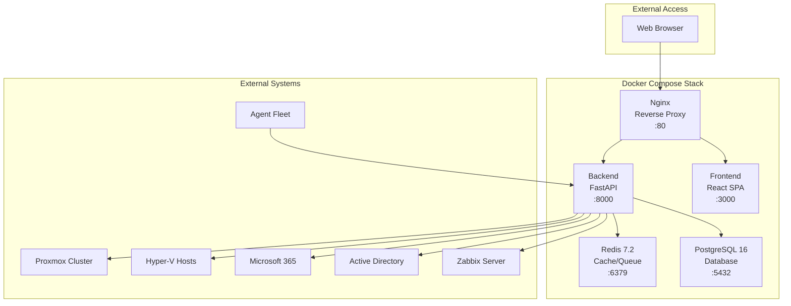
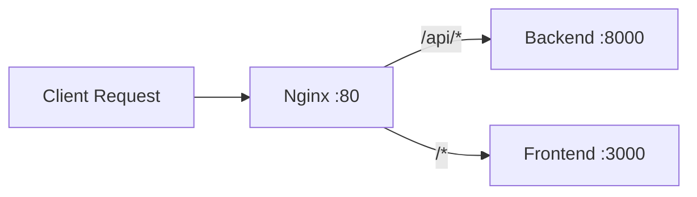
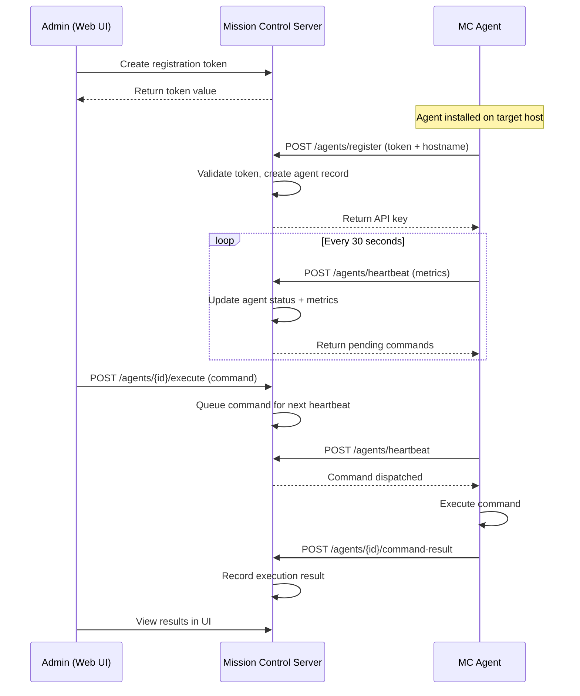
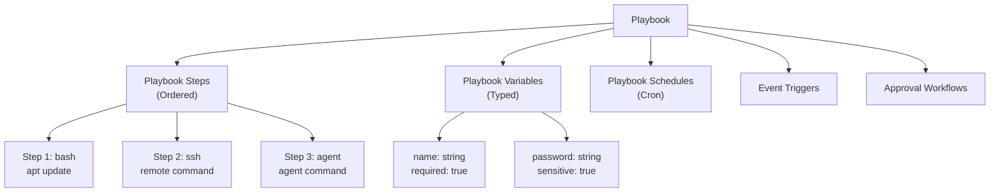
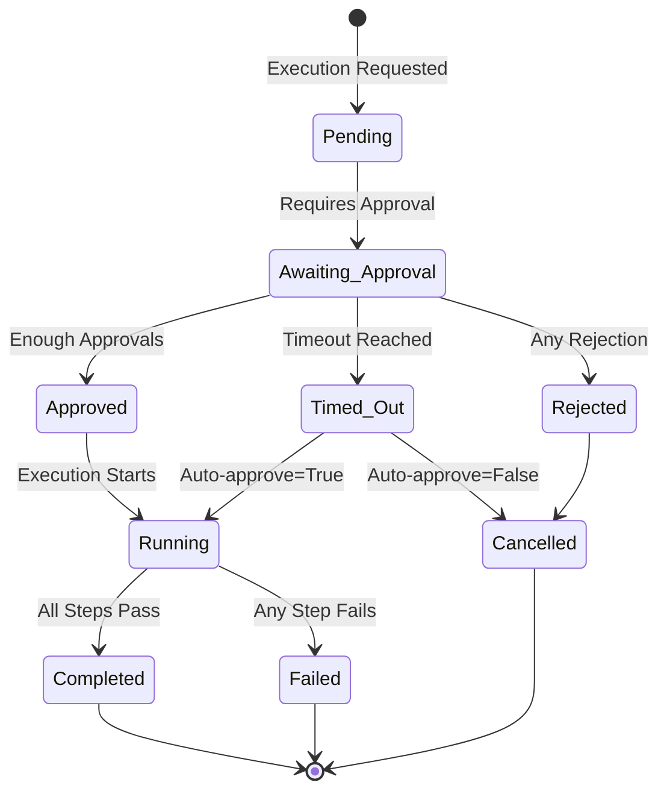
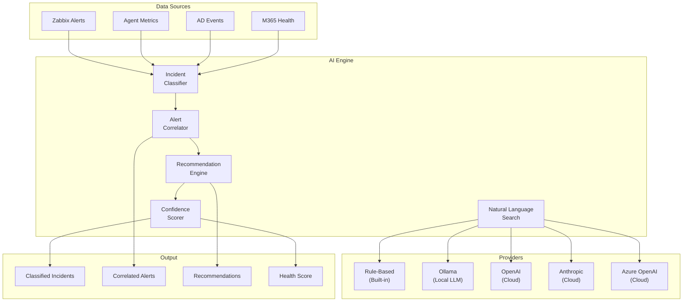
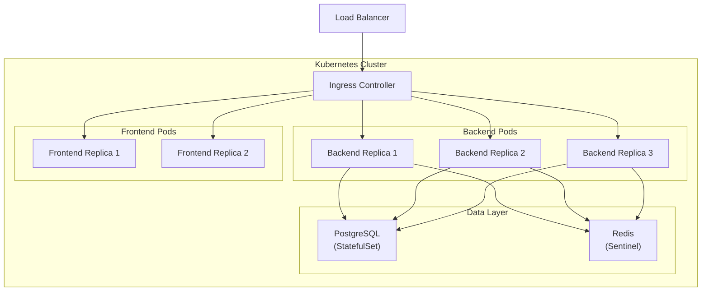
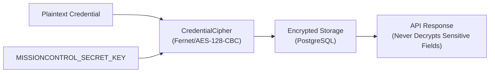
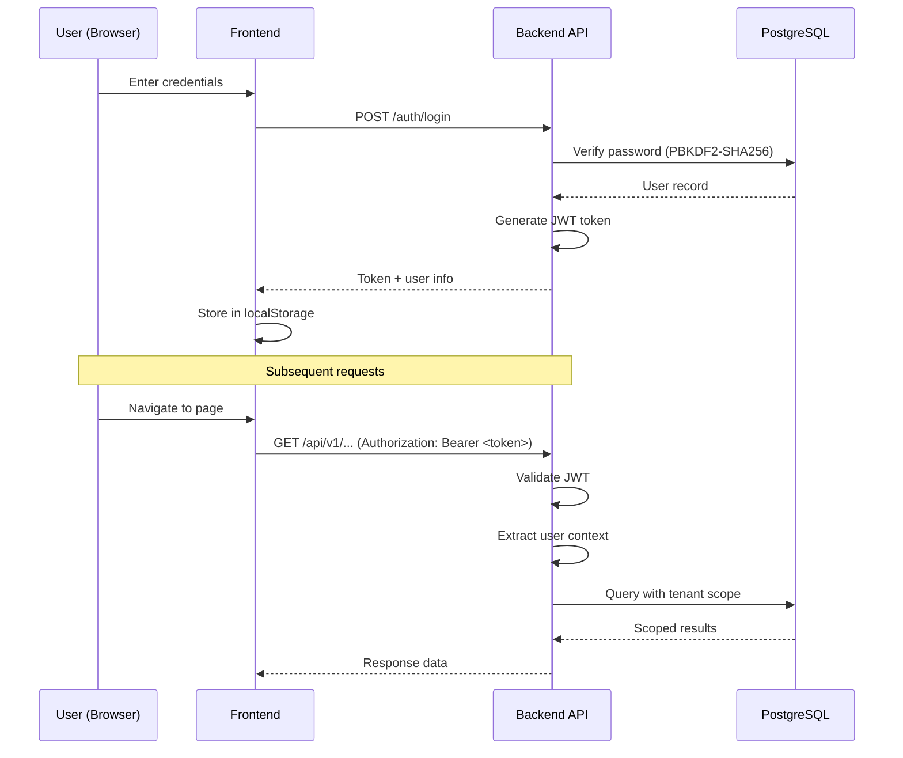
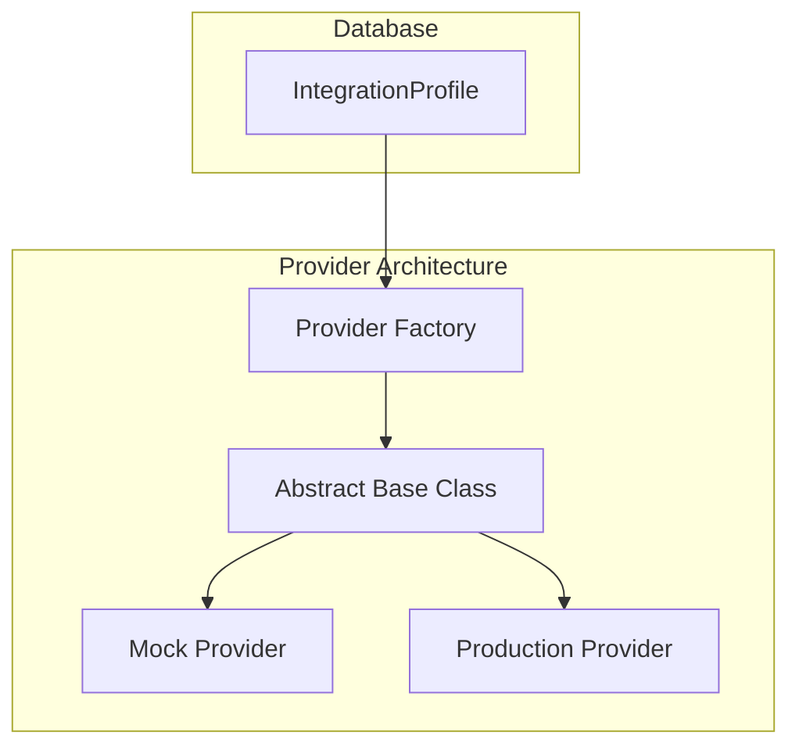

# Mission Control v2 -- Operations Manual

> **Version:** 0.1.0 (Sprint 2.9)
> **Document Classification:** Internal -- Operations
> **Last Updated:** 2026-07-16
> **Audience:** System Administrators, IT Operations Teams, Infrastructure Engineers, MSPs, Enterprise Customers

---

## Table of Contents

- [1. Executive Summary](#1-executive-summary)
- [2. System Requirements](#2-system-requirements)
  - [2.1 Supported Platforms](#21-supported-platforms)
  - [2.2 Hardware Requirements](#22-hardware-requirements)
  - [2.3 Software Prerequisites](#23-software-prerequisites)
- [3. Installation](#3-installation)
  - [3.1 Docker Installation (Recommended)](#31-docker-installation-recommended)
  - [3.2 Linux Installation](#32-linux-installation)
  - [3.3 Windows Installation](#33-windows-installation)
  - [3.4 Post-Installation Verification](#34-post-installation-verification)
- [4. Production Deployment](#4-production-deployment)
  - [4.1 Reverse Proxy Configuration](#41-reverse-proxy-configuration)
  - [4.2 SSL Certificates](#42-ssl-certificates)
  - [4.3 Nginx Configuration](#43-nginx-configuration)
  - [4.4 Environment Hardening](#44-environment-hardening)
- [5. Database Management](#5-database-management)
  - [5.1 PostgreSQL Configuration](#51-postgresql-configuration)
  - [5.2 Database Migrations](#52-database-migrations)
  - [5.3 Database Backups](#53-database-backups)
  - [5.4 Database Restore](#54-database-restore)
- [6. Redis Management](#6-redis-management)
  - [6.1 Redis Configuration](#61-redis-configuration)
  - [6.2 Redis Persistence](#62-redis-persistence)
- [7. Upgrade Procedures](#7-upgrade-procedures)
  - [7.1 Pre-Upgrade Checklist](#71-pre-upgrade-checklist)
  - [7.2 Upgrade Steps](#72-upgrade-steps)
  - [7.3 Migration Procedures](#73-migration-procedures)
  - [7.4 Rollback Procedures](#74-rollback-procedures)
- [8. Configuration Reference](#8-configuration-reference)
  - [8.1 Environment Variables](#81-environment-variables)
  - [8.2 Integration Profiles](#82-integration-profiles)
  - [8.3 Zabbix Configuration](#83-zabbix-configuration)
  - [8.4 Active Directory Configuration](#84-active-directory-configuration)
  - [8.5 Microsoft 365 Configuration](#85-microsoft-365-configuration)
  - [8.6 Hyper-V Configuration](#86-hyper-v-configuration)
  - [8.7 Proxmox Configuration](#87-proxmox-configuration)
  - [8.8 AI Provider Configuration](#88-ai-provider-configuration)
- [9. Mission Control Agent Deployment](#9-mission-control-agent-deployment)
  - [9.1 Agent Architecture](#91-agent-architecture)
  - [9.2 Agent Registration](#92-agent-registration)
  - [9.3 Agent Tokens](#93-agent-tokens)
  - [9.4 Agent Updates](#94-agent-updates)
  - [9.5 Agent Health Monitoring](#95-agent-health-monitoring)
- [10. Automation Management](#10-automation-management)
  - [10.1 Playbook Administration](#101-playbook-administration)
  - [10.2 Execution Providers](#102-execution-providers)
  - [10.3 Scheduling](#103-scheduling)
  - [10.4 Approval Workflows](#104-approval-workflows)
  - [10.5 Execution History](#105-execution-history)
  - [10.6 Audit Trail](#106-audit-trail)
  - [10.7 Import and Export](#107-import-and-export)
- [11. AI Operations](#11-ai-operations)
  - [11.1 AI Architecture](#111-ai-architecture)
  - [11.2 Incident Classification](#112-incident-classification)
  - [11.3 Alert Correlation](#113-alert-correlation)
  - [11.4 Recommendations](#114-recommendations)
  - [11.5 Health Score](#115-health-score)
  - [11.6 Natural Language Search](#116-natural-language-search)
- [12. Dashboard Administration](#12-dashboard-administration)
  - [12.1 Dashboard Overview](#121-dashboard-overview)
  - [12.2 Dashboard Components](#122-dashboard-components)
  - [12.3 Dashboard Customization](#123-dashboard-customization)
- [13. Monitoring Mission Control](#13-monitoring-mission-control)
  - [13.1 Health Checks](#131-health-checks)
  - [13.2 Logging](#132-logging)
  - [13.3 Log Rotation](#133-log-rotation)
  - [13.4 Performance Tuning](#134-performance-tuning)
  - [13.5 Scaling](#135-scaling)
- [14. High Availability](#14-high-availability)
  - [14.1 Current Architecture](#141-current-architecture)
  - [14.2 Future Kubernetes Deployment](#142-future-kubernetes-deployment)
  - [14.3 Load Balancing](#143-load-balancing)
- [15. Disaster Recovery](#15-disaster-recovery)
  - [15.1 Backup Strategy](#151-backup-strategy)
  - [15.2 Restore Procedures](#152-restore-procedures)
  - [15.3 Recovery Scenarios](#153-recovery-scenarios)
- [16. Security Hardening](#16-security-hardening)
  - [16.1 Credential Management](#161-credential-management)
  - [16.2 Secrets Management](#162-secrets-management)
  - [16.3 TLS Certificates](#163-tls-certificates)
  - [16.4 Firewall Rules](#164-firewall-rules)
  - [16.5 Port Reference](#165-port-reference)
  - [16.6 Authentication](#166-authentication)
  - [16.7 Authorization](#167-authorization)
- [17. Multi-Tenant Administration](#17-multi-tenant-administration)
  - [17.1 Company Management](#171-company-management)
  - [17.2 Tenant Isolation](#172-tenant-isolation)
  - [17.3 License Management](#173-license-management)
- [18. Multi-Site Administration](#18-multi-site-administration)
  - [18.1 Site Management](#181-site-management)
  - [18.2 Site Health](#182-site-health)
  - [18.3 Site Context Switching](#183-site-context-switching)
- [19. Plugin Administration](#19-plugin-administration)
  - [19.1 Plugin Architecture](#191-plugin-architecture)
  - [19.2 Provider System](#192-provider-system)
- [20. Troubleshooting](#20-troubleshooting)
  - [20.1 Common Errors](#201-common-errors)
  - [20.2 Database Issues](#202-database-issues)
  - [20.3 Redis Issues](#203-redis-issues)
  - [20.4 Docker Issues](#204-docker-issues)
  - [20.5 Agent Issues](#205-agent-issues)
  - [20.6 Integration Issues](#206-integration-issues)
  - [20.7 Performance Issues](#207-performance-issues)
  - [20.8 Backup Failures](#208-backup-failures)
  - [20.9 Recovery Scenarios](#209-recovery-scenarios)
- [21. Maintenance Procedures](#21-maintenance-procedures)
  - [21.1 Routine Maintenance](#211-routine-maintenance)
  - [21.2 Patch Management](#212-patch-management)
  - [21.3 Health Reviews](#213-health-reviews)
- [22. Appendices](#22-appendices)
  - [22.1 Command Reference](#221-command-reference)
  - [22.2 Port Reference](#222-port-reference)
  - [22.3 Directory Structure](#223-directory-structure)
  - [22.4 Useful Commands](#224-useful-commands)
  - [22.5 Glossary](#225-glossary)

---

## 1. Executive Summary

Mission Control v2 is a comprehensive IT operations management platform designed to centralize infrastructure monitoring, remote operations, identity management, and automation into a single unified dashboard. Built on a modular monolith architecture, it provides a web-based interface for managing distributed infrastructure across multiple sites, tenants, and hypervisors.

### Key Capabilities

| Capability | Description |
|------------|-------------|
| **Dashboard** | Real-time aggregated view of infrastructure health, agents, automation, and AI insights |
| **Remote Operations** | SSH/WinRM command execution, file transfer, terminal console, command templates, scheduling |
| **Monitoring** | Full Zabbix integration with hosts, triggers, problems, events, templates, and dashboards |
| **Identity** | Active Directory and Microsoft 365 user/group/device management |
| **Hyper-V** | Virtual machine lifecycle management, networks, storage, checkpoints, replication |
| **Proxmox VE** | Node, VM, LXC container, storage, network, and snapshot management |
| **Agents** | Distributed agent fleet with heartbeat monitoring, command dispatch, and inventory collection |
| **Automation** | Playbook engine with 8 execution providers, approval workflows, rollback, and audit trail |
| **AI Operations** | Incident classification, alert correlation, recommendations, and health scoring |
| **Multi-Tenant** | Company and site-based tenant isolation with role-based access control |

### Architecture Overview

Mission Control v2 is deployed as a Docker Compose stack consisting of five services:



### Design Principles

- **Modular Monolith:** Single deployment unit with clean module boundaries for easier deployment, debugging, and lower operational overhead, with a clear path to microservice decomposition when scale demands it.
- **Outbound-Only Agent Communication:** Agents initiate all connections via HTTPS, requiring no inbound firewall rules on managed endpoints.
- **Encryption at Rest:** All credentials and secrets are encrypted using Fernet (AES-128-CBC with HMAC-SHA256).
- **AI Observability:** The AI engine observes, analyzes, and recommends -- it never executes infrastructure changes.

---

## 2. System Requirements

### 2.1 Supported Platforms

| Platform | Architecture | Status |
|----------|-------------|--------|
| Docker (Linux containers) | x86_64 | **Primary** |
| Ubuntu 22.04 / 24.04 LTS | x86_64 | Supported |
| Debian 12 (Bookworm) | x86_64 | Supported |
| Rocky Linux 9 | x86_64 | Supported |
| Windows Server 2022 | x86_64 | Supported (Docker Desktop) |
| Windows 10/11 Pro | x86_64 | Development only |

### 2.2 Hardware Requirements

| Resource | Minimum | Recommended |
|----------|---------|-------------|
| **CPU** | 2 cores | 4+ cores |
| **RAM** | 4 GB | 8+ GB |
| **Storage** | 20 GB | 50+ GB SSD |
| **Network** | 100 Mbps | 1 Gbps |

> [!IMPORTANT]
> These requirements cover the Mission Control stack itself. Additional resources are required for the PostgreSQL database depending on the number of tenants, agents, and automation executions.

### 2.3 Software Prerequisites

| Software | Minimum Version | Purpose |
|----------|----------------|---------|
| Docker Engine | 24.0+ | Container runtime |
| Docker Compose | 2.20+ | Service orchestration |
| Git | 2.30+ | Repository cloning |
| PowerShell | 7.0+ | CLI tooling (Windows) |

For non-Docker installations:

| Software | Minimum Version | Purpose |
|----------|----------------|---------|
| Python | 3.12+ | Backend runtime |
| Node.js | 22+ | Frontend build |
| PostgreSQL | 16+ | Database |
| Redis | 7.2+ | Cache/queue |
| Nginx | 1.27+ | Reverse proxy |
| SSH client | OpenSSH 8+ | Remote operations |
| sshpass | Any | Non-interactive SSH auth |

---

## 3. Installation

### 3.1 Docker Installation (Recommended)

The Docker-based installation deploys all five services as a managed stack. This is the **recommended** deployment method.

#### Step 1: Clone the Repository

```bash
git clone <repository-url> MissionControl
cd MissionControl
```

#### Step 2: Generate a Secret Key

Mission Control requires a Fernet encryption key for credential encryption. Generate one using:

```bash
python3 -c "from cryptography.fernet import Fernet; print(Fernet.generate_key().decode())"
```

> [!WARNING]
> Store this key securely. It is required to decrypt all stored credentials. Loss of this key means **permanent loss** of all encrypted credential data.

#### Step 3: Configure Environment

Copy the example environment file and edit it:

```bash
cp .env.example .env
```

Edit `.env` and set at minimum:

```env
MISSIONCONTROL_SECRET_KEY=<your-generated-key>
POSTGRES_PASSWORD=<strong-password>
ENVIRONMENT=production
```

> [!CAUTION]
> Never use default passwords (`mission_control`) in production. Always set a strong `POSTGRES_PASSWORD`.

#### Step 4: Build and Start the Stack

```bash
docker compose up -d --build
```

This command:
1. Builds the backend image (Python 3.12 + dependencies)
2. Builds the frontend image (Node 22 build stage + Nginx serve stage)
3. Pulls PostgreSQL 16, Redis 7.2, and Nginx 1.27 images
4. Creates the `mc-net` bridge network
5. Creates persistent volumes (`postgres_data`, `redis_data`)
6. Starts all services in dependency order

#### Step 5: Verify Installation

```bash
docker compose ps
```

All five services should reach a healthy state:

| Service | Expected Status |
|---------|----------------|
| `postgres` | healthy |
| `redis` | healthy |
| `backend` | healthy |
| `frontend` | running |
| `nginx` | healthy |

Access the web interface at `http://<host-ip>`.

#### Step 6: First Login

The system seeds a default admin user on first startup. Access the web UI and log in with the seeded credentials.

> [!NOTE]
> Check the backend logs for the seeded credentials: `docker compose logs backend | findstr "seed"`

### 3.2 Linux Installation

For environments where Docker is not available, Mission Control can be deployed natively.

#### Install Dependencies

```bash
# Ubuntu/Debian
sudo apt update
sudo apt install -y python3.12 python3.12-venv python3-pip \
    nodejs npm postgresql redis-server nginx \
    openssh-client sshpass git

# Rocky Linux/RHEL
sudo dnf install -y python3.12 python3.12-pip \
    nodejs npm postgresql-server redis nginx \
    openssh-clients sshpass git
```

#### Set Up PostgreSQL

```bash
sudo systemctl enable postgresql
sudo systemctl start postgresql

sudo -u postgres psql -c "CREATE USER mission_control WITH PASSWORD 'mission_control';"
sudo -u postgres psql -c "CREATE DATABASE mission_control OWNER mission_control;"
sudo -u postgres psql -c "GRANT ALL PRIVILEGES ON DATABASE mission_control TO mission_control;"
```

#### Set Up Redis

```bash
sudo systemctl enable redis
sudo systemctl start redis
```

#### Set Up the Backend

```bash
cd backend
python3 -m venv venv
source venv/bin/activate
pip install -r requirements.txt

export MISSIONCONTROL_SECRET_KEY=$(python3 -c "from cryptography.fernet import Fernet; print(Fernet.generate_key().decode())")
export POSTGRES_HOST=localhost
export POSTGRES_PASSWORD=mission_control

alembic upgrade head
python -m app.seed.runner

uvicorn app.main:app --host 0.0.0.0 --port 8000
```

#### Set Up the Frontend

```bash
cd frontend
npm ci
npm run build

# The built assets are in dist/
sudo cp -r dist/* /var/www/mission-control/
```

#### Configure Nginx

```bash
sudo cp nginx/production.conf /etc/nginx/sites-available/mission-control
sudo ln -s /etc/nginx/sites-available/mission-control /etc/nginx/sites-enabled/
sudo nginx -t
sudo systemctl reload nginx
```

### 3.3 Windows Installation

Windows deployment uses Docker Desktop or WSL2.

#### Docker Desktop (Recommended)

1. Install [Docker Desktop for Windows](https://docs.docker.com/desktop/install/windows-install/)
2. Ensure WSL2 backend is enabled
3. Follow the Docker installation steps from [Section 3.1](#31-docker-installation-recommended)

#### PowerShell CLI

Mission Control includes a PowerShell 7+ CLI for development and operations:

```powershell
# Load the CLI
.\scripts\mc.ps1

# Check environment
.\scripts\mc.ps1 doctor

# Full rebuild
.\scripts\rebuild.ps1

# Verify stack
.\scripts\verify.ps1 -Detailed
```

> [!NOTE]
> The PowerShell CLI requires PowerShell 7.0 or later. Windows PowerShell 5.1 is not supported for CLI operations.

### 3.4 Post-Installation Verification

Run the comprehensive verification script:

```bash
# Docker deployment
./scripts/verify.ps1 -Detailed

# Or use the backend health endpoint
curl http://localhost/api/v1/health/live
curl http://localhost/api/v1/health/ready
curl http://localhost/api/v1/status
```

The verification checks:

| Check | Endpoint | Expected |
|-------|----------|----------|
| Container status | `docker compose ps` | All healthy |
| PostgreSQL | `pg_isready` | Accepting connections |
| Redis | `redis-cli ping` | PONG |
| Backend liveness | `/api/v1/health/live` | 200 OK |
| Backend readiness | `/api/v1/health/ready` | 200 OK |
| Dashboard API | `/api/v1/dashboard` | JSON payload |
| Frontend | `http://localhost` | HTML page |
| Nginx proxy | `http://localhost/api/v1/version` | Version info |

---

## 4. Production Deployment

### 4.1 Reverse Proxy Configuration

Mission Control uses Nginx as a reverse proxy, routing traffic to the appropriate backend service.

#### Default Routing



The default Nginx configuration (`nginx/default.conf`) routes:

| Path Pattern | Target | Notes |
|-------------|--------|-------|
| `/api/*` | `http://backend:8000/api/` | WebSocket support enabled |
| `/*` | `http://frontend:3000/` | SPA catch-all |

### 4.2 SSL Certificates

> [!WARNING]
> The default configuration does **not** include TLS termination. For production deployments, SSL/TLS must be configured.

#### Option A: Nginx SSL Termination

```nginx
server {
    listen 443 ssl http2;
    server_name mission-control.example.com;

    ssl_certificate /etc/nginx/ssl/cert.pem;
    ssl_certificate_key /etc/nginx/ssl/key.pem;
    ssl_protocols TLSv1.2 TLSv1.3;
    ssl_ciphers HIGH:!aNULL:!MD5;
    ssl_prefer_server_ciphers on;

    # ... proxy configuration ...
}

server {
    listen 80;
    server_name mission-control.example.com;
    return 301 https://$host$request_uri;
}
```

#### Option B: Let's Encrypt (Certbot)

```bash
sudo apt install certbot python3-certbot-nginx
sudo certbot --nginx -d mission-control.example.com
sudo certbot renew --dry-run
```

#### Option C: External Load Balancer

Deploy an external load balancer (HAProxy, AWS ALB, Azure Application Gateway) with TLS termination and forward HTTP to port 80.

### 4.3 Nginx Configuration

The Nginx configuration includes security headers and WebSocket support:

```nginx
server {
    listen 80;
    server_name _;

    # Security Headers
    add_header X-Frame-Options "SAMEORIGIN" always;
    add_header X-Content-Type-Options "nosniff" always;
    add_header X-XSS-Protection "1; mode=block" always;

    # API Proxy with WebSocket Support
    location /api/ {
        proxy_pass http://backend:8000/api/;
        proxy_set_header Host $host;
        proxy_set_header X-Real-IP $remote_addr;
        proxy_set_header X-Forwarded-For $proxy_add_x_forwarded_for;
        proxy_set_header X-Forwarded-Proto $scheme;
        proxy_set_header Upgrade $http_upgrade;
        proxy_set_header Connection "upgrade";
        proxy_buffering off;
        proxy_read_timeout 3600s;
    }

    # Frontend SPA
    location / {
        proxy_pass http://frontend:3000/;
        proxy_set_header Host $host;
        proxy_set_header X-Real-IP $remote_addr;
        proxy_set_header X-Forwarded-For $proxy_add_x_forwarded_for;
        proxy_set_header X-Forwarded-Proto $scheme;
    }
}
```

Key configuration details:

| Setting | Value | Purpose |
|---------|-------|---------|
| `proxy_buffering off` | Disabled | Supports streaming output and SSE |
| `proxy_read_timeout 3600s` | 1 hour | Accommodates long-running commands |
| `Upgrade` headers | WebSocket | Enables SSH terminal WebSocket connections |
| Security headers | Enabled | XSS protection, clickjacking prevention |

### 4.4 Environment Hardening

#### Production Environment Variables

```env
# Security
MISSIONCONTROL_SECRET_KEY=<fernet-key>
ENVIRONMENT=production

# Database (use strong credentials)
POSTGRES_PASSWORD=<20+ char random password>
POSTGRES_DB=mission_control
POSTGRES_USER=mission_control

# CORS (restrict to your domain)
BACKEND_CORS_ORIGINS=https://mission-control.example.com

# Timeouts (tuned for production)
SSH_CONNECT_TIMEOUT=10
SSH_COMMAND_TIMEOUT=60
WINRM_CONNECT_TIMEOUT=10
WINRM_OPERATION_TIMEOUT=60
REMOTE_RETRY_COUNT=2
```

#### Docker Security

```yaml
# Add to docker-compose.yml for production
services:
  backend:
    read_only: true
    tmpfs:
      - /tmp
    security_opt:
      - no-new-privileges:true

  postgres:
    environment:
      POSTGRES_PASSWORD: ${POSTGRES_PASSWORD}
    volumes:
      - postgres_data:/var/lib/postgresql/data
    # Do NOT expose port 5432 to host in production
```

---

## 5. Database Management

### 5.1 PostgreSQL Configuration

Mission Control uses PostgreSQL 16 (Alpine) as its primary data store.

#### Connection Settings

| Parameter | Value |
|-----------|-------|
| Host | `postgres` (Docker) / `localhost` (native) |
| Port | 5432 |
| Database | `mission_control` |
| User | `mission_control` |
| Driver | `psycopg` (sync) / `asyncpg` (async) |
| Pool Size | 10 connections |
| Max Overflow | 20 connections |
| Pool Pre-Ping | Enabled (connection health checks) |

#### Connection Pool Tuning

The backend uses SQLAlchemy's connection pool. Adjust in the backend configuration if needed:

| Setting | Default | Description |
|---------|---------|-------------|
| `DATABASE_POOL_SIZE` | 10 | Base number of connections |
| `DATABASE_MAX_OVERFLOW` | 20 | Additional connections under load |
| `pool_pre_ping` | true | Tests connections before use |

#### Database Tables

Mission Control manages 28+ database tables organized by domain:

| Domain | Tables |
|--------|--------|
| **Core** | `companies`, `sites`, `users` |
| **Remote Operations** | `remote_hosts`, `credential_profiles`, `command_history`, `command_templates`, `scheduled_commands` |
| **Agents** | `agents`, `agent_commands`, `agent_registration_tokens` |
| **Automation** | `playbooks`, `playbook_steps`, `playbook_variables`, `playbook_executions`, `playbook_schedules`, `execution_logs` |
| **Approvals** | `approval_workflows`, `approval_requests` |
| **Audit** | `audit_trail`, `event_triggers` |
| **Integrations** | `integration_profiles` |
| **Projects** | `projects`, `tasks`, `notes`, `parking_lot`, `resumes` |

### 5.2 Database Migrations

Mission Control uses Alembic for schema migration management. Migrations run automatically on container startup via the entrypoint script.

#### Migration Chain

The current migration chain includes 21 migrations:

```bash
# View current migration state
docker compose exec backend alembic current

# View migration history
docker compose exec backend alembic history

# Apply pending migrations manually
docker compose exec backend alembic upgrade head

# Downgrade one revision
docker compose exec backend alembic downgrade -1
```

#### Entry Point Migration Flow

The `entrypoint.sh` script handles migrations on startup:

1. **Wait for PostgreSQL** -- 30 retries with DNS, TCP, and protocol verification
2. **Wait for Redis** -- 30 retries with DNS, TCP, and protocol verification
3. **Validate configuration** -- Checks `MISSIONCONTROL_SECRET_KEY` validity
4. **Apply migrations** -- `alembic upgrade head` (falls back to `alembic stamp head` on failure)
5. **Run seed data** -- Idempotent seed runner populates initial data
6. **Start API server** -- Uvicorn on port 8000

> [!NOTE]
> If a migration fails, the entrypoint falls back to `alembic stamp head` to mark all migrations as applied, allowing the server to start. This prevents startup failures from blocking the service but means schema changes must be applied manually.

#### Creating New Migrations

When modifying ORM models:

```bash
# Auto-generate migration from model changes
docker compose exec backend alembic revision --autogenerate -m "description of changes"

# Review the generated migration in alembic/versions/
# Then apply
docker compose exec backend alembic upgrade head
```

### 5.3 Database Backups

> [!IMPORTANT]
> Automated backups are not currently implemented. Manual backup procedures are critical for production deployments.

#### Manual Backup Using pg_dump

```bash
# Full database backup
docker compose exec postgres pg_dump -U mission_control mission_control > backup_$(date +%Y%m%d_%H%M%S).sql

# Compressed backup
docker compose exec postgres pg_dump -U mission_control mission_control | gzip > backup_$(date +%Y%m%d_%H%M%S).sql.gz

# Backup with custom format (for pg_restore)
docker compose exec postgres pg_dump -U mission_control -Fc mission_control > backup_$(date +%Y%m%d_%H%M%S).dump
```

#### Automated Backup Script

Create `/opt/mission-control/backup.sh`:

```bash
#!/bin/bash
BACKUP_DIR="/opt/mission-control/backups"
DATE=$(date +%Y%m%d_%H%M%S)
RETENTION_DAYS=30

mkdir -p "$BACKUP_DIR"

# Database backup
docker compose exec -T postgres pg_dump -U mission_control mission_control \
    | gzip > "$BACKUP_DIR/db_$DATE.sql.gz"

# Docker volume backup
docker run --rm \
    -v missioncontrol_postgres_data:/data \
    -v "$BACKUP_DIR":/backup \
    alpine tar czf /backup/volume_$DATE.tar.gz /data

# Cleanup old backups
find "$BACKUP_DIR" -name "*.gz" -mtime +$RETENTION_DAYS -delete

echo "[$(date)] Backup completed: $DATE"
```

Schedule with cron:

```bash
# Daily backup at 2:00 AM
0 2 * * * /opt/mission-control/backup.sh >> /var/log/mission-control-backup.log 2>&1
```

#### Backup Verification

Periodically verify backups are restorable:

```bash
# Test restore to a temporary database
docker compose exec postgres createdb -U mission_control test_restore
docker compose exec postgres psql -U mission_control test_restore < backup.sql
docker compose exec postgres dropdb -U mission_control test_restore
```

### 5.4 Database Restore

#### Full Restore from SQL Dump

```bash
# Stop the backend first
docker compose stop backend

# Drop and recreate database
docker compose exec postgres psql -U mission_control -c "DROP DATABASE mission_control;"
docker compose exec postgres psql -U mission_control -c "CREATE DATABASE mission_control OWNER mission_control;"

# Restore
docker compose exec postgres psql -U mission_control mission_control < backup.sql

# Stamp migrations to match restored schema
docker compose exec backend alembic stamp head

# Restart backend
docker compose start backend
```

#### Restore from Compressed Dump

```bash
gunzip -c backup.sql.gz | docker compose exec -T postgres psql -U mission_control mission_control
```

#### Restore from Custom Format (pg_restore)

```bash
docker compose exec -T postgres pg_restore -U mission_control -d mission_control < backup.dump
```

---

## 6. Redis Management

### 6.1 Redis Configuration

Mission Control uses Redis 7.2 (Alpine) for health checks and as infrastructure for future caching, session management, and pub/sub features.

| Parameter | Value |
|-----------|-------|
| Host | `redis` (Docker) / `localhost` (native) |
| Port | 6379 |
| Database | 0 |
| Client | `redis.asyncio.Redis` (async) |
| Persistence | AOF enabled |

### 6.2 Redis Persistence

Redis is configured with Append-Only File (AOF) persistence:

```bash
# Check Redis status
docker compose exec redis redis-cli ping
# Expected: PONG

# View Redis info
docker compose exec redis redis-cli info memory

# Monitor Redis operations
docker compose exec redis redis-cli monitor
```

#### Redis Data Volume

Redis data is persisted to the `redis_data` Docker volume:

```bash
# Check Redis data size
docker volume inspect missioncontrol_redis_data

# Flush Redis data (if needed)
docker compose exec redis redis-cli FLUSHALL
```

---

## 7. Upgrade Procedures

### 7.1 Pre-Upgrade Checklist

Before upgrading Mission Control:

- [ ] Read the CHANGELOG.md for breaking changes
- [ ] Back up the database (see [Section 5.3](#53-database-backups))
- [ ] Back up the `.env` file
- [ ] Back up any custom Nginx configuration
- [ ] Note the current version: `cat VERSION`
- [ ] Verify Docker and Docker Compose versions meet requirements
- [ ] Schedule a maintenance window if running in production

### 7.2 Upgrade Steps

#### Docker Deployment Upgrade

```bash
# 1. Back up database
docker compose exec postgres pg_dump -U mission_control mission_control > pre_upgrade_backup.sql

# 2. Pull latest code
git pull origin main

# 3. Review changes
git log --oneline HEAD..origin/main

# 4. Stop the stack
docker compose down

# 5. Rebuild images
docker compose build --no-cache

# 6. Start the stack
docker compose up -d

# 7. Verify health
docker compose ps
curl http://localhost/api/v1/health/live
curl http://localhost/api/v1/health/ready
```

#### Using the Rebuild Script

The PowerShell CLI includes a rebuild script that automates the full upgrade:

```powershell
# Full rebuild (stops, prunes, rebuilds, starts, verifies)
.\scripts\rebuild.ps1

# Skip image pruning
.\scripts\rebuild.ps1 -SkipPrune

# Skip verification
.\scripts\rebuild.ps1 -SkipVerify

# Verbose output
.\scripts\rebuild.ps1 -Verbose
```

The rebuild script:

1. Validates pre-conditions (Docker, Compose, `.env`, secret key)
2. Auto-generates a Fernet key if `MISSIONCONTROL_SECRET_KEY` is `CHANGE_ME`
3. Stops all running containers
4. Removes Mission Control images
5. Prunes builder cache and dangling images
6. Rebuilds all images with `--no-cache`
7. Starts all services
8. Waits up to 120 seconds for health
9. Verifies API and frontend endpoints

### 7.3 Migration Procedures

Database migrations run automatically on startup via the entrypoint script. If automatic migration fails:

```bash
# Check migration status
docker compose exec backend alembic current

# View pending migrations
docker compose exec backend alembic heads

# Apply manually
docker compose exec backend alembic upgrade head

# If migration fails, stamp to current state
docker compose exec backend alembic stamp head

# Then investigate and fix the migration
docker compose logs backend | grep -i "error\|migration"
```

### 7.4 Rollback Procedures

If an upgrade fails:

```bash
# 1. Stop the new version
docker compose down

# 2. Check out the previous version
git checkout <previous-tag-or-commit>

# 3. Restore database from backup
docker compose up -d postgres
docker compose exec postgres psql -U mission_control mission_control < pre_upgrade_backup.sql

# 4. Build and start the old version
docker compose up -d --build

# 5. Verify
docker compose ps
curl http://localhost/api/v1/health/live
```

---

## 8. Configuration Reference

### 8.1 Environment Variables

All configuration is managed through environment variables loaded from the `.env` file.

#### Core Settings

| Variable | Required | Default | Description |
|----------|----------|---------|-------------|
| `MISSIONCONTROL_SECRET_KEY` | **Yes** | -- | Fernet encryption key for credential storage. Generate with: `python3 -c "from cryptography.fernet import Fernet; print(Fernet.generate_key().decode())"` |
| `PROJECT_NAME` | No | `Mission Control` | Application display name |
| `ENVIRONMENT` | No | `development` | Runtime environment label (`development`, `staging`, `production`) |
| `COMPOSE_PROJECT_NAME` | No | `missioncontrol` | Docker Compose project name |

#### PostgreSQL Settings

| Variable | Required | Default | Description |
|----------|----------|---------|-------------|
| `POSTGRES_DB` | No | `mission_control` | Database name |
| `POSTGRES_USER` | No | `mission_control` | Database user |
| `POSTGRES_PASSWORD` | No | `mission_control` | Database password (change in production) |
| `POSTGRES_HOST` | No | `postgres` | Database host (Docker service name) |
| `POSTGRES_PORT` | No | `5432` | Database port |

#### Redis Settings

| Variable | Required | Default | Description |
|----------|----------|---------|-------------|
| `REDIS_HOST` | No | `redis` | Redis host |
| `REDIS_PORT` | No | `6379` | Redis port |

#### Application Settings

| Variable | Required | Default | Description |
|----------|----------|---------|-------------|
| `BACKEND_CORS_ORIGINS` | No | `http://localhost,...` | Comma-separated allowed CORS origins |
| `DATABASE_ECHO` | No | `false` | Log SQL queries (development only) |
| `DATABASE_POOL_SIZE` | No | `10` | PostgreSQL connection pool size |
| `DATABASE_MAX_OVERFLOW` | No | `20` | PostgreSQL max overflow connections |

#### Remote Operations Settings

| Variable | Required | Default | Description |
|----------|----------|---------|-------------|
| `SSH_DEFAULT_USERNAME` | No | `ubuntu` | Default SSH username |
| `SSH_DEFAULT_PORT` | No | `22` | Default SSH port |
| `SSH_CONNECT_TIMEOUT` | No | `10` | SSH connection timeout (seconds) |
| `SSH_COMMAND_TIMEOUT` | No | `60` | SSH command execution timeout (seconds) |
| `SSH_IDLE_TIMEOUT` | No | `300` | SSH idle session timeout (seconds) |
| `WINRM_DEFAULT_PORT` | No | `5985` | Default WinRM port |
| `WINRM_CONNECT_TIMEOUT` | No | `10` | WinRM connection timeout (seconds) |
| `WINRM_OPERATION_TIMEOUT` | No | `60` | WinRM operation timeout (seconds) |
| `REMOTE_RETRY_COUNT` | No | `1` | Retries for transient remote failures |
| `REMOTE_MAX_COMMAND_TIMEOUT` | No | `300` | Maximum allowed command timeout |
| `REMOTE_CONNECTION_POOL_SIZE` | No | `5` | Remote connection pool size |
| `TERMINAL_MAX_SESSIONS` | No | `10` | Maximum concurrent terminal sessions |

#### Active Directory Settings

| Variable | Required | Default | Description |
|----------|----------|---------|-------------|
| `AD_SERVER` | No | -- | LDAP server URL (e.g., `ldaps://dc.example.com`) |
| `AD_PORT` | No | `636` | LDAP port |
| `AD_USE_SSL` | No | `true` | Use SSL/TLS for LDAP connections |
| `AD_USERNAME` | No | -- | Service account username for LDAP bind |
| `AD_PASSWORD` | No | -- | Service account password |
| `AD_BASE_DN` | No | -- | LDAP base DN (e.g., `DC=example,DC=com`) |

#### Microsoft 365 Settings

| Variable | Required | Default | Description |
|----------|----------|---------|-------------|
| `M365_TENANT_ID` | No | -- | Azure AD tenant ID |
| `M365_CLIENT_ID` | No | -- | Azure AD app registration client ID |
| `M365_CLIENT_SECRET` | No | -- | Azure AD app registration client secret |

#### Zabbix Settings

| Variable | Required | Default | Description |
|----------|----------|---------|-------------|
| `ZABBIX_URL` | No | -- | Zabbix server frontend URL |
| `ZABBIX_USERNAME` | No | `Admin` | Zabbix API username |
| `ZABBIX_PASSWORD` | No | `zabbix` | Zabbix API password |
| `ZABBIX_VERIFY_SSL` | No | `true` | Verify SSL certificate for Zabbix API |
| `ZABBIX_TIMEOUT` | No | `30` | Zabbix API request timeout (seconds) |
| `ZABBIX_RETRIES` | No | `3` | Zabbix API retry count |

### 8.2 Integration Profiles

Mission Control supports database-driven integration configuration via `IntegrationProfile` records. This allows managing integrations through the web UI without editing environment variables.

| Profile Type | Database Key | Environment Fallback |
|-------------|-------------|---------------------|
| Zabbix | `zabbix` | `ZABBIX_*` variables |
| Active Directory | `active_directory` | `AD_*` variables |
| Microsoft 365 | `microsoft_365` | `M365_*` variables |
| Hyper-V | `hyperv` | -- |
| Proxmox VE | `proxmox` | -- |
| AI Provider | `ai_provider` | -- |

Integration profiles store connection details and API tokens encrypted at rest using Fernet encryption.

#### Managing via Web UI

Navigate to **Settings > Integrations** to:

- Create new integration profiles
- Edit existing profiles
- Test connectivity
- Enable/disable integrations
- View connection status

#### Managing via API

```bash
# List integrations
curl -H "Authorization: Bearer <token>" http://localhost/api/v1/integrations

# Create integration
curl -X POST \
  -H "Authorization: Bearer <token>" \
  -H "Content-Type: application/json" \
  -d '{"name": "Primary Zabbix", "integration_type": "zabbix", "config": {"url": "https://zabbix.example.com"}}' \
  http://localhost/api/v1/integrations

# Test connectivity
curl -X POST \
  -H "Authorization: Bearer <token>" \
  http://localhost/api/v1/integrations/{id}/test
```

### 8.3 Zabbix Configuration

Mission Control provides full Zabbix monitoring integration.

#### Prerequisites

- Zabbix 6.0+ server with API access
- A Zabbix user with API access (read-only minimum, read-write for host management)
- Network connectivity from Mission Control to Zabbix frontend

#### Configuration

**Option A: Environment Variables**

```env
ZABBIX_URL=https://zabbix.example.com
ZABBIX_USERNAME=MCServiceAccount
ZABBIX_PASSWORD=<strong-password>
ZABBIX_VERIFY_SSL=true
ZABBIX_TIMEOUT=30
ZABBIX_RETRIES=3
```

**Option B: Integration Profile (Recommended)**

1. Navigate to **Settings > Integrations**
2. Click **Add Integration**
3. Select type **Zabbix**
4. Enter connection details
5. Click **Test Connection**
6. Click **Save**

#### Available Data

| Endpoint | Description |
|----------|-------------|
| Overview | Summary statistics |
| Hosts | All monitored hosts with status and availability |
| Host Groups | Grouped host collections |
| Templates | Applied monitoring templates |
| Items | Collected metrics and data points |
| Triggers | Alert trigger definitions and states |
| Problems | Active problems and acknowledgments |
| Events | Event history and details |
| Maps | Network topology maps |
| Dashboards | Zabbix dashboard data |
| Health | Zabbix server health and connectivity |

#### Supported Operations

- View hosts, groups, templates, items, triggers, problems, events, maps, dashboards
- Monitor Zabbix server health
- View problem acknowledgment status
- Access trigger and event history
- Connection testing from the web UI

### 8.4 Active Directory Configuration

Mission Control integrates with Active Directory via LDAP for identity management.

#### Prerequisites

- Active Directory domain controller
- Service account with read access (minimum) for user/group queries
- For write operations (password reset, account management): elevated permissions
- LDAP over SSL (port 636) recommended

#### Configuration

**Environment Variables:**

```env
AD_SERVER=ldaps://dc01.example.com
AD_PORT=636
AD_USE_SSL=true
AD_USERNAME=svc-missioncontrol@example.com
AD_PASSWORD=<service-account-password>
AD_BASE_DN=DC=example,DC=com
```

#### Available Operations

| Operation | Permission Required |
|-----------|-------------------|
| List users | Read |
| List groups | Read |
| List devices/computers | Read |
| View user group membership | Read |
| Health check | Read |
| Replication status | Read |
| Reset password | Write |
| Unlock account | Write |
| Enable/disable account | Write |
| Rename account | Write |
| Add/remove group membership | Write |

#### Azure AD / Entra ID Considerations

For Azure AD (Entra ID), use the Microsoft 365 integration instead, which uses the Microsoft Graph API with OAuth2 client credentials.

### 8.5 Microsoft 365 Configuration

Mission Control integrates with Microsoft 365 via the Microsoft Graph API for identity and service health monitoring.

#### Prerequisites

- Azure AD app registration with the following API permissions:
  - `User.Read.All` (delegated or application)
  - `Group.Read.All`
  - `Device.Read.All`
  - `ServiceHealth.Read.All`
- Client credentials flow (no user interaction required)

#### Configuration

**Environment Variables:**

```env
M365_TENANT_ID=<azure-ad-tenant-id>
M365_CLIENT_ID=<app-registration-client-id>
M365_CLIENT_SECRET=<app-registration-client-secret>
```

#### App Registration Setup

1. Navigate to **Azure Portal > Azure Active Directory > App registrations**
2. Click **New registration**
3. Set name: `Mission Control`
4. Select **Accounts in this organizational directory only**
5. Click **Register**
6. Navigate to **Certificates & secrets > New client secret**
7. Copy the secret value (shown only once)
8. Navigate to **API permissions > Add permission**
9. Add **Microsoft Graph > Application permissions**:
   - `User.Read.All`
   - `Group.Read.All`
   - `Device.Read.All`
   - `ServiceHealth.Read.All`
10. Click **Grant admin consent**

#### Available Data

- Tenant summary (user count, group count, license status)
- User directory (name, email, department, status)
- Group directory (name, membership)
- Managed devices (name, OS, compliance)
- Service health (current issues, advisories)

### 8.6 Hyper-V Configuration

Mission Control manages Hyper-V hosts via PowerShell remoting over SSH or WinRM.

#### Prerequisites

- Windows Server with Hyper-V role enabled
- PowerShell remoting enabled (`Enable-PSRemoting`)
- SSH or WinRM access from Mission Control to Hyper-V hosts
- Appropriate permissions (Hyper-V Administrator role minimum)

#### Configuration

Hyper-V hosts are configured through **Integration Profiles** or as **Remote Hosts** with PowerShell-capable connections.

| Setting | Description |
|---------|-------------|
| Connection type | SSH or WinRM |
| Host address | IP or hostname of Hyper-V host |
| Credentials | Encrypted credential profile with admin access |
| Protocol | PowerShell remoting |

#### Available Operations

| Operation | Description |
|-----------|-------------|
| List VMs | View all virtual machines with status |
| VM lifecycle | Start, stop, restart, pause, resume VMs |
| Virtual networks | View virtual switch configurations |
| Storage | View VHDs and storage pools |
| Checkpoints | Create and delete VM checkpoints |
| Replication | View Hyper-V Replica status |
| Host health | CPU, memory, disk, uptime |

### 8.7 Proxmox Configuration

Mission Control integrates with Proxmox VE via the Proxmox REST API.

#### Prerequisites

- Proxmox VE 7.0+ cluster or standalone node
- API token with appropriate permissions
- Network connectivity from Mission Control to Proxmox API (port 8006)

#### Configuration

Configure via Integration Profile in **Settings > Integrations**:

| Field | Description |
|-------|-------------|
| API URL | `https://proxmox.example.com:8006` |
| Username | `root@pam` or dedicated API user |
| Token ID | Proxmox API token ID |
| Token Secret | Proxmox API token secret |
| Verify SSL | Whether to validate the Proxmox SSL certificate |

#### Available Operations

| Operation | Description |
|-----------|-------------|
| Cluster nodes | View node status, CPU, memory, uptime |
| QEMU VMs | List, start, stop, restart, pause, resume |
| LXC containers | List, start, stop |
| Storage | View storage pools and usage |
| Networks | View bridge and VLAN configurations |
| Snapshots | Create and delete VM snapshots |
| Tasks | View task history |
| Health | Cluster health overview |

### 8.8 AI Provider Configuration

Mission Control includes an AI operations engine that can interface with multiple LLM providers.

#### Supported Providers

| Provider | Type | Default Model | Offline Capable |
|----------|------|---------------|----------------|
| Ollama | Local LLM | `llama3` | Yes |
| OpenAI | Cloud API | `gpt-4o` | No |
| Azure OpenAI | Cloud API | `gpt-4o` | No |
| Anthropic | Cloud API | `claude-sonnet-4-20250514` | No |
| Local LLM | Local (Ollama) | `llama3` | Yes |
| Rule-Based | Built-in | `rule-based-v1` | Always |

#### Configuration

If no AI provider is configured, the system falls back to the built-in **Rule-Based** provider, which uses deterministic rule matching without requiring any external service.

To configure a provider, create an Integration Profile of type `ai_provider` through the web UI or API.

> [!NOTE]
> The AI engine is designed for **observability only** -- it classifies incidents, correlates alerts, and generates recommendations. It never executes infrastructure changes.

---

## 9. Mission Control Agent Deployment

### 9.1 Agent Architecture

Mission Control agents provide a distributed execution and monitoring capability across managed endpoints.



#### Key Design Decisions

| Decision | Rationale |
|----------|-----------|
| **Outbound-only communication** | No inbound firewall rules needed on managed endpoints |
| **Heartbeat-based polling** | Simple, firewall-friendly; no push infrastructure required |
| **API key authentication** | Stateless, scalable, easy to rotate |
| **Server-side command queue** | Commands wait for next heartbeat; no direct agent addressing |

### 9.2 Agent Registration

#### Step 1: Create a Registration Token

Via the web UI:

1. Navigate to **Agents > Overview**
2. Click **Create Registration Token**
3. Configure:
   - **Name:** Descriptive label (e.g., `web-server-fleet`)
   - **Company:** Target tenant
   - **Site:** Target site (optional)
   - **Max Agents:** Maximum number of agents this token can register
   - **Expiry:** Token expiration date/time
4. Click **Generate**
5. **Copy the token value** -- it is shown only once

Via the API:

```bash
curl -X POST \
  -H "Authorization: Bearer <token>" \
  -H "Content-Type: application/json" \
  -d '{
    "name": "web-server-fleet",
    "company_id": "<company-uuid>",
    "max_agents": 50,
    "expires_in_hours": 72
  }' \
  http://localhost/api/v1/agent-tokens
```

#### Step 2: Install and Register the Agent

On the target host, install the MC Agent and provide the registration token:

```bash
# Agent registration returns an API key
curl -X POST \
  -H "Content-Type: application/json" \
  -d '{
    "registration_token": "<token-value>",
    "hostname": "web-server-01",
    "operating_system": "linux",
    "os_version": "22.04"
  }' \
  http://mission-control-host/api/v1/agents/register
```

The response includes an `api_key` that the agent uses for all subsequent communication.

> [!IMPORTANT]
> Store the API key securely on the agent host. It provides full command execution access to the registered agent.

### 9.3 Agent Tokens

#### Token Lifecycle

| State | Description |
|-------|-------------|
| **Active** | Token can be used for new registrations |
| **Disabled** | Token cannot be used; existing agents unaffected |
| **Expired** | Token past its expiry date; cannot be used |
| **Consumed** | Token reached its `max_agents` limit |

#### Managing Tokens

```bash
# List all tokens
curl -H "Authorization: Bearer <token>" http://localhost/api/v1/agent-tokens

# Disable a token
curl -X POST \
  -H "Authorization: Bearer <token>" \
  http://localhost/api/v1/agent-tokens/{id}/disable

# Delete a token
curl -X DELETE \
  -H "Authorization: Bearer <token>" \
  http://localhost/api/v1/agent-tokens/{id}
```

> [!NOTE]
> Disabling or deleting a token does not affect agents that have already registered with it. Those agents continue to operate with their API keys.

### 9.4 Agent Updates

Agent updates follow the same heartbeat-based communication pattern:

1. **Server queues an update command** via `POST /api/v1/agents/{id}/execute`
2. **Agent receives the command** on next heartbeat
3. **Agent executes the update** (implementation-specific)
4. **Agent reports result** via `POST /api/v1/agents/{id}/command-result`
5. **Agent updates its version** via subsequent heartbeat metadata

### 9.5 Agent Health Monitoring

#### Heartbeat Metrics

Each agent heartbeat reports:

| Metric | Description |
|--------|-------------|
| `cpu_percent` | CPU utilization percentage |
| `memory_percent` | Memory utilization percentage |
| `disk_percent` | Disk utilization percentage |

#### Health Status

| Status | Condition |
|--------|-----------|
| `healthy` | All metrics below warning thresholds |
| `degraded` | One or more metrics above warning thresholds |
| `unknown` | Agent registered but no heartbeat received yet |
| `offline` | No heartbeat received for 120+ seconds |

#### Stale Agent Detection

The system automatically marks agents as offline if no heartbeat is received within 120 seconds. This runs periodically and is reflected in the agent list and dashboard.

#### Inventory Collection

Agents can report system inventory via `POST /api/v1/agents/{id}/inventory`. Inventory data is stored as JSON in the `inventory_json` field and includes hardware and software information collected by the agent.

---

## 10. Automation Management

### 10.1 Playbook Administration

Playbooks are the core automation unit in Mission Control. A playbook contains ordered steps, typed variables, and execution configuration.

#### Playbook Structure



#### Creating a Playbook

Via the web UI:

1. Navigate to **Automation > Playbooks**
2. Click **New Playbook**
3. Configure:
   - **Name:** Descriptive name
   - **Description:** Purpose of the playbook
   - **Category:** Classification tag
   - **Version:** Semantic version
   - **Requires Approval:** Enable approval workflow
   - **Allow Rollback:** Enable per-step rollback
   - **Timeout:** Maximum execution time (seconds)
4. Click **Create**

Via the API:

```bash
curl -X POST \
  -H "Authorization: Bearer <token>" \
  -H "Content-Type: application/json" \
  -d '{
    "name": "Server Patching",
    "description": "Automated server patching workflow",
    "category": "maintenance",
    "requires_approval": true,
    "allow_rollback": true,
    "timeout_seconds": 3600
  }' \
  http://localhost/api/v1/automation/playbooks
```

#### Adding Steps

Each step within a playbook is configured with:

| Field | Description |
|-------|-------------|
| `step_order` | Execution order (integer) |
| `step_type` | Step classification |
| `provider` | Execution backend (bash, ssh, winrm, etc.) |
| `command` | Command or script to execute |
| `target_host` | Remote host UUID (for remote providers) |
| `rollback_command` | Command to undo changes on failure |
| `continue_on_failure` | Whether to proceed if this step fails |
| `timeout_seconds` | Per-step timeout |

### 10.2 Execution Providers

Mission Control supports 8 execution backends for playbook steps:

| Provider | Protocol | Use Case |
|----------|----------|----------|
| `bash` | Local | Local shell commands on the Mission Control server |
| `powershell` | Local | PowerShell scripts on Windows Mission Control servers |
| `ssh` | Remote | Commands on Linux/Unix remote hosts via SSH |
| `winrm` | Remote | Commands on Windows remote hosts via WinRM |
| `http` | Webhook | HTTP API calls and webhook invocations |
| `agent` | Agent | Commands dispatched to registered MC agents |
| `hyperv` | PowerShell | Hyper-V management via PowerShell remoting |
| `proxmox` | API | Proxmox VE management via REST API |

Each provider implements:

- **`execute_step()`** -- Run the step command
- **`validate_step()`** -- Pre-execution validation
- **`rollback_step()`** -- Execute rollback command on failure

#### Provider Selection

When adding a step, the provider determines how the command is executed:

```bash
# Example: SSH provider executes on remote host
curl -X POST \
  -H "Authorization: Bearer <token>" \
  -H "Content-Type: application/json" \
  -d '{
    "step_order": 1,
    "provider": "ssh",
    "command": "sudo apt update && sudo apt upgrade -y",
    "target_host": "<remote-host-uuid>",
    "timeout_seconds": 600,
    "rollback_command": "sudo apt-mark hold $(dpkg -l | grep '^ii' | awk '{print $2}')"
  }' \
  http://localhost/api/v1/automation/playbooks/{id}/steps
```

### 10.3 Scheduling

Playbooks can be scheduled for automatic execution using cron expressions.

#### Cron Expression Format

```
┌───────────── minute (0-59)
│ ┌───────────── hour (0-23)
│ │ ┌───────────── day of month (1-31)
│ │ │ ┌───────────── month (1-12)
│ │ │ │ ┌───────────── day of week (0-6, Sunday=0)
│ │ │ │ │
* * * * *
```

#### Common Schedules

| Schedule | Cron Expression | Description |
|----------|----------------|-------------|
| Daily at 2 AM | `0 2 * * *` | Nightly maintenance |
| Weekly Sunday 3 AM | `0 3 * * 0` | Weekly patching |
| Every 6 hours | `0 */6 * * *` | Periodic health checks |
| Every Monday 9 AM | `0 9 * * 1` | Weekly reporting |
| First of month 1 AM | `0 1 1 * *` | Monthly tasks |

#### Creating a Schedule

```bash
curl -X POST \
  -H "Authorization: Bearer <token>" \
  -H "Content-Type: application/json" \
  -d '{
    "cron_expression": "0 2 * * *",
    "enabled": true,
    "variables_override": {
      "environment": "production"
    }
  }' \
  http://localhost/api/v1/automation/playbooks/{id}/schedules
```

#### Manual Trigger

```bash
# Run a schedule immediately
curl -X POST \
  -H "Authorization: Bearer <token>" \
  http://localhost/api/v1/automation/schedules/{id}/run-now
```

### 10.4 Approval Workflows

Playbooks with `requires_approval` enabled require one or more approvals before execution.

#### Approval Configuration

| Field | Description |
|-------|-------------|
| `required_approvers` | Number of approvals required |
| `approver_roles` | Roles that can approve (e.g., `company_admin`, `site_admin`) |
| `timeout_minutes` | Maximum wait time for approvals |
| `auto_approve_on_timeout` | Whether to auto-approve if timeout is reached |

#### Approval Flow



#### Approving an Execution

```bash
# View pending approvals
curl -H "Authorization: Bearer <token>" http://localhost/api/v1/automation/approvals/pending

# Approve
curl -X PUT \
  -H "Authorization: Bearer <token>" \
  http://localhost/api/v1/automation/approvals/{id}/approve

# Reject
curl -X PUT \
  -H "Authorization: Bearer <token>" \
  http://localhost/api/v1/automation/approvals/{id}/reject
```

### 10.5 Execution History

All playbook executions are recorded with detailed step-level logging.

#### Execution States

| State | Description |
|-------|-------------|
| `pending` | Execution queued, awaiting start |
| `running` | Currently executing steps |
| `completed` | All steps finished successfully |
| `failed` | One or more steps failed |
| `rolled_back` | Execution failed and rollback completed |
| `cancelled` | Execution was cancelled |

#### Viewing Execution History

Via the web UI: Navigate to **Automation > Executions**

Via the API:

```bash
# List all executions
curl -H "Authorization: Bearer <token>" http://localhost/api/v1/automation/executions

# Get execution details
curl -H "Authorization: Bearer <token>" http://localhost/api/v1/automation/executions/{id}

# Get step-level logs
curl -H "Authorization: Bearer <token>" http://localhost/api/v1/automation/executions/{id}/logs
```

#### Execution Log Fields

| Field | Description |
|-------|-------------|
| `step_order` | Step number within the playbook |
| `provider` | Execution provider used |
| `command` | Command that was executed |
| `stdout` | Standard output capture |
| `stderr` | Standard error capture |
| `exit_code` | Process exit code |
| `duration_ms` | Execution time in milliseconds |
| `status` | Step status (completed/failed/skipped) |

### 10.6 Audit Trail

The automation system maintains an immutable audit trail of all actions.

#### Audit Record Fields

| Field | Description |
|-------|-------------|
| `entity_type` | Type of entity acted upon (playbook, execution, etc.) |
| `entity_id` | UUID of the entity |
| `action` | Action performed (create, execute, approve, etc.) |
| `actor` | User or system that performed the action |
| `details` | JSON details of the action |
| `ip_address` | Source IP address |
| `timestamp` | UTC timestamp of the action |

#### Querying the Audit Trail

```bash
# List audit entries
curl -H "Authorization: Bearer <token>" http://localhost/api/v1/automation/audit

# Filter by entity type
curl -H "Authorization: Bearer <token>" \
  "http://localhost/api/v1/automation/audit?entity_type=playbook&action=execute"
```

### 10.7 Import and Export

Playbooks can be cloned, exported, and imported for reuse across tenants and environments.

#### Clone a Playbook

```bash
curl -X POST \
  -H "Authorization: Bearer <token>" \
  -H "Content-Type: application/json" \
  -d '{"name": "Server Patching - Copy"}' \
  http://localhost/api/v1/automation/playbooks/{id}/clone
```

#### Export a Playbook

```bash
curl -H "Authorization: Bearer <token>" \
  http://localhost/api/v1/automation/playbooks/{id}/export
```

Returns a JSON representation including all steps, variables, schedules, and triggers. Sensitive variable values are excluded.

#### Import a Playbook

```bash
curl -X POST \
  -H "Authorization: Bearer <token>" \
  -H "Content-Type: application/json" \
  -d @exported-playbook.json \
  http://localhost/api/v1/automation/playbooks/import
```

---

## 11. AI Operations

### 11.1 AI Architecture

The AI operations engine provides intelligent analysis of infrastructure data without executing any changes.



#### Design Principle

> [!CAUTION]
> **AI NEVER executes infrastructure changes.** The AI engine only observes, analyzes, prioritizes, and recommends. All actions require human approval and execution through the automation system.

### 11.2 Incident Classification

The incident classifier categorizes infrastructure events by severity and business impact.

#### Classification Dimensions

| Dimension | Values |
|-----------|--------|
| **Criticality** | critical, high, medium, low, info |
| **Business Impact** | catastrophic, major, moderate, minor, none |
| **Priority** | P1, P2, P3, P4, P5 |

#### Host Importance Weights

| Host Type | Weight | Description |
|-----------|--------|-------------|
| Domain Controller | 1.0 | Highest importance |
| Database Server | 0.9 | Critical data systems |
| Exchange Server | 0.85 | Communication infrastructure |
| File Server | 0.8 | Data storage |
| Hyper-V Host | 0.75 | Virtualization infrastructure |
| Proxmox Host | 0.7 | Virtualization infrastructure |
| Web Server | 0.7 | Application hosting |
| Workstation | 0.3 | End-user devices |

#### Priority Scoring

Priority is calculated using a weighted score from:

- Criticality level (40% weight)
- Business impact (30% weight)
- Host importance (20% weight)
- Alert frequency (10% weight)

### 11.3 Alert Correlation

The correlation engine identifies patterns across alerts from multiple sources.

#### Correlation Types

| Type | Description | Detection Method |
|------|-------------|-----------------|
| **Duplicate Alerts** | Same alert repeated for same host | Message similarity within time window |
| **Root Cause** | Earliest alert in a correlated group | Temporal ordering |
| **Cascading Failure** | Chain of related alerts across sources | Multi-source pattern detection |
| **Related Alerts** | Alerts sharing common attributes | Host, tag, and time proximity grouping |

### 11.4 Recommendations

The recommendation engine generates actionable suggestions based on classified incidents and correlations.

#### Recommendation Templates

| Template | Risk Level | Description |
|----------|-----------|-------------|
| `restart_service` | Low | Suggests service restart |
| `health_check` | Low | Suggests running health diagnostics |
| `free_disk_space` | Medium | Suggests disk cleanup |
| `check_dns` | Low | Suggests DNS verification |
| `investigate_replication` | High | Suggests AD/DB replication investigation |
| `verify_backups` | Medium | Suggests backup verification |
| `restart_vm` | Medium | Suggests VM restart |
| `check_hyper_v_storage` | Medium | Suggests Hyper-V storage check |
| `review_failed_logins` | High | Suggests security review |
| `investigate_cpu_usage` | Medium | Suggests CPU analysis |
| `check_network_connectivity` | Low | Suggests network diagnostics |
| `scale_resources` | High | Suggests capacity scaling |
| `review_m365_service_health` | Low | Suggests M365 health check |
| `investigate_ad_replication` | High | Suggests AD replication analysis |

Each recommendation includes:

- Confidence score (0-100)
- Risk level (low/medium/high/critical)
- Estimated impact description
- Detailed explanation
- Suggested resolution steps

### 11.5 Health Score

The AI engine calculates an overall system health score.

#### Scoring Model

| Score Range | Grade | Description |
|-------------|-------|-------------|
| 90-100 | A | Excellent -- all systems nominal |
| 80-89 | B | Good -- minor issues detected |
| 70-79 | C | Fair -- attention recommended |
| 60-69 | D | Poor -- issues require action |
| 0-59 | F | Critical -- immediate attention required |

The score is calculated from:

- Alert severity distribution
- Host health status
- Service availability
- Recent incident frequency
- Correlation patterns

### 11.6 Natural Language Search

The AI engine supports natural language queries against infrastructure data:

```bash
# Natural language search
curl -X POST \
  -H "Authorization: Bearer <token>" \
  -H "Content-Type: application/json" \
  -d '{"query": "Show me all critical alerts from the last 24 hours"}' \
  http://localhost/api/v1/ai/search
```

When a cloud LLM provider is configured, queries are processed through the LLM. When no provider is available, the built-in rule-based engine parses common query patterns.

---

## 12. Dashboard Administration

### 12.1 Dashboard Overview

The Mission Control dashboard provides a single-pane-of-glass view of all managed infrastructure, accessible at the root URL (`/`).

The dashboard aggregates data from all subsystems into a unified view via the `GET /api/v1/dashboard` endpoint.

### 12.2 Dashboard Components

| Component | Data Source | Description |
|-----------|------------|-------------|
| **Stat Cards** | Multiple | Key metrics (projects, tasks, containers, repos) |
| **Health Badges** | Docker, Git, Tasks | Service health indicators |
| **Quick Actions** | Static | Shortcut buttons for common operations |
| **Integrations Card** | Integration Profiles | Status of configured integrations |
| **Hyper-V Card** | Hyper-V Provider | VM counts and health |
| **Proxmox Card** | Proxmox Provider | Node/VM counts and health |
| **Agent Card** | Agent Service | Agent fleet status (online/offline) |
| **Automation Card** | Automation Service | Playbook execution summary |
| **AI Card** | AI Engine | Health score and incident summary |
| **Recent Commands** | Command History | Latest remote operations |
| **System Gauges** | System Service | CPU, memory, disk utilization |

### 12.3 Dashboard Customization

The dashboard layout is currently defined in the frontend component hierarchy. Customization options include:

- **Navigation grouping** via `frontend/src/config/navigation.ts`
- **Theme customization** via **Settings > Appearance**
- **Company branding** via company `theme` and `logo_url` fields

---

## 13. Monitoring Mission Control

### 13.1 Health Checks

Mission Control provides multiple health check endpoints:

| Endpoint | Purpose | Checks |
|----------|---------|--------|
| `GET /api/v1/health/live` | Liveness probe | Application is running |
| `GET /api/v1/health/ready` | Readiness probe | PostgreSQL + Redis connectivity |
| `GET /api/v1/status` | System status | Platform version and status |
| `GET /api/v1/doctor` | Diagnostics | Environment, Docker, HTTP health |
| `GET /api/docs` | API documentation | Swagger UI availability |

#### Docker Health Checks

All Docker services include health check configurations:

| Service | Health Check | Interval | Timeout | Retries |
|---------|-------------|----------|---------|---------|
| `backend` | HTTP GET `/api/v1/health/live` | 30s | 10s | 3 |
| `postgres` | `pg_isready` | 10s | 5s | 5 |
| `redis` | `redis-cli ping` | 10s | 5s | 5 |
| `nginx` | `wget --spider localhost` | 30s | 5s | 3 |

#### External Monitoring Integration

For external monitoring systems (Zabbix, Prometheus, Datadog), configure checks against:

```
GET http://<mission-control-host>/api/v1/health/ready
Expected: 200 OK with JSON body
```

### 13.2 Logging

#### Backend Logging

The backend uses Python's standard `logging` module with `INFO` level by default.

```bash
# View live backend logs
docker compose logs -f backend

# View last 100 lines
docker compose logs --tail 100 backend

# View logs for all services
docker compose logs -f

# View logs for a specific time range
docker compose logs --since "2026-07-16T00:00:00" backend
```

#### Log Format

```
[YYYY-MM-DD HH:MM:SS] [LEVEL] [module] message
```

#### CLI Logging

The PowerShell CLI logs to `logs/mc.log`:

```
[2026-07-16 10:30:15] [INFO] Stack started successfully
[2026-07-16 10:30:16] [SUCCESS] All services healthy
[2026-07-16 10:35:22] [WARN] Redis connection slow
[2026-07-16 10:40:01] [ERROR] PostgreSQL connection refused
```

### 13.3 Log Rotation

#### Docker Logging Driver

Configure Docker log rotation in `docker-compose.yml`:

```yaml
services:
  backend:
    logging:
      driver: "json-file"
      options:
        max-size: "50m"
        max-file: "5"
```

#### System Log Rotation

For native installations, configure logrotate:

```
# /etc/logrotate.d/mission-control
/var/log/mission-control/*.log {
    daily
    missingok
    rotate 14
    compress
    delaycompress
    notifempty
    create 0640 www-data www-data
}
```

### 13.4 Performance Tuning

#### Database Connection Pool

Adjust pool settings based on workload:

| Setting | Low Traffic | Medium Traffic | High Traffic |
|---------|------------|---------------|-------------|
| `DATABASE_POOL_SIZE` | 5 | 10 | 20 |
| `DATABASE_MAX_OVERFLOW` | 10 | 20 | 40 |

#### SSH/WinRM Timeouts

Tune timeouts based on network conditions:

| Setting | LAN | WAN | High Latency |
|---------|-----|-----|-------------|
| `SSH_CONNECT_TIMEOUT` | 5 | 10 | 20 |
| `SSH_COMMAND_TIMEOUT` | 30 | 60 | 120 |
| `WINRM_CONNECT_TIMEOUT` | 5 | 10 | 20 |
| `WINRM_OPERATION_TIMEOUT` | 30 | 60 | 120 |

#### Nginx Tuning

For high-traffic deployments:

```nginx
worker_processes auto;
events {
    worker_connections 1024;
}

http {
    sendfile on;
    tcp_nopush on;
    keepalive_timeout 65;
    gzip on;
    gzip_types text/plain application/json application/javascript text/css;
}
```

### 13.5 Scaling

#### Current Scaling Model

Mission Control v2 uses a **vertical scaling** model with a modular monolith architecture:

| Component | Scaling Method |
|-----------|---------------|
| Backend | Increase CPU/RAM on the host |
| Frontend | Nginx static file serving (horizontal scale trivially) |
| PostgreSQL | Vertical scaling + read replicas (planned) |
| Redis | Vertical scaling + clustering (planned) |
| Agents | Horizontal (add more agents) |

#### Scaling Considerations

- **Agent Fleet:** Agents communicate via outbound HTTPS polling. Adding agents increases load linearly but does not require architectural changes.
- **Database:** PostgreSQL connection pooling (pool_size + max_overflow) handles concurrent connections. For extreme scale, consider PgBouncer or read replicas.
- **Concurrent Users:** The React SPA is served as static files via Nginx. Concurrent user load is primarily a backend API concern.

---

## 14. High Availability

### 14.1 Current Architecture

> [!NOTE]
> Mission Control v2 is currently a **single-replica** deployment. High availability is not built-in but can be achieved through infrastructure-level redundancy.

The current architecture supports HA through:

| Component | HA Strategy |
|-----------|------------|
| PostgreSQL | Streaming replication + failover (PgBouncer, Patroni) |
| Redis | Redis Sentinel or Redis Cluster |
| Backend | Multiple replicas behind a load balancer |
| Frontend | Multiple replicas behind a load balancer (stateless) |
| Nginx | Multiple instances behind an external LB |

### 14.2 Future Kubernetes Deployment

A Kubernetes deployment architecture is planned for enterprise environments:



### 14.3 Load Balancing

For multi-replica deployments:

| Load Balancer | Use Case |
|--------------|----------|
| Nginx upstream | Simple TCP/HTTP load balancing |
| HAProxy | Advanced health checking, SSL termination |
| AWS ALB / Azure LB | Cloud-native load balancing |
| Kubernetes Ingress | Container-native routing |

---

## 15. Disaster Recovery

### 15.1 Backup Strategy

#### Backup Components

| Component | Backup Method | Frequency | Retention |
|-----------|--------------|-----------|-----------|
| PostgreSQL database | `pg_dump` | Daily | 30 days |
| Docker volumes | `tar` archive | Daily | 30 days |
| `.env` configuration | File copy | On change | Indefinite |
| Nginx configuration | File copy | On change | Indefinite |
| Custom integrations | Database (backed up with pg_dump) | Daily | 30 days |

#### Backup Priority

| Priority | Component | RTO | RPO |
|----------|-----------|-----|-----|
| P1 | PostgreSQL database | 1 hour | 24 hours |
| P2 | Configuration files | 4 hours | On change |
| P3 | Docker volumes | 4 hours | 24 hours |

> [!IMPORTANT]
> The `MISSIONCONTROL_SECRET_KEY` is **not** stored in the database. It must be backed up separately and securely. Loss of this key results in permanent loss of all encrypted credential data.

### 15.2 Restore Procedures

#### Full Environment Restore

```bash
# 1. Provision new host with Docker and Docker Compose

# 2. Clone the repository
git clone <repository-url> MissionControl
cd MissionControl

# 3. Restore the .env file
cp /backup/.env .env

# 4. Start PostgreSQL only
docker compose up -d postgres

# 5. Wait for PostgreSQL to be ready
docker compose exec postgres pg_isready

# 6. Restore database
gunzip -c /backup/db_YYYYMMDD.sql.gz | docker compose exec -T postgres psql -U mission_control mission_control

# 7. Start all services
docker compose up -d

# 8. Verify
docker compose ps
curl http://localhost/api/v1/health/live
curl http://localhost/api/v1/health/ready
```

#### Partial Restore (Database Only)

```bash
# Stop backend to prevent writes
docker compose stop backend

# Restore database
gunzip -c /backup/db_YYYYMMDD.sql.gz | docker compose exec -T postgres psql -U mission_control mission_control

# Stamp migrations to match restored schema
docker compose exec backend alembic stamp head

# Restart backend
docker compose start backend
```

### 15.3 Recovery Scenarios

#### Scenario: Database Corruption

```bash
# 1. Stop the backend
docker compose stop backend

# 2. Drop corrupted database
docker compose exec postgres psql -U mission_control -c "DROP DATABASE mission_control;"

# 3. Recreate
docker compose exec postgres psql -U mission_control -c "CREATE DATABASE mission_control OWNER mission_control;"

# 4. Restore from backup
gunzip -c /backup/db_latest.sql.gz | docker compose exec -T postgres psql -U mission_control mission_control

# 5. Restart
docker compose start backend
```

#### Scenario: Complete Server Loss

```bash
# 1. Provision new server
# 2. Install Docker and Docker Compose
# 3. Clone repository
# 4. Restore .env (including MISSIONCONTROL_SECRET_KEY)
# 5. Follow full restore procedure (Section 15.2)
# 6. Update DNS/load balancer to point to new server
# 7. Verify agent connectivity (agents will reconnect on next heartbeat)
```

#### Scenario: Secret Key Loss

> [!CAUTION]
> If `MISSIONCONTROL_SECRET_KEY` is lost and no backup exists, all encrypted credential data is **permanently unrecoverable**. The database must be restored from a backup that was created with the known key, or credentials must be re-entered manually.

---

## 16. Security Hardening

### 16.1 Credential Management

Mission Control encrypts all credential data at rest using Fernet symmetric encryption (AES-128-CBC with HMAC-SHA256).

#### What Is Encrypted

| Data | Location | Fields |
|------|----------|--------|
| SSH passwords | `credential_profiles` | `password_encrypted` |
| SSH private keys | `credential_profiles` | `private_key_encrypted` |
| SSH key passphrases | `credential_profiles` | `passphrase_encrypted` |
| Integration API tokens | `integration_profiles` | `encrypted_secret` |
| M365 client secrets | `integration_profiles` | `client_secret_encrypted` |
| Zabbix passwords | `integration_profiles` | `encrypted_secret` |

#### Encryption Architecture



#### API Security

- API responses **never expose** decrypted sensitive fields
- Credential profiles are returned with masked values
- Integration profile secrets are excluded from list responses

### 16.2 Secrets Management

#### Environment File Security

```bash
# Set proper permissions on .env
chmod 600 .env
chown mission-control:mission-control .env

# Verify .env is in .gitignore
grep -q "\.env" .gitignore && echo "Protected" || echo "NOT IN GITIGNORE"
```

#### Docker Secret Management

For Docker Swarm or Kubernetes deployments, use native secret management:

```yaml
# Docker Swarm
secrets:
  missioncontrol_secret_key:
    external: true
  postgres_password:
    external: true

services:
  backend:
    secrets:
      - missioncontrol_secret_key
```

#### Key Rotation

To rotate the Fernet encryption key:

1. Generate a new key: `python3 -c "from cryptography.fernet import Fernet; print(Fernet.generate_key().decode())"`
2. Update `MISSIONCONTROL_SECRET_KEY` in `.env`
3. Restart the backend: `docker compose restart backend`

> [!WARNING]
> The current implementation does not support transparent key rotation. Existing encrypted data encrypted with the old key will not be decryptable with the new key. A data migration process is required for key rotation. Plan key rotation carefully.

### 16.3 TLS Certificates

#### Certificate Requirements

| Component | TLS Required | Notes |
|-----------|-------------|-------|
| Nginx (external) | **Yes** | Terminate TLS at reverse proxy |
| Backend (internal) | No | Internal network only |
| PostgreSQL (internal) | No | Docker network isolation |
| Redis (internal) | No | Docker network isolation |
| LDAP (AD) | Yes | Use `ldaps://` protocol |
| M365 API | Yes | HTTPS enforced by Microsoft |
| Zabbix API | Recommended | Configurable via `ZABBIX_VERIFY_SSL` |
| Proxmox API | Yes | HTTPS on port 8006 |

#### Self-Signed Certificates (Development)

```bash
# Generate self-signed certificate
openssl req -x509 -nodes -days 365 -newkey rsa:2048 \
    -keyout /etc/nginx/ssl/key.pem \
    -out /etc/nginx/ssl/cert.pem \
    -subj "/CN=mission-control.local"
```

> [!NOTE]
> Self-signed certificates are suitable for development and internal use only. Production deployments should use certificates from a trusted CA.

### 16.4 Firewall Rules

#### Inbound Rules (Mission Control Server)

| Port | Protocol | Source | Purpose |
|------|----------|--------|---------|
| 80 | TCP | Users/Administrators | HTTP (redirect to HTTPS) |
| 443 | TCP | Users/Administrators | HTTPS web interface |
| 22 | TCP | Administrators | SSH management access |

#### Outbound Rules (Mission Control Server)

| Port | Protocol | Destination | Purpose |
|------|----------|------------|---------|
| 22 | TCP | Managed Linux hosts | SSH remote operations |
| 5985 | TCP | Managed Windows hosts | WinRM remote operations |
| 5986 | TCP | Managed Windows hosts | WinRM HTTPS |
| 443 | TCP | Zabbix, AD, M365, Proxmox | Integration APIs |
| 636 | TCP | Active Directory DCs | LDAPS |
| 8006 | TCP | Proxmox nodes | Proxmox API |
| 3389 | TCP | Windows hosts | RDP (optional) |

> [!IMPORTANT]
> No inbound ports are required for agent communication. Agents initiate all connections outbound via HTTPS to the Mission Control server.

### 16.5 Port Reference

| Port | Service | Binding | Protocol |
|------|---------|---------|----------|
| 80 | Nginx | External (host) | HTTP |
| 3000 | Frontend | Internal (Docker) | HTTP |
| 5432 | PostgreSQL | Internal (Docker) | TCP |
| 6379 | Redis | Internal (Docker) | TCP |
| 8000 | Backend API | Internal (Docker) | HTTP |

> [!CAUTION]
> Only port 80 (and 443 with TLS) should be exposed to the network. PostgreSQL, Redis, and the backend API must remain on the internal Docker network.

### 16.6 Authentication

#### JWT Token Authentication

Mission Control uses custom HMAC-signed JWT-like tokens:

| Property | Value |
|----------|-------|
| Algorithm | HMAC-SHA256 |
| Header | `{"alg":"HS256","typ":"MC"}` |
| Payload Fields | `sub` (user_id), `cid` (company_id), `sid` (site_id), `role`, `iat`, `exp` |
| Default Expiry | 480 minutes (8 hours) |
| Signing Key | `MISSIONCONTROL_SECRET_KEY` |
| Storage | Browser `localStorage` (`mc_token`) |

#### Authentication Flow



#### Password Security

| Setting | Value |
|---------|-------|
| Hashing Algorithm | PBKDF2-SHA256 |
| Iterations | 260,000 |
| Salt | Per-user random (16 hex bytes, `mc_` prefix) |
| Comparison | Constant-time via `hmac.compare_digest` |

#### Agent Authentication

| Setting | Value |
|---------|-------|
| Method | API Key |
| Format | `mc_agent_` + 64 hex characters (256 bits entropy) |
| Header | `X-Agent-API-Key` |
| Storage | SHA-256 hash (key is not stored in plaintext) |

### 16.7 Authorization

#### Role-Based Access Control (RBAC)

| Role | Level | Permissions |
|------|-------|------------|
| `global_admin` | 5 | Full access to all companies, sites, users, and resources |
| `company_admin` | 4 | Manage their company, all sites, create users, manage integrations |
| `site_admin` | 3 | Manage assigned sites, hosts, credentials, agents |
| `operator` | 2 | Execute commands, view history, manage assigned resources |
| `readonly` | 1 | Read-only access to assigned scope |

#### Role Enforcement

Roles are enforced at the API router level using FastAPI dependencies:

```python
# Require minimum role level
@router.get("/users")
async def list_users(current_user = Depends(require_role("company_admin"))):
    # Only company_admin and above can access
    ...
```

#### Tenant Scoping

All data queries are scoped by the authenticated user's company and site:

- `global_admin`: Sees all data across all companies
- `company_admin`: Sees all data within their company
- `site_admin` and below: Sees data within their assigned site(s)

---

## 17. Multi-Tenant Administration

### 17.1 Company Management

Companies represent tenant organizations in Mission Control.

#### Company Model

| Field | Description |
|-------|-------------|
| `uuid` | Unique identifier |
| `name` | Internal name |
| `display_name` | Display name shown in UI |
| `status` | Active, inactive, suspended |
| `license_type` | License classification |
| `max_sites` | Maximum sites allowed |
| `max_agents` | Maximum agents allowed |
| `max_users` | Maximum users allowed |
| `contact_email` | Primary contact |
| `contact_phone` | Contact phone |
| `timezone` | Default timezone |
| `logo_url` | Custom logo URL |
| `theme` | UI theme override |
| `is_global` | Global tenant flag |

#### Creating a Company

```bash
curl -X POST \
  -H "Authorization: Bearer <token>" \
  -H "Content-Type: application/json" \
  -d '{
    "name": "acme-corp",
    "display_name": "ACME Corporation",
    "license_type": "enterprise",
    "max_sites": 10,
    "max_agents": 100,
    "max_users": 50,
    "timezone": "America/New_York"
  }' \
  http://localhost/api/v1/companies
```

#### Managing Users

Users are assigned to companies and optionally to specific sites:

```bash
# Create user for a company
curl -X POST \
  -H "Authorization: Bearer <token>" \
  -H "Content-Type: application/json" \
  -d '{
    "email": "admin@acme.example.com",
    "password": "<secure-password>",
    "role": "company_admin",
    "company_id": "<company-uuid>"
  }' \
  http://localhost/api/v1/auth/users
```

### 17.2 Tenant Isolation

#### Database-Level Isolation

Nearly every table includes `company_id` and `site_id` columns with foreign key constraints and database indexes:

| Table | company_id | site_id |
|-------|-----------|---------|
| `users` | Yes | Yes |
| `agents` | Yes | Yes |
| `playbooks` | Yes | Yes |
| `audit_trail` | Yes | Yes |
| `integration_profiles` | Yes | Yes |
| `remote_hosts` | Yes | Yes |
| `command_history` | Yes | Yes |
| `credential_profiles` | Yes | Yes |
| `command_templates` | Yes | Yes |
| `scheduled_commands` | Yes | Yes |

#### API-Level Isolation

The `CompanyContext` FastAPI dependency extracts tenant context from request headers:

| Header | Description |
|--------|-------------|
| `X-Company-Id` | Company UUID for tenant scoping |
| `X-Site-Id` | Site UUID for site scoping |

All repository queries automatically filter by the authenticated user's company scope.

#### JWT-Level Isolation

JWT tokens encode `cid` (company_id) and `sid` (site_id), ensuring tenant context is cryptographically bound to the authentication token.

### 17.3 License Management

Each company has configurable limits:

| Limit | Description | Enforcement |
|-------|-------------|-------------|
| `max_sites` | Maximum number of sites | Checked on site creation |
| `max_agents` | Maximum number of registered agents | Checked on agent registration |
| `max_users` | Maximum number of user accounts | Checked on user creation |

---

## 18. Multi-Site Administration

### 18.1 Site Management

Sites represent physical or logical locations within a company.

#### Site Model

| Field | Description |
|-------|-------------|
| `uuid` | Unique identifier |
| `name` | Site name |
| `code` | Short code (unique within company) |
| `company_id` | Parent company |
| `address` | Physical address |
| `city` | City |
| `state` | State/province |
| `country` | Country |
| `postal_code` | Postal/ZIP code |
| `latitude` / `longitude` | Geographic coordinates |
| `timezone` | Site timezone |
| `contact_name` | On-site contact |
| `contact_email` | Contact email |
| `contact_phone` | Contact phone |
| `is_default` | Default site flag |
| `enabled` | Active/inactive |

#### Creating a Site

```bash
curl -X POST \
  -H "Authorization: Bearer <token>" \
  -H "Content-Type: application/json" \
  -d '{
    "name": "Primary Data Center",
    "code": "PDC",
    "company_id": "<company-uuid>",
    "address": "123 Main Street",
    "city": "New York",
    "state": "NY",
    "country": "US",
    "timezone": "America/New_York",
    "contact_name": "Jane Doe",
    "contact_email": "jane.doe@acme.example.com"
  }' \
  http://localhost/api/v1/sites
```

### 18.2 Site Health

Each site maintains an independent health status derived from:

- Enabled integration profiles and their connectivity status
- Number of online/total remote hosts
- Agent health within the site
- Recent automation execution results

```bash
# View all site health statuses
curl -H "Authorization: Bearer <token>" http://localhost/api/v1/sites/health

# View specific site health
curl -H "Authorization: Bearer <token>" http://localhost/api/v1/sites/{id}/health
```

### 18.3 Site Context Switching

The web UI provides a site selector in the navigation sidebar, allowing administrators to switch between site contexts. Changing the site context updates the `X-Site-Id` header on all subsequent API requests, filtering data to the selected site.

---

## 19. Plugin Administration

### 19.1 Plugin Architecture

Mission Control uses a provider-based plugin architecture. Each integration domain (Zabbix, Active Directory, Hyper-V, etc.) follows the same pattern:



| Component | Purpose |
|-----------|---------|
| **Base Provider** | Abstract class defining the provider interface |
| **Production Provider** | Real implementation using external APIs/protocols |
| **Mock Provider** | Test/development implementation returning simulated data |
| **Provider Factory** | Resolves the correct provider from `IntegrationProfile` |
| **Integration Profile** | Database record storing configuration and encrypted secrets |

### 19.2 Provider System

#### Current Providers

| Domain | Base Class | Production | Mock | Factory |
|--------|-----------|-----------|------|---------|
| Zabbix | `ZabbixProvider` | `ZabbixProvider` | `MockZabbixProvider` | `ZabbixProviderFactory` |
| Identity (AD) | `IdentityProvider` | `LDAPADProvider` | -- | `IdentityProviderFactory` |
| Identity (M365) | `M365Provider` | `GraphM365Provider` | -- | `IdentityProviderFactory` |
| Hyper-V | `HyperVProvider` | `HyperVProvider` | `MockHyperVProvider` | `HyperVProviderFactory` |
| Proxmox | `ProxmoxProvider` | `ProxmoxProvider` | `MockProxmoxProvider` | `ProxmoxProviderFactory` |
| Automation (bash) | `AutomationProvider` | `BashAutomationProvider` | -- | `provider_factory` |
| Automation (ssh) | `AutomationProvider` | `SSHAutomationProvider` | -- | `provider_factory` |
| Automation (winrm) | `AutomationProvider` | `WinRMAutomationProvider` | -- | `provider_factory` |
| Automation (http) | `AutomationProvider` | `HTTPAutomationProvider` | -- | `provider_factory` |
| Automation (agent) | `AutomationProvider` | `AgentAutomationProvider` | -- | `provider_factory` |
| Automation (hyperv) | `AutomationProvider` | `HyperVAutomationProvider` | -- | `provider_factory` |
| Automation (proxmox) | `AutomationProvider` | `ProxmoxAutomationProvider` | -- | `provider_factory` |

#### Adding a New Integration

To add a new integration provider:

1. Create a base provider class in `backend/app/providers/<domain>/base_provider.py`
2. Implement the production provider in `backend/app/providers/<domain>/<provider>.py`
3. Optionally create a mock provider for development
4. Create a provider factory that resolves from `IntegrationProfile`
5. Add a new `integration_type` enum value
6. Create the corresponding service layer
7. Add API routes in `backend/app/routers/`
8. Add frontend pages and navigation items

---

## 20. Troubleshooting

### 20.1 Common Errors

#### "Mission Control secret key is not set"

```
Error: MISSIONCONTROL_SECRET_KEY environment variable is not set or invalid
```

**Cause:** The `MISSIONCONTROL_SECRET_KEY` environment variable is missing or not a valid Fernet key.

**Resolution:**
```bash
# Generate a new key
python3 -c "from cryptography.fernet import Fernet; print(Fernet.generate_key().decode())"

# Add to .env
echo "MISSIONCONTROL_SECRET_KEY=<generated-key>" >> .env

# Restart
docker compose restart backend
```

#### "Connection refused" on startup

```
Error: could not connect to server: Connection refused
```

**Cause:** PostgreSQL or Redis is not yet available when the backend starts.

**Resolution:** The entrypoint script retries connections for up to 60 seconds. If the issue persists:
```bash
# Check PostgreSQL status
docker compose ps postgres
docker compose logs postgres

# Check Redis status
docker compose ps redis
docker compose logs redis
```

#### "Token has expired"

```
Error: Authentication failed: token has expired
```

**Cause:** The JWT token has exceeded its 8-hour expiry.

**Resolution:** Log in again to obtain a fresh token. The session timeout is configurable.

### 20.2 Database Issues

#### Connection Pool Exhaustion

```
Error: QueuePool limit of size 10 overflow 20 reached
```

**Resolution:**
```bash
# Increase pool size in .env
echo "DATABASE_POOL_SIZE=20" >> .env
echo "DATABASE_MAX_OVERFLOW=40" >> .env
docker compose restart backend

# Or check for connection leaks
docker compose exec postgres psql -U mission_control -c "SELECT count(*) FROM pg_stat_activity WHERE datname='mission_control';"
```

#### Migration Conflicts

```bash
# Check current state
docker compose exec backend alembic current

# If heads differ from expected
docker compose exec backend alembic heads

# Stamp to current state if needed
docker compose exec backend alembic stamp head

# Re-run migrations
docker compose exec backend alembic upgrade head
```

#### Disk Space

```bash
# Check database size
docker compose exec postgres psql -U mission_control -c "SELECT pg_size_pretty(pg_database_size('mission_control'));"

# Check table sizes
docker compose exec postgres psql -U mission_control -c "
SELECT relname, pg_size_pretty(pg_total_relation_size(relid))
FROM pg_catalog.pg_statio_user_tables
ORDER BY pg_total_relation_size(relid) DESC
LIMIT 10;
"
```

### 20.3 Redis Issues

#### Connection Refused

```bash
# Check Redis status
docker compose exec redis redis-cli ping

# Check Redis memory
docker compose exec redis redis-cli info memory

# Check connected clients
docker compose exec redis redis-cli info clients

# Flush if needed (caution: clears all data)
docker compose exec redis redis-cli FLUSHALL
```

### 20.4 Docker Issues

#### Container Won't Start

```bash
# Check container logs
docker compose logs <service-name>

# Check container status
docker compose ps

# Inspect container
docker compose exec <service-name> sh

# Force rebuild
docker compose down
docker compose build --no-cache
docker compose up -d
```

#### Image Build Failures

```bash
# Clean Docker build cache
docker builder prune -af

# Rebuild without cache
docker compose build --no-cache --no-rm

# Check available disk space
docker system df
docker system prune -f
```

#### Volume Issues

```bash
# List volumes
docker volume ls | grep missioncontrol

# Inspect volume
docker volume inspect missioncontrol_postgres_data

# Backup volume
docker run --rm -v missioncontrol_postgres_data:/data -v $(pwd):/backup alpine tar czf /backup/pg_data.tar.gz /data
```

### 20.5 Agent Issues

#### Agent Shows Offline

```bash
# Check agent last heartbeat
curl -H "Authorization: Bearer <token>" http://localhost/api/v1/agents/{id} | jq '.last_heartbeat'

# If no heartbeat for 120+ seconds, agent is marked offline
# Check agent-side logs for connectivity issues
# Verify agent can reach Mission Control server
curl -I http://mission-control-host/api/v1/health/live
```

#### Agent Registration Fails

```bash
# Verify registration token is active and not expired
curl -H "Authorization: Bearer <token>" http://localhost/api/v1/agent-tokens | jq '.[] | select(.enabled == true)'

# Check token hasn't reached max_agents limit
# Generate a new token if needed
```

### 20.6 Integration Issues

#### Zabbix Connection Failed

```bash
# Test connectivity
curl -X POST \
  -H "Authorization: Bearer <token>" \
  http://localhost/api/v1/integrations/{id}/test

# Check Zabbix server accessibility
curl -k https://zabbix.example.com/apiinfo.php

# Verify API credentials
curl -k -X POST \
  -H "Content-Type: application/json" \
  -d '{"jsonrpc":"2.0","method":"user.login","params":{"username":"Admin","password":"zabbix"},"id":1}' \
  https://zabbix.example.com/api_jsonrpc.php
```

#### Active Directory Connection Failed

```bash
# Test LDAP connectivity
ldapsearch -H ldaps://dc.example.com -x -b "DC=example,DC=com" -D "svc-missioncontrol@example.com" -W

# Check SSL certificate
openssl s_client -connect dc.example.com:636

# Verify base DN is correct
```

#### Microsoft 365 Authentication Failed

```bash
# Test token acquisition
curl -X POST \
  -H "Content-Type: application/x-www-form-urlencoded" \
  -d "grant_type=client_credentials&client_id=<client-id>&client_secret=<client-secret>&scope=https://graph.microsoft.com/.default" \
  https://login.microsoftonline.com/<tenant-id>/oauth2/v2.0/token

# Common issues:
# - Expired client secret
# - Insufficient API permissions
# - Admin consent not granted
```

### 20.7 Performance Issues

#### Slow API Responses

```bash
# Check backend resource usage
docker stats missioncontrol-backend-1

# Check database query performance
docker compose exec postgres psql -U mission_control -c "
SELECT query, mean_time, calls
FROM pg_stat_statements
ORDER BY mean_time DESC
LIMIT 10;
"

# Enable SQL logging (development only)
# Set DATABASE_ECHO=true in .env
```

#### High Memory Usage

```bash
# Check container memory
docker stats --format "table {{.Name}}\t{{.MemUsage}}\t{{.MemPerc}}"

# Restart backend to clear memory
docker compose restart backend
```

#### Slow Database Queries

```bash
# Check for missing indexes
docker compose exec postgres psql -U mission_control -c "
SELECT schemaname, tablename, indexname, idx_scan
FROM pg_stat_user_indexes
WHERE idx_scan = 0
ORDER BY pg_relation_size(indexrelid) DESC;
"

# Analyze table statistics
docker compose exec postgres psql -U mission_control -c "ANALYZE;"
```

### 20.8 Backup Failures

#### pg_dump Fails

```bash
# Check disk space
df -h

# Check PostgreSQL logs
docker compose logs postgres | tail -20

# Test backup manually
docker compose exec postgres pg_dump -U mission_control mission_control > /dev/null
echo "Exit code: $?"
```

#### Volume Backup Fails

```bash
# Check Docker volume access
docker run --rm -v missioncontrol_postgres_data:/data alpine ls /data

# Check available disk space
docker system df
```

### 20.9 Recovery Scenarios

#### Scenario: Backend Won't Start After Migration

```bash
# Check migration status
docker compose exec backend alembic current

# Stamp to head and restart
docker compose exec backend alembic stamp head
docker compose restart backend

# If still failing, check logs
docker compose logs backend | tail -50
```

#### Scenario: Frontend Shows Blank Page

```bash
# Check frontend container
docker compose ps frontend

# Check nginx proxy
curl -I http://localhost
curl -I http://localhost/api/v1/health/live

# Rebuild frontend
docker compose build frontend
docker compose up -d frontend
```

---

## 21. Maintenance Procedures

### 21.1 Routine Maintenance

#### Daily Tasks

| Task | Command | Purpose |
|------|---------|---------|
| Check service health | `docker compose ps` | Verify all services are healthy |
| Review error logs | `docker compose logs --since 24h backend \| grep ERROR` | Identify emerging issues |
| Verify backup completion | `ls -la /opt/mission-control/backups/` | Ensure backups are running |
| Monitor disk usage | `df -h` | Prevent storage exhaustion |

#### Weekly Tasks

| Task | Command | Purpose |
|------|---------|---------|
| Review agent fleet status | Web UI > Agents | Check for offline/degraded agents |
| Review automation executions | Web UI > Automation > Executions | Identify failed playbooks |
| Review audit trail | Web UI > Automation > Audit | Check for anomalies |
| Test backup restore | Restore to temp database | Verify backup integrity |
| Update system packages | `apt update && apt upgrade` | Security patches |

#### Monthly Tasks

| Task | Command | Purpose |
|------|---------|---------|
| Full database backup verification | Restore to test environment | Ensure recoverability |
| Review user access | Web UI > Settings > Users | Remove stale accounts |
| Review integration health | Web UI > Settings > Integrations | Verify all integrations |
| Clean old logs | `docker system prune -f` | Reclaim disk space |
| Review security headers | `curl -I https://mission-control.example.com` | Verify security posture |

### 21.2 Patch Management

#### Application Updates

```bash
# Check for updates
git fetch origin
git log --oneline HEAD..origin/main

# Apply updates
git pull origin main

# Review CHANGELOG for breaking changes
cat CHANGELOG.md

# Backup before upgrading
docker compose exec postgres pg_dump -U mission_control mission_control > pre_patch_backup.sql

# Rebuild and restart
docker compose down
docker compose build --no-cache
docker compose up -d

# Verify
./scripts/verify.ps1 -Detailed
```

#### Operating System Patches

```bash
# Linux (Ubuntu/Debian)
sudo apt update && sudo apt upgrade -y

# Restart Docker after kernel updates
sudo systemctl restart docker
docker compose up -d
```

### 21.3 Health Reviews

#### Weekly Health Checklist

- [ ] All Docker services healthy
- [ ] No error logs in last 24 hours
- [ ] Agent fleet all online or known-maintenance
- [ ] Database disk usage < 80%
- [ ] Redis memory usage < 80%
- [ ] All integration connections verified
- [ ] Backup completion verified
- [ ] No failed automation executions
- [ ] Security log review completed

#### Monthly Health Review

- [ ] Database performance analysis (slow queries, index usage)
- [ ] API response time analysis
- [ ] User access audit
- [ ] Integration credential expiration check
- [ ] SSL certificate expiry check
- [ ] Docker image updates available
- [ ] Security vulnerability scan

---

## 22. Appendices

### 22.1 Command Reference

#### Docker Compose Commands

| Command | Description |
|---------|-------------|
| `docker compose up -d` | Start all services in detached mode |
| `docker compose down` | Stop and remove all services |
| `docker compose restart` | Restart all services |
| `docker compose ps` | Show service status |
| `docker compose logs -f` | Follow live logs |
| `docker compose logs <svc>` | View service logs |
| `docker compose build --no-cache` | Rebuild all images |
| `docker compose exec <svc> <cmd>` | Execute command in service |
| `docker compose pull` | Pull latest images |
| `docker compose config` | Validate configuration |

#### Mission Control CLI Commands

| Command | Description |
|---------|-------------|
| `.\scripts\mc.ps1` | Load CLI framework |
| `.\scripts\mc.ps1 doctor` | Environment health check |
| `.\scripts\mc.ps1 status` | Show environment status |
| `.\scripts\mc.ps1 version` | Show CLI version |
| `.\scripts\mc.ps1 docker up` | Start Docker stack |
| `.\scripts\mc.ps1 docker down` | Stop Docker stack |
| `.\scripts\mc.ps1 docker logs` | View Docker logs |
| `.\scripts\rebuild.ps1` | Full clean rebuild |
| `.\scripts\verify.ps1` | Verify stack health |
| `.\scripts\verify.ps1 -Detailed` | Detailed health check |

#### Alembic Commands

| Command | Description |
|---------|-------------|
| `alembic current` | Show current migration |
| `alembic heads` | Show pending migrations |
| `alembic history` | Show migration history |
| `alembic upgrade head` | Apply all pending migrations |
| `alembic downgrade -1` | Downgrade one revision |
| `alembic stamp head` | Mark all as applied |
| `alembic revision --autogenerate -m "msg"` | Create new migration |

### 22.2 Port Reference

| Port | Service | Internal | External |
|------|---------|----------|----------|
| 80 | Nginx HTTP | No | Yes |
| 443 | Nginx HTTPS | No | Yes |
| 3000 | Frontend (Nginx) | Yes | No |
| 5432 | PostgreSQL | Yes | No |
| 6379 | Redis | Yes | No |
| 8000 | Backend API | Yes | No |

### 22.3 Directory Structure

```
MissionControl/
├── backend/                    # Python FastAPI backend
│   ├── app/
│   │   ├── ai/                 # AI operations engine
│   │   ├── core/               # Configuration, security, dependencies
│   │   ├── infrastructure/     # Provider base classes
│   │   ├── models/
│   │   │   ├── db/             # SQLAlchemy ORM models (28+)
│   │   │   └── schemas/        # Pydantic schemas (33+)
│   │   ├── providers/          # Integration providers
│   │   │   ├── automation/     # 8 automation providers
│   │   │   ├── hyperv/         # Hyper-V provider
│   │   │   ├── identity/       # AD + M365 providers
│   │   │   ├── proxmox/        # Proxmox provider
│   │   │   └── zabbix/         # Zabbix provider
│   │   ├── repositories/       # Data access layer (25 repos)
│   │   ├── routers/            # API routes (26 routers)
│   │   ├── seed/               # Database seed runner
│   │   └── services/           # Business logic (27 services)
│   ├── alembic/                # Database migrations (21 migrations)
│   │   └── versions/
│   ├── tests/                  # Backend tests (307 tests)
│   ├── Dockerfile
│   ├── entrypoint.sh
│   └── requirements.txt
├── frontend/                   # React TypeScript SPA
│   ├── src/
│   │   ├── components/         # UI components
│   │   │   ├── common/         # Shared components
│   │   │   ├── dashboard/      # Dashboard widgets
│   │   │   ├── modals/         # Dialog modals
│   │   │   ├── sidebar/        # Navigation components
│   │   │   ├── hyperv/         # Hyper-V components
│   │   │   └── zabbix/         # Zabbix components
│   │   ├── config/             # Navigation, app config
│   │   ├── contexts/           # React contexts (Auth, Sidebar, Toast)
│   │   ├── layouts/            # App layout, sidebar, top bar
│   │   ├── pages/              # 65 page components
│   │   │   ├── ai/             # AI operations pages
│   │   │   ├── agents/         # Agent management pages
│   │   │   ├── automation/     # Automation pages
│   │   │   ├── auth/           # Login page
│   │   │   ├── companies/      # Tenant management
│   │   │   ├── hyperv/         # Hyper-V pages
│   │   │   ├── identity/       # AD + M365 pages
│   │   │   ├── infrastructure/ # System pages
│   │   │   ├── proxmox/        # Proxmox pages
│   │   │   ├── remote/         # Remote operations pages
│   │   │   ├── settings/       # Settings pages
│   │   │   └── zabbix/         # Zabbix monitoring pages
│   │   └── services/           # API client modules (14)
│   ├── nginx.conf
│   ├── Dockerfile
│   ├── package.json
│   └── vite.config.ts
├── website/                    # Next.js marketing site
├── nginx/                      # Reverse proxy configuration
│   └── default.conf
├── scripts/                    # PowerShell CLI toolchain
│   ├── commands/               # CLI command modules (13)
│   ├── lib/                    # CLI library modules (12)
│   ├── mc.ps1                  # CLI entry point
│   ├── rebuild.ps1             # Full rebuild script
│   └── verify.ps1              # Health verification script
├── tests/                      # Pester CLI tests
├── docs/                       # Documentation
│   ├── operations/             # This manual
│   ├── adr/                    # Architecture Decision Records
│   └── prompts/                # Sprint prompt files
├── .agents/                    # Agent configuration
├── .config/                    # Application configuration
├── docker-compose.yml          # Docker Compose orchestration
├── .env.example                # Environment variable template
├── VERSION                     # Current version (0.1.0)
├── README.md                   # Project documentation
├── CHANGELOG.md                # Version history
└── CONTRIBUTING.md             # Contribution guidelines
```

### 22.4 Useful Commands

#### Quick Diagnostics

```bash
# Full stack status
docker compose ps && curl -s http://localhost/api/v1/health/ready | python3 -m json.tool

# Check all container resource usage
docker stats --no-stream

# Verify network connectivity
docker compose exec backend python3 -c "import socket; print(socket.getaddrinfo('postgres', 5432)[0])"

# Check database connections
docker compose exec postgres psql -U mission_control -c "SELECT count(*) FROM pg_stat_activity WHERE datname='mission_control';"

# View recent API errors
docker compose logs --since 1h backend 2>&1 | grep -i error
```

#### Backup and Restore Shortcuts

```bash
# Quick backup
alias mc-backup='docker compose exec postgres pg_dump -U mission_control mission_control | gzip > mc_backup_$(date +%Y%m%d).sql.gz'

# Quick restore
alias mc-restore='gunzip -c $1 | docker compose exec -T postgres psql -U mission_control mission_control'

# Check backup age
ls -lt /opt/mission-control/backups/ | head -5
```

#### Development Helpers

```bash
# Watch backend logs
docker compose logs -f backend

# Watch all logs
docker compose logs -f

# Execute Python in backend
docker compose exec backend python3 -c "from app.core.config import settings; print(settings.POSTGRES_HOST)"

# Run backend tests
docker compose exec backend pytest -v

# Rebuild single service
docker compose build backend --no-cache
docker compose up -d backend
```

### 22.5 Glossary

| Term | Definition |
|------|-----------|
| **Agent** | A lightweight process running on managed endpoints that communicates with Mission Control via outbound HTTPS heartbeats |
| **Automation Provider** | An execution backend (bash, ssh, winrm, etc.) that runs playbook steps |
| **Company** | A tenant organization in the multi-tenant architecture |
| **Credential Profile** | An encrypted record storing authentication credentials for remote hosts |
| **Heartbeat** | Periodic (30s default) agent status update including CPU/memory/disk metrics |
| **Integration Profile** | A database-driven configuration record for external system integrations |
| **Modular Monolith** | Architecture pattern with clean module boundaries in a single deployment unit |
| **Playbook** | An automation workflow containing ordered steps, variables, and execution configuration |
| **Provider** | A strategy-pattern implementation for a specific integration domain |
| **RBAC** | Role-Based Access Control with five hierarchical roles |
| **Registration Token** | A time-limited token used to register new agents with scoping and limits |
| **Site** | A physical or logical location within a company tenant |
| **Tenant Isolation** | Database-level data separation using `company_id` and `site_id` columns |

---

> **Document Version:** 1.0
> **Mission Control Version:** 0.1.0 (Sprint 2.9)
> **Classification:** Internal -- Operations
> **Maintainer:** Mission Control Operations Team
